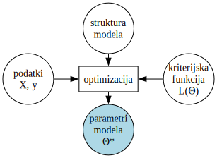
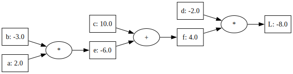

# Strojno odvajanje: gradientni sestop in računski graf

V prejšnjem poglavju smo obravnavali tehnike zmanjšanja dimenzij, s katerimi lahko podatke prikažemo v dvodimenzionalnih kartah oziroma razsevnih diagramih. Cilj teh metod je poenostaviti podatke tako, da ohranimo njihovo strukturo in odnose. Pravzaprav je tako z vsemi metoda strojnega učenja in umetne inteligence: iz vhodnih podatkov zgradijo model, ki podatke predstavijo v neki kompaktni, stisnjeni obliki, ki postane potem uporabna za preučevanje neke problemske domene ali pa napovedovanje izidov na njenem področju. Kot bomo videli tudi v prihodnje, imamo na vhodu vedno podatke, strukturo modela, kriterijsko funkcijo, ki nam pove, kaj je cilj našega modeliranja, na izhodu pa parametre, ki pri dani strukturi modela določajo naš model.


*Slika: Postopek učenja.* Na vhodu so podatki, struktura modela in kriterijska funkcija \( L(\theta) \). Strojno učenje, ali, bolje rečeno, optimizacijska metoda, poišče parametre modela \( \theta^* \) tako, da se dobljeni model — določen s strukturo in parametri — čim bolje prilega podatkom. Stopnjo prileganja ocenimo s kriterijsko funkcijo \( L(\theta) \).

V prejšnjem poglavju smo podrobneje obravnavali tri pristope: metodo glavnih komponent, večdimenzionalno lestvičenje in t-SNE. Kaj so bili struktura modela in kaj njegovi parametri?

V prejšnjem poglavju smo podrobneje obravnavali tri pristope: metodo glavnih komponent, večdimenzionalno lestvičenje in t-SNE. Kaj so bili struktura modela in kaj njegovi parametri?

- Pri metodi glavnih komponent (PCA) je **struktura modela** projekcija podatkov na linearne osi, to je, za vsako komponento, linearna kombinacija vhodnih spremenljivk, **parametri modela** so projekcijski vektorji oziroma smeri glavnih komponent \( \mathbf{u}_1, \mathbf{u}_2, \dots \), kriterijska funkcija, tu zapisana za prvo komponento, pa je:
  \[
  L(\mathbf{u}_1) = -\frac{1}{n} \sum_{i=1}^{n} (X_i \mathbf{u}_1)^2 \quad \text{pri pogoju} \quad \mathbf{u}_1^T \mathbf{u}_1 = 1
  \]

- Pri večdimenzionalnem lestvičenju (MDS) je **struktura modela** evklidski prostor nizke dimenzije, **parametri modela** so koordinate točk \( \mathbf{z}_1, \dots, \mathbf{z}_n \), ki jim pravimo tudi podatkovne vložitve, kriterijska funkcija pa:
  \[
  L(\mathbf{z}_1, \dots, \mathbf{z}_n) = \sum_{i < j} \left( d_{ij} - \| \mathbf{z}_i - \mathbf{z}_j \| \right)^2
  \]

- Pri metodi t-SNE je **struktura modela** verjetnostna porazdelitev sosedstev, **parametri modela** so koordinate točk (vektorske vložitve) v prostoru nizkih dimenzij \( \mathbf{z}_1, \dots, \mathbf{z}_n \), kriterijska funkcija pa:
  \[
  L(\mathbf{z}_1, \dots, \mathbf{z}_n) = \sum_{i \neq j} p_{ij} \log \frac{p_{ij}}{q_{ij}}
  \]

Česar do sedaj nismo opisali je postopek učenje. Torej, kako iz naših treh vhodov (podatki, struktura modela, kriterijska funkcija) sploh dobimo končni model podatkov. Izkaže se, da je ta postopek lahko univerzalen, torej da lahko izdelamo učno metodo, ki bo pri tovrstnem podajanju našega problema lahko uporabna za kakršnekoli podatke, poljubne strukture modela in poljubno izbrane kriterijske funkcije. Tehnika, ki jo bomo opisali, temelji na stohastičnem postopku iskanja vrednosti parametrov in gre nekako takole:

1. inicializacija: naključno ponastavi vrednosti vektorja \( \theta \)
2. vsako vrednost vektorja \( \theta \) rahlo spremeni tako, da izboljšaš vrednost kriterijske funkcije \( L(\theta) \), tj. posodobiš po formuli:
   \[
   \theta \leftarrow \theta - \eta \nabla L(\theta)
   \]
3. ponavljaj postopek do konvergence, označi dobljeno rešitev kot optimalno:
   \[
   \theta^* = \arg\min_{\theta} L(\theta)
   \]

Kriterijsko funkcijo tipično zapišemo tako, da iščemo njen minimum. Taki funkciji pravimo tudi funkcija izgub (angl. *loss function*). Če želimo spremeniti vrednosti parametrov, ki so zapisani v vektorju \( \theta \), v "pravi" smeri, rabimo izračunati parcialni odvod \( \frac{\partial L}{\partial \theta_i} \) oziroma gradient \( \nabla L(\theta) \). Zgornji postopek optimizacije lahko implementiramo s t. i. gradientnim sestopom. Najtežji del tega postopka je računanje gradientov. Klasično bi za vsako strukturo modela in dano kriterijsko funkcijo izračunali gradiente analitično ter rešitev uporabili pri strojnem učenju, a vse moderne tehnike umetne inteligence ta korak naredijo strojno.

## Gradientni sestop  

Gradientni sestop deluje tako, da v vsakem koraku oceni, kako strma je funkcija v trenutni točki, in nato prilagodi vrednost parametra v smeri nižje vrednosti. Pomembno je izbrati ustrezno hitrost učenja \( \eta \) – če je prevelika, lahko preskočimo minimum, če je premajhna, bo postopek zelo počasen.  

V gradientnem sestopu iščemo vrednost parametra, ki minimizira kriterijsko funkcijo. Če funkcijo označimo s \( f(\theta) \), kjer je \( \theta \) vektor parametrov, potem gradientni sestop deluje po naslednji iterativni posodobitvi:  

\[
\theta_{t+1} = \theta_t - \eta \nabla f(\theta_t)
\]

kjer je \( \nabla f(\theta_t) \) gradient funkcije v trenutni točki, ki nam pove smer največjega naraščanja funkcije. Ker želimo minimizirati funkcijo, se premikamo v nasprotni smeri gradienta.  

Da lahko izvedemo gradientni sestop, moramo poznati odvod funkcije po danem parametru. V primeru enega parametra je gradient enak navadnemu odvodu, v večdimenzionalnem primeru pa gre za vektor vseh delnih odvodov:  

\[
\nabla f(\theta) = \left( \frac{\partial f}{\partial \theta_1}, \frac{\partial f}{\partial \theta_2}, \dots, \frac{\partial f}{\partial \theta_n} \right)^T
\]

Gradient funkcije lahko določimo na dva načina: **analitično** ali **numerično**.  

Analitična rešitev temelji na simbolnem odvajanju funkcije, pri katerem neposredno izpeljemo enačbo za gradient. To je običajno bolj natančno in učinkovito, vendar je lahko pri kompleksnih funkcijah težko izvedljivo.  

Alternativno lahko gradient izračunamo numerično z metodo končnih diferenc. Če želimo izračunati odvod funkcije \( f \) po parametru \( \theta_i \), lahko uporabimo aproksimacijo:  

\[
\frac{\partial f}{\partial \theta_i} \approx \frac{f(\theta_i + h) - f(\theta_i)}{h}
\]

kjer je \( h \) majhno število (npr. \( h = 10^{-5} \)).  

Numerični gradient ima več slabosti. Prvič, izbira vrednosti \( h \) vpliva na natančnost – če je prevelik, dobimo grobo oceno, če je premajhen, lahko pride do numeričnih napak zaradi omejene natančnosti računalniške aritmetike. Drugič, za vsak parameter moramo izračunati vrednost funkcije vsaj dvakrat, kar pomeni, da je numerični gradient računsko drag pri funkcijah z veliko parametri.  

Zaradi teh slabosti se gradientni sestop običajno izvaja s simbolnim (analitičnim) gradientom, ki ga dobimo z odvajanjem kriterijske funkcije. To pomeni, da moramo že na začetku določiti enačbe za vse odvode po parametrih in jih nato uporabiti pri posodobitvah parametrov.  

Kriterijske funkcije v strojnem učenju in umetni inteligenci običajno niso preproste, kot v primeru kvadratne funkcije, temveč so lahko zelo kompleksne. V primeru nevronskih mrež imamo opravka s funkcijami, ki vsebujejo več milijonov parametrov. Ročno računanje gradientov bi bilo v takšnih primerih zamudno in nepraktično, zato se uporablja avtomatično izračunavanje gradientov.  

Postopek avtomatičnega izračuna gradienta temelji na metodi avtomatskega odvajanje (angl. *automatic differentiation*), ki omogoča natančno in učinkovito računanje gradientov kompleksnih funkcij brez uporabe simbolne ali numerične diferenciacije. Ta metoda je osnova za algoritme učenja v nevronskih mrežah in drugih naprednih modelih strojnega učenja.  

V nadaljevanju bomo podrobneje raziskali, kako gradientni sestop deluje v večdimenzionalnem prostoru in kako lahko pospešimo njegovo delovanje s pomočjo različnih različic algoritma.

## Primer  

Začnimo s preprosim primerom, ki nam bo pomagal intuitivno razumeti gradientni sestop. Obravnavali bomo kvadratno funkcijo:  

\[
f(a) = a^2 - 10a + 28
\]

in poiskali takšno vrednost parametra \( a \), pri kateri funkcija doseže minimum.  

**Analitična rešitev**. Ker je dana funkcija kvadratna, lahko njen minimum poiščemo analitično. Kvadratne funkcije oblike  

\[
f(a) = c_1 a^2 + c_2 a + c_3
\]

imajo ekstrem v točki, kjer je prvi odvod enak nič. Odvajamo funkcijo:  

\[
\frac{d}{da} f(a) = 2a - 10
\]

Minimum najdemo tako, da odvod enačimo z nič:  

\[
2a - 10 = 0
\]

Rešimo za \( a \):  

\[
a = 5
\]

Vrednost funkcije v tej točki je:  

\[
f(5) = 5^2 - 10(5) + 28 = 25 - 50 + 28 = 3
\]

Torej funkcija doseže svoj minimum pri \( a = 5 \), kjer velja \( f(5) = 3 \).  

**Numerična rešitev**. Če analitične rešitve ne bi poznali, bi lahko uporabili **gradientni sestop**, ki iterativno prilagaja vrednost parametra \( a \), dokler ne doseže minimuma funkcije.  

Gradientni sestop deluje tako, da se premikamo v smeri negativnega gradienta (odvoda funkcije), saj ta kaže proti nižjim vrednostim funkcije. Posodobitev parametra \( a \) v vsakem koraku poteka po formuli:  

\[
a_{t+1} = a_t - \eta \frac{d}{da} f(a_t)
\]

kjer je \( \eta \) (grški simbol "eta") **hitrost učenja**, ki določa, kako veliki bodo koraki pri posodabljanju vrednosti parametra.  

Začnimo s **začetno vrednostjo** \( a_0 = 6 \) in izberimo hitrost učenja \( \eta = 0.1 \).  

1. Izračunamo odvod funkcije pri \( a_0 = 6 \):

   \[
   \frac{d}{da} f(6) = 2(6) - 10 = 12 - 10 = 2
   \]

   Posodobimo vrednost parametra:  

   \[
   a_1 = 6 - 0.1 \times 2 = 6 - 0.2 = 5.8
   \]

2. Izračunamo gradient pri \( a_1 = 5.8 \):

   \[
   \frac{d}{da} f(5.8) = 2(5.8) - 10 = 11.6 - 10 = 1.6
   \]

   Posodobimo vrednost parametra: 

   \[
   a_2 = 5.8 - 0.1 \times 1.6 = 5.8 - 0.16 = 5.64
   \]

3. Izračunamo gradient pri \( a_2 = 5.64 \):

   \[
   \frac{d}{da} f(5.64) = 2(5.64) - 10 = 11.28 - 10 = 1.28
   \]

   Posodobimo vrednost parametra: 

   \[
   a_3 = 5.64 - 0.1 \times 1.28 = 5.64 - 0.128 = 5.512
   \]

Postopek nadaljujemo, dokler se vrednost \( a \) ne približa 5. Če bi nadaljevali, bi videli, da se vrednosti sčasoma stabilizirajo okoli \( a = 5 \), kar je pričakovani minimum.  

Program, ki implementira tak postopek za našo funkcijo, je:

```python
def f(a):
    return a**2 - 10*a + 28

def df(a):
    return 2*a - 10

a = 6
eta = 0.1
for _ in range(20):
    grad = df(a)
    a = a - eta * grad
    print(f"a = {a:.6f}, f(a) = {f(a):.6f}")
```

Če ga poženemo, program hitro skonvergira k pravi rešitvi:

```python
a = 5.800000, f(a) = 3.640000
a = 5.640000, f(a) = 3.409600
a = 5.512000, f(a) = 3.262144
...
a = 5.014412, f(a) = 3.000208
a = 5.011529, f(a) = 3.000133
```

Zgoraj smo odvod funkcije zapisali analitično. Lahko bi ga izračunali tudi numerično z metodo končnih diferenc.

```python
def df(a, h=0.0001):
    return (f(a + h) - f(a)) / h
```

Tipično je uporaba analitično izračunanega odvoda oziroma gradientov hitrejša in bolj točna, zato se bomo od tu dalje osredotičili na te postopke oziroma na postopke strojnega odvajanja, torej odvajanja, kjer nam odvod za poljubno funkcijo izračuna algoritem.

## Računski graf in računanje gradienta

Začnimo s primerom in z enostavno funkcijo:

\[
L(a, b, c, d) = (ab + c) f
\]

Za to funkcijo bi radi izračunali gradient pri vrednostih njenih parametrov \( a = 2 \), \( b = -3 \), \( c = 10 \), \( d = -2 \), konkretno, radi bi izračunali sledeče parcialne odvode

\[
\frac{\partial L}{\partial a}, \frac{\partial L}{\partial b}, \frac{\partial L}{\partial c}, \frac{\partial L}{\partial d}.
\]

Z drugimi besedami, želeli bi izračunati gradient funkcije 

\[
\nabla L = \left( \frac{\partial L}{\partial a}, \frac{\partial L}{\partial b}, \frac{\partial L}{\partial c}, \frac{\partial L}{\partial d} \right)
\]

Gremo počasi in si skušajmo olajšati izračun tako, da našo funkcijo zapišemo kot:

\[
\begin{align*}
e &= ab \\
f &= e + c \\
L &= fd
\end{align*}
\]

Ta zapis lahko ponazorimo tudi grafično s spodnjim računskim grafom, ki smo mu dodali tudi vrednosti spremenljivk za naš primer.



Začnimo od zadaj in izračunajmo odvod funkcije \( L \) po spremenljivki \( f \). 

\[
\frac{\partial L}{\partial f} = \lim_{h \to 0} \frac{(f+h)d - fd}{h} = \lim_{h \to 0} \frac{fd + hd - fd}{h} = \lim_{h \to 0} \frac{hd}{h} = d
\]

Pri naših vrednostih parametrov \( f = 2 \times (-3) + 10 = 4 \) in \( d = -2 \) je torej odvod po spremenljivki \( f \) enak:

\[
\frac{\partial L}{\partial f} = d = -2
\]

Podobno izračunamo lahko tudi odvod po spremenljivki \( d \):

\[
\frac{\partial L}{\partial d} = \lim_{h \to 0} \frac{f(d+h) - fd}{h} = \lim_{h \to 0} \frac{fd + fh - fd}{h} = \lim_{h \to 0} \frac{fh}{h} = f
\]

Pri naših vrednostih parametrov \( f = 4 \) je torej odvod enak:

\[
\frac{\partial L}{\partial d} = f = 4
\]

Za izračun odvoda po parametru \( c \) rabimo poseči po verižnem pravilu:

\[
\frac{\partial L}{\partial c} = \frac{\partial L}{\partial f} \frac{\partial f}{\partial c}
\]

kjer je \( \frac{\partial f}{\partial c} \) enak:

\[
\frac{\partial f}{\partial c} = \frac{\partial (e+c)}{\partial c} = \lim_{h \to 0} \frac{(e+c+h) - (e+c)}{h} = \lim_{h \to 0} \frac{e+c+h-e-c}{h} = \lim_{h \to 0} \frac{h}{h} = 1
\]

Ker smo že izračunali \( \frac{\partial L}{\partial f} = d = -2 \), je torej:

\[
\frac{\partial L}{\partial c} = d \times 1 = -2
\]

Podobno izračunamo parcialni odvod po spremenljivki e, ki bo prav tako enak -2. Ostane name še izračun parcialnih odvodov po spremenljivkah a in b. Začnimo s spremenljivko a:

\[
\frac{\partial L}{\partial a} = \frac{\partial L}{\partial e} \frac{\partial e}{\partial a}
\]

Odvod \( \frac{\partial L}{\partial e} \) poznamo, enak je -2, \( \frac{\partial e}{\partial a} \) pa izračunajmo:

\[
\frac{\partial e}{\partial a} = \frac{\partial (ab)}{\partial a} = \lim_{h \to 0} \frac{(a+h)b - ab}{h} = \lim_{h \to 0} \frac{ab + hb - ab}{h} = \lim_{h \to 0} \frac{hb}{h} = b
\]

Ker je \( b = -3 \) in \( \frac{\partial L}{\partial e} = -2 \), je \( \frac{\partial L}{\partial a} \) torej enak 6. Podobno bi lahko izračunali še, da je \( \frac{\partial L}{\partial b} = -4 \). 

Zgornje računanje "na roke" je malce zamudno in pisci tega besedila vedo, da imajo opravka z bralci, ki vse to dobro razumejo in znajo, že iz prvega letnika če ne iz srednješolske matematike. A to, kar smo želeli izpostaviti, je razstavljanje funkcije in ponazoritev njenega izračuna z računskim grafom, in vzvratno računanje odvodov z verižnim pravilom. 

Spoznali smo tudi, da pri vsoti "skopiramo" vrednost odvoda k staršem vozlišča, pri množenju pa ta odvod pomnožimo še z vrednostjo sosednjega (sestrskega) vozlišča. Vse to nam bo zelo prav prišlo v naslednjem poglavju, ko bomo sestavljali kodo za avtomatsko odvajanje.


## Numerično odvajanje

Vse zgornje izračune lahko preverimo še programsko:

```python
def L(a, b, c, d):
    e = a * b
    f = e + c
    return f * d

# Vrednosti parametrov
a, b, c, d = 2, -3, 10, -2

# Izračun vrednosti e in f
e = a * b
f = e + c
print(f"e = {e}")  # Pričakujemo -6
print(f"f = {f}")  # Pričakujemo 4

h = 0.001
df = (L(a, b, c, d + h) - L(a, b, c, d)) / h
print(f"∂L/∂f = {df}")  # Pričakujemo 4
dd = (L(a, b, c, d + h) - L(a, b, c, d)) / h
print(f"∂L/∂d = {dd}")  # Pričakujemo 4
dc = (L(a, b, c + h, d) - L(a, b, c, d)) / h
print(f"∂L/∂c = {dc}")  # Pričakujemo -2
de = (L(a + h, b, c, d) - L(a, b, c, d)) / h
print(f"∂L/∂e = {de}")  # Pričakujemo -2
da = (L(a + h, b, c, d) - L(a, b, c, d)) / h
print(f"∂L/∂a = {da}")  # Pričakujemo 6
db = (L(a, b + h, c, d) - L(a, b, c, d)) / h
print(f"∂L/∂b = {db}")  # Pričakujemo -4
```

Program izračuna vse parcialne odvode numerično z metodo končnih diferenc, kjer uporabljamo majhno vrednost \( h = 0.001 \). Rezultati bi morali biti zelo blizu analitičnim vrednostim, ki smo jih izračunali "na roke". Majhne razlike so posledica numeričnih napak pri računanju s končno natančnostjo.

Pravzaprav bi lahko vedno odvajali kar numerično in na ta način pridobili vrednost gradienta funkcije pri danih vrednosti parametrov. A ima numerično odvajanje pred analitičnim kar nekaj slabosti. Numerično odvajanje je počasnejše, saj moramo vsakič vsaj dvakrat ovrednotiti celotno funkcijo, manj natančno in občutljivo na izbiro koraka h, saj premajhen korak vodi v zaokrožitvene napake, prevelik pa v netočne približke. V strojnem učenju zato, kjer je le možno, uporabljamo analitične odvode, ki pa jih ne računamo ročno ampak raje strojno.