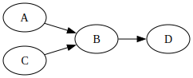
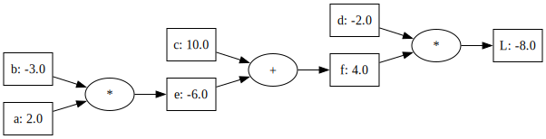
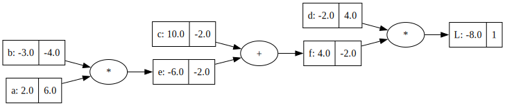

# Strojno odvajanje: razvoj programa

V prejšnjem poglavju smo videli, da nam pri odvajanju funkcij pride prav, če te zapišemo v obliki računskega grafa in se potem, v namene odvajanje, po grafu sprehodimo od konca proti začetku. Ta vzvratni "sprehod" (angl. *back-propagation*) ustreza tudi verižnemu pravilu odvajanja, kjer pa si vse vmesne rezultate zapomnimo in jih izračunamo torej natanko enkrat.

Na osnovi tega vzvratnega sprehoda bomo zgradili algoritem oziroma implementirali kodo za strojno odvajanje. Pričeli bomo pri njenem okostju, računskemu grafu, kjer najprej implementiramo njegovo vozlišče, vozlišču dodamo podatek o njenem predhodniku, preverimo, če računski graf lahko uporabimo pri računanju funkcij (angl. *forward computation*) in ko smo s tem zadovoljni, implementiramo še izračun gradientov. Postopek bomo razvijali v korakih, zaključili pa seveda z demonstracijo uporabnosti.

> **Opomba:** Pri razvoju postopka in kode za strojno odvajanje smo se močno zgledovali po izjemnem predavanju Andreja Karpathyja *The spelled-out intro to neural networks and backpropagation: building micrograd* ter uporabili pristop iz njegove knjižnice micrograd ([GitHub repo](https://github.com/karpathy/micrograd)).  

## Vozlišča v računskem grafu

Čas je, da za to odvajanje spišemo kodo. V Pythonu. Začnimo s predstavitvijo vozlišča v računskem grafu, ki ga implementiramo v razredu `Value`, saj nam bo ta hranil vrednost neke spremenljivke:

```python
class Value:
    def __init__(self, data):
        self.data = data

    def __repr__(self):
        return f"Value({self.data})"
```

Vozlišča bodo hranila podatke, `data` ter znala te izpisati:

```python
>>> a = Value(2.0)
>>> a
Value(2.0)
```

## Računski graf

Nad vozlišči, oziroma spremenljivkami, ki jih vozlišča predstavljajo, bi radi izvajali računske operacije. Na primer, želeli bi jih implementirati `Value` tako, da lahko izvedemo spodnjo kodo:

```python
>>> a = Value(2.0)
>>> b = Value(-3.0)
>>> e = a + b
>>> g = e * b
```

Naš razred za vozlišče v računskemu grafu zato razširimo z implementacijo vsote in produkta. Ker gradimo graf, bomo povezave v njem hranili tako, da si bo vozlišče zapomnilo njegove predhodnike. V namene izrisa grafa bomo tudi shranili oznako matematične operacije in ime spremenljivke, ki jo hrani vozlišče. Tu opozorimo, da teh oznak in imen sicer ne rabimo hraniti v resnih aplikacijah strojnega učenja (kot so na primer nevronske mreže), pri spoznavanju strojnega odvajanja, kot to počnemo v tem poglavju, pa ta funkcionalnost ne škodi.

```python
class Value:
    def __init__(self, data, _children=(), _op='', label=''):
        self.data = data
        self.label = label
        self._prev = set(_children)
        self._op = _op

    def __repr__(self):
        return f"Value({self.label}: {self.data})"
    
    def __add__(self, other):
        out = Value(self.data + other.data, (self, other), '+')
        return out
    
    def __mul__(self, other):
        out = Value(self.data * other.data, (self, other), '*')
        return out
```

Zgradimo računski graf za enostavno funkcijo, ki smo jo spoznavali v prejšnjem poglavju (predavanju):

```python
a = Value(2.0, label='a')
b = Value(-3.0, label='b')
c = Value(10.0, label='c')
d = Value(-2.0, label='d')

e = a * b
e.label = 'e'
f = e + c
f.label = 'f'
L = f * d
L.label = 'L'
```

Preverimo njeno delovanje:

```python
>>> L
Value(L: -8.0)
>>> L._prev
{Value(d: -2.0), Value(f: 4.0)}
```

Dela! 

# Izris računskega grafa

Računski graf bi sicer bilo fino izrisati. Za to bomo uporabili graphviz, odprtokodni program oziroma knjižnico za risanje grafov, ki je zlasti primerna za izris usmerjenih in neusmerjenih grafov, kjer vozlišča in povezave predstavljajo podatke ali odnose. Graphviz za opis grafa uporablja jezik DOT. Načeloma je DOT preprost tekstovni zapis, s katerim lahko opišemo vozlišča in povezave med njimi. V Pythonu pa ta jezik preposto nadomestimo s funkcijskimi klici. Za začetek si oglejmo enostaven primer uporabe knjižnice graphviz:

```python
import graphviz
from IPython.display import display
dot = graphviz.Digraph()
dot.node('A')
dot.node('B')
dot.edge('A', 'B')
dot.node('C')
dot.edge('C', 'B')
dot.node('D')
dot.edge('B', 'D')
display(dot)
```

ki izriše graf:



> **Opomba:** Graphviz sta razvila Stephen North in Ellie Gansner iz AT&T Labs – Research v zgodnjih 90. letih, natančneje leta 1991. Projekt je nastal kot del raziskav na področju vizualizacije grafov in orodij za avtomatsko risanje diagramov. Graphviz je bil kasneje objavljen kot odprtokodni projekt in je postal eden najpogosteje uporabljenih orodij za vizualizacijo grafov. 

Koda za izris računskega grafa je nekoliko kompleksnejša (hvala Andreju Karpathyju tudi zanjo), tu jo samo izpišemo, na bralcu pa je, da jo natančno prebere in skuša razumeti. Zanimiv del te kode je tudi funkcija `trace`, ki se sprehodi po grafu in topološko uredi vozlišča ter nam bo prišla prav tudi kasneje pri računanju gradientov.

```python
def trace(root):
    nodes, edges = set(), set()
    def build(v):
        if v not in nodes:
            nodes.add(v)
            for child in v._prev:
                edges.add((child, v))
                build(child)
    build(root)
    return nodes, edges

def draw_dot(root, format='svg', rankdir='LR'):
    """
    format: png | svg | ...
    rankdir: TB (top to bottom graph) | LR (left to right)
    """
    assert rankdir in ['LR', 'TB']
    nodes, edges = trace(root)
    dot = Digraph(format=format, graph_attr={'rankdir': rankdir})
    
    for n in nodes:
        dot.node(name=str(id(n)), label = "{ %s: %.1f }" % \
         (n.label, n.data), shape='record')
        if n._op:
            dot.node(name=str(id(n)) + n._op, label=n._op)
            dot.edge(str(id(n)) + n._op, str(id(n)))
    
    for n1, n2 in edges:
        dot.edge(str(id(n1)), str(id(n2)) + n2._op)
    
    return dot
```

Sedaj lahko izrišemo naš računski graf:

```python
>>> draw_dot(L)
```



Vse je prav izračunano. Manjkajo le še odvodi.

# Računanje gradientov

Do tu nam je šlo lepo, a vse, kar smo do sedaj naredili, je bilo računanje vrednosti funkcij. Takih enostavnih, z vsotami in produkti. Manjka nam (vsaj) še izračun gradientov. Te računamo po verižnem pravilu, od zadaj naprej. Torej, od končnih vozlišč s končno vrednostjo funkcije do začetnih vozlišč oziroma vhodnih parametrov. 

Gradiente bomo torej strojno računali tako, da bodo te vozliščem računali njihovi nasledniki, in sicer tako, da jim bodo ustrezno prišteli vrednost lastnega gradienta (vsota) oziroma k tej pomnožili še vrednost sosednega vozlišča (produkt). Vse to bo implementirano v funkciji `_backward()`, ki bo lastna vsaki od implementiranih operacij (zaenkrat sta tu le vsota in produkt, kasneje bomo dodali še kakšno drugo funkcijo). Za končni izračun gradienta se moramo sprehoditi po računskemu grafu. To bo storila funkcija `backward()`, ki se bo najprej topološko uredila vozlišča, potem pa se po njih sprehodila in v vsakem klicala `_backward()`.

Še nekaj razmislekov preden razkrijemo zadnjo razširitev naše kode. Gradiente nasledniki prištevajo, ne nastavijo. Na začetku morajo biti gradienti zato postavljeni na vrednosti 0. Prištevanje pa nam koristi v primeru, da ima vozlišče več kot enega naslednika. Npr., v funkciji \( b = a + a \) vsak \( a \) "prinese" po eno 1-ko k odvodu. V nevronskih mrežah, na primer, bodo imela vozlišča računskega grafa tipično veliko naslednikov, in vsak od njih bo k gradientu vozlišča prispeval svojo vrednost. 

Upoštevamo tudi, da je odvod zadnjega vozlišča, torej odvod končne spremenljivke \( L \) po \( L \)-u enak 1. Začnemo torej s to vrednostjo odvoda in jo razširimo od tega, zadnjega vozlišča, nazaj proti začetnim vozliščem. Tu je koda, kjer za vsako od operacij implementiramo funkcijo `_backward()`:

```python
class Value:
    def __init__(self, data, _children=(), _op='', label=''):
        self.data = data
        self.label = label
        self.grad = 0.0
        self._backward = lambda: None
        self._prev = set(_children)
        self._op = _op

    def __repr__(self):
        return f"Value({self.label}: {self.data})"
    
    def __add__(self, other):
        out = Value(self.data + other.data, (self, other), '+')

        def _backward():
            self.grad += 1.0 * out.grad
            other.grad += 1.0 * out.grad
        out._backward = _backward
        return out
    
    def __mul__(self, other):
        out = Value(self.data * other.data, (self, other), '*')

        def _backward():
            self.grad += other.data * out.grad
            other.grad += self.data * out.grad
        out._backward = _backward
        return out
```

Manjka le še uporaba funkcij `_backward()`. Spomnimo se (morda preveč ponavljamo, a je pomembno), da za dano vozlišče funkcija `_backward()` zabeleži vpliv neposrednih predhodnikov danega vozlišča na gradient vozlišča. Če želimo izračunati gradiente za vse spremenljivke v računskem grafu, moram priče od zadaj, in v topološkem redu od zadaj naprej za vsako vozlišče pognati `_backward()`. Implementacijo takega vzvratnega razširjanja gradientov dodamo v razred `Value`:

```python
    def backward(self):
        # topološko uredi vozlišča v grafu in jih daj v seznam
        topo = []
        visited = set()
        def build_topo(v):
            v.grad = 0
            if v not in visited:
                visited.add(v)
                for child in v._prev:
                    build_topo(child)
                topo.append(v)
        build_topo(self)

        # za vsako od vozlišč v seznamu uporabi verižno pravilo
        # in dodaj gradient neposrednim predhodnikom
        self.grad = 1
        for v in reversed(topo):
            v._backward()
```

Preskusimo njeno delovanje na naši enostavni funkciji, torej na tej, za katero smo gradiente računali ročno v prejšnjem poglavju:

```
a = Value(2.0, label='a')
b = Value(-3.0, label='b')
c = Value(10.0, label='c')
d = Value(-2.0, label='d')

e = a * b
e.label = 'e'
f = e + c
f.label = 'f'
L = f * d
L.label = 'L'

L.backward()
```

Izpišimo še vrednosti gradientov:

```python
>>> a.grad, b.grad, c.grad, d.grad
(6.0, -4.0, -2.0, 4.0)
```

Juhu! Dela. Oziroma, bolje rečeno, pravilno izračuna vrednosti gradientov za našo enostavno funkcijo. Enostavno zato, ker ta samo sešteva in množi. Spodaj je še izris računskega grafa z odvodi:



## Konstante, negacija, potenciranje

Pri malce bolj kompleksnih funkcijah bi želeli v naših računskih grafih obravnavati tudi konstate, računali razlike, potence... Oziroma, delali z izrazi, kot so na primer spodnji:

```
>>> a = Value(3, 'a')
>>> b = Value(42, 'b')
>>> a + 10
>>> -13 + a
>>> a - b
>>> (a + b) ** 3
```

Pri vseh teh nam naša trenutna implementacija vrne napako. Potrebno jo bo zato razširiti. Za operacije s konstantami bomo avtomatsko dodali novo vozlišče, za to, da bodo te lahko v naših operacijah tudi na levi strani, bomo implementirali funkcije, kot je `__radd__`, odštevanje bomo implementirali s seštevanje z negativno vrednostjo desnega operanda, spisali pa bomo tudi novo operacijo za potenciranje. Spodaj je tako razširjena implementacija razreda `Value`:

```python
class Value:
    def __init__(self, data, _children=(), _op='', label=''):
        self.data = data
        self.label = label
        self.grad = 0.0
        self._backward = lambda: None
        self._prev = set(_children)
        self._op = _op

    def __repr__(self):
        return f"Value({self.label}: {self.data})"
    
    def __add__(self, other):
        other = other if isinstance(other, Value) else Value(other)
        out = Value(self.data + other.data, (self, other), '+')

        def _backward():
            self.grad += out.grad
            other.grad += out.grad
        out._backward = _backward

        return out
    
    def __mul__(self, other):
        other = other if isinstance(other, Value) else Value(other)
        out = Value(self.data * other.data, (self, other), '*')

        def _backward():
            self.grad += other.data * out.grad
            other.grad += self.data * out.grad
        out._backward = _backward
        return out
    
    def __pow__(self, other):
        out = Value(self.data ** other, (self, ), f'**{other}')

        def _backward():
            self.grad += other * (self.data ** (other - 1)) * out.grad
        out._backward = _backward
        return out
    
    def __radd__(self, other):  # other + self
        return self + other
    
    def __neg__(self): # - self
        return self * -1
    
    def __sub__(self, other):
        return self + (-other)
    
    def __rsub__(self, other):  # other - self
        return other + (-self)

    def __rmul__(self, other):  # other * self
        return self * other
```

Iz zgornjega zapisa smo izpustili funkcijo `backward()`, ki ostane enaka kot prej. Tu je čas za bralca, da preskusi delovanje teh novih funkcionalnosti, morda tudi s prej naštetimi operacijami, ki nam z osnovno implementacijo niso delovale. Mi pa se bomo spustili v nove podvige v naslednjem poglavju, ko bomo to kodo za avtomatsko odvajanje uporabili na bolj resnih primerih linearne regresije iz večrazrednega lestvičenja.

S temi, in morda še kakšnimi drugi manjšimi razširitvami, smo sedaj pripravljeni za "resno" naše male knjižnice za avtomatsko odvajanje.