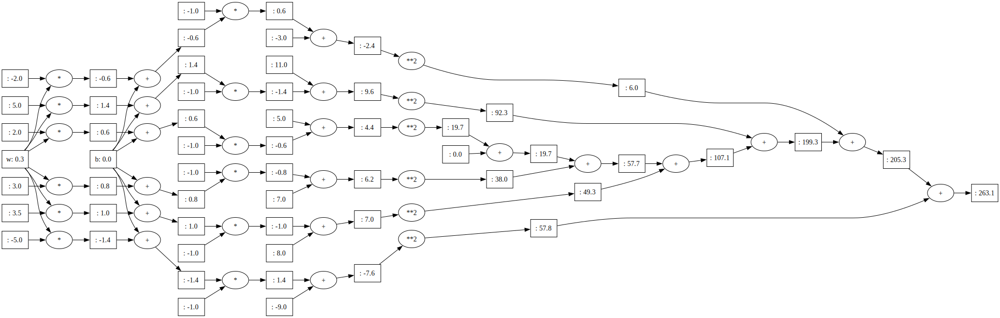
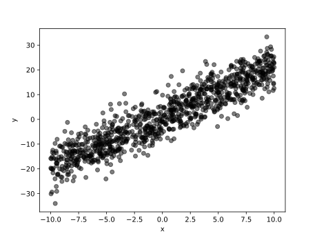
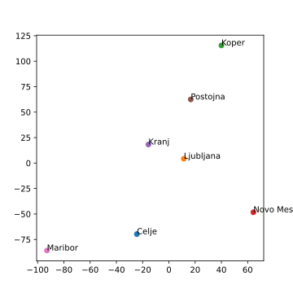

# Učenje modelov z gradientnim sestopom in strojnim odvajanjem

V prejšnjem poglavju smo razvili enostavno implementacijo strojnega odvajanja, kjer funkcijo zložimo v računski graf, za vsako operacijo v njem določimo, kako končno, rezultantsko vozlišče razširi svoj gradient nazaj na predhodnike, in graf uporabimo za verižni izračun gradienta od končnega vozlišča do začetnih vozlišč oziroma vhodnih parametrov funkcije.

Čas je za malo kompleksnejše primere. Začnimo z univariatno linearno regresijo.

## Univariatna linearna regresija

Linearna regresija ene vhodne spremenljivke je funkcija \( \hat{y}=w x + b \), kjer je \( \hat{y} \) ocenjena vrednost izhodne spremenljivke, \( x \) vrednost vhodne spremenljivke, \( w \) in \( b \) pa sta parametra našega modela oziroma funkcije. To funkcijo implementirajmo v razredu:

```python
class LinReg:
    def __init__(self):
        self.w = Value(random.uniform(-1,1), label='w')
        self.b = Value(0.0, label='b')
    
    def __call__(self, x):
        return self.w * x + self.b
    
    def parameters(self):
        return [self.w, self.b]

    def loss(self, xs, ys):
        yhats = [self(x) for x in xs]
        return sum([(y - yhat)**2  for y, yhat in zip(ys, yhats)])
    
    def __repr__(self):
        return f"LinReg(w={self.w.data:.3f}, b={self.b.data:.3f})"
```

V funkciji `__init__()` določimo začetne vrednosti parametrov modela. Klic modela implementiramo v funkciji `__call__()`. Razred `LinReg` vrne tudi seznam parametrov modela, ki ga bomo rabili pri posodabljanju parametrov v gradientnem sestopu. Izjemno pomembna pa je fukcija `loss()`, ki računa izgubo. Pri linearni regresiji tipično določimo parametre modela tako, da ti minimizirajo vsoto kvadratov napak in izguba bo torej enaka tej vsoti. O tem, zakaj je ravno tako, malce kasneje. Spomnimo samo, da izgubo v naši kodi izračunamo iz računskega grafa, ki ga v ta namen zgradimo, zato smo vse izračune implementirali z razredom `Value`. Prav ta graf bomo uporabili pri gradientnem sestopu. 

Za prvi test delovanja zgornje kode poskusimo uporabiti naš razred za izračun linearne regresije pri določenih parametrih modela:

```python
>>> model = LinReg()
>>> model.w = Value(10); model.b = Value(3)
>>> model(10)
Value(: 103)
```

Za učenje modela tu uporabimo majhno učno množico, kjer upamo, da se bomo lahko naučili funkcije \( y = 2 x + 1 \). Zaenkrat bomo zelo konzervativni in v učno množico ne bodo dodajali naključnih napak, pa tudi primerov je bolj malo, zato, da v testih kodo hitreje izvedemo. Vedno se splača začeti z enostavnimi primeri.

```
xs = [2., 3., 3.5, 5., -2., -5.]
ys = [2*x + 1 for x in xs]
```

Naš linearni model se bomo naučili iz teh podatkov. Preiskusimo najprej, kako za nek naključni začetni model izračunamo izgubo:

```python
>>> model = LinReg()
>>> model
LinReg(w=0.279, b=0.000)
>>> loss = model.loss(xs, ys)
>>> loss
Value(: 263.140739802441)
```

Izguba (vsota kvadratov napak) je seveda velika, saj je zgornji model še nenaučen, naključen. Zanimiv pa je računski graf za izgubo. Ta je že kar kompleksen, tudi zato, ker vključuje vsoto preko vseh šestih učnih primerov:



V računskem grafu namenoma nismo izpisali gradientov, saj se že brez njih na tej sliki komaj kaj vidi. Pravzaprav smo prikazali ta graf samo zato, da vidimo strukturo računskega grafa in da lahko ocenimo, na čem vse bo potekal strojni izračun gradientov. Kar komplicirano za tako enostavni problem. Še sreča, da računamo gradiente strojno!

Sestavimo sedaj funkcijo za učenje, ki implementira gradientni sestop. Spodnja optimizacijska funkcija je pravzaprav splošna, uporabili bi jo lahko za kakršenkoli model, ki pri učenju uporablja primere z razredom.

```python
def train(model, xs, ys, learning_rate=0.001, n_epochs=1000):
    for k in range(n_epochs):
        # izračunamo napovedi in iz njih izgubo
        loss = model.loss(xs, ys)

        # izračunamo gradiente
        loss.backward()

        # en korak gradientnega sestopa
        for p in model.parameters():
            p.data -= learning_rate * p.grad
        
        if k % 50 == 0:
            print(f"{k:3} Loss: {loss.data:5.3f} {model}")
    return model
```

Čas je za učenje:

```python
>>> model = train(model, xs, ys, n_epochs=500)
  0 Loss: 263.141 LinReg(w=0.565, b=0.034)
 50 Loss: 1.302 LinReg(w=2.042, b=0.517)
100 Loss: 0.437 LinReg(w=2.025, b=0.720)
150 Loss: 0.147 LinReg(w=2.014, b=0.838)
200 Loss: 0.049 LinReg(w=2.008, b=0.906)
250 Loss: 0.017 LinReg(w=2.005, b=0.946)
300 Loss: 0.006 LinReg(w=2.003, b=0.968)
350 Loss: 0.002 LinReg(w=2.002, b=0.982)
400 Loss: 0.001 LinReg(w=2.001, b=0.989)
450 Loss: 0.000 LinReg(w=2.001, b=0.994)
```

Gradientni sestop je v nekaj sto iteracijah torej našel (skoraj) pravi model, torej ta s parametri \( w=2 \) in \( b=1 \). Bralcu prepuščamo eksperimente z večjo stopnjo učenja. Povejmo le, da za te podatke in ta model učenje konvergira hitreje pri `learning_rate=0.01`, pri `learning_rate=0.1` pa se nam izvajanje programa prekine z napako `OverflowError: (34, 'Result too large')`. Zakaj?

## Paketno učenje

Bralec teh zapiskov bi lahko pripomnil, da je primer v prejšnem poglavju s šestimi primeri in brez šuma bil preenostaven in da bi znali tako linearno regresijo narediti tudi "na roko". Morda. Zato pa je zdaj pravi trenutek, da preskusimo našo implementacijo na večji množici podatkov:

```python
random.seed(42)
n = 1000
xs = [random.uniform(-10, 10) for _ in range(n)]
ys = [2*x + 1 + random.gauss(0, 5) for x in xs]
```

Podatki tudi v izrisu kažejo, da so bili generirani iz linearnega modela, le da smo jih tokrat malo zašumili:



Število primerov `n` lahko v tem našem vzorcu spreminjamo. Najprej, ne bi želeli, da bi funkcija izgube bila odvisna od števila primerov. Zato vsoto kvadriranih napak raje delimo z `n` in tako dobimo povprečno kvadrirano napako:

```python
    def loss(self, xs, ys):
        yhats = [self(x) for x in xs]
        return sum([(y - yhat)**2 for y, yhat in zip(ys, yhats)]) / len(xs)
```

Še ena sprememba oziroma dodatek sledi v naši implementaciji razreda `LinReg`. Računski graf, ki bi temeljil na `n=1000` primerov, bi bil za našo knjižnico in implementacijo razreda `Value` že kar velik. Zato bomo tokrat poskusili gradientni sestop v vsakem koraku izračunati le na osnovi gradientov, ki jih dobimo iz naključno izbranih primerov. Temu pristopu pravi paketno učenje (angl. *batch learning*). Poleg funkcije `loss()` v razredu `LinReg` dodajmo tudi funkcijo, ki izgubo računa samo iz podmnožice učnih podatkov

```python
    def batch_loss(self, xs, ys, m=10):
        indices = random.sample(range(len(xs)), m)
        batch_xs = [xs[idx] for idx in indices]
        batch_ys = [ys[idx] for idx in indices]
        return self.loss(batch_xs, batch_ys)
```

O, še ena sprememba: izguba z deljenjem z `len(xs)` bi pri naši trenutni implementaciji razreda `Value` sprožila napako. Deljenja še nismo implementirali. Vse, kar rabimo, je, da v razred `Value` dodamo sledeči dve funkciji:

```python
    def __truediv__(self, other): # self / other
        return self * other**-1

    def __rtruediv__(self, other): # other / self
        return other * self**-1
```

Prva, `__truediv__()`, implentira deljenje kot potenciranje na `-1`, druga pa (za kar pisec teh vrstic ni čisto prepričan, če jo prav zares potrebujemo), reši napako pri deljenju s številom, ki ni tipa `Value`. 

Funkcija `train()` je ista kot zgoraj, le parameter za velikost paketa podatkov smo ji dodali. Namesto izgube nad vsemi podatki zdaj, pri računanju gradienta, uporabimo izgubo nad podmnožico (klic funkcije `barch_loss()`), pri poročanju o napredku učenja pa namesto nje poročamo o izgubi na celi učni množici.

```python
def train(model, xs, ys, learning_rate=0.001, n_epochs=1000, batch_size=10):
    for k in range(n_epochs):
        # izračunamo napovedi in iz njih izgubo
        loss = model.batch_loss(xs, ys, batch_size)

        # izračunamo gradiente
        loss.backward()

        # osvežimo parametre
        for p in model.parameters():
            p.data -= learning_rate * p.grad
        
        if k % 100 == 0:
            print(f"{k:3} Loss: {model.loss(xs, ys).data:5.3f} {model}")
    return model
```

Pri paketnem učenju izguba na celotni učni množici ne bo padala monotono:

```python
>>> model = train(model, xs, ys, n_epochs=10000, batch_size=20)
  0 Loss: 252.970 LinReg(w=-0.579, b=0.010)
100 Loss: 25.068 LinReg(w=2.005, b=0.176)
200 Loss: 25.020 LinReg(w=1.981, b=0.265)
300 Loss: 24.927 LinReg(w=2.114, b=0.424)
400 Loss: 24.666 LinReg(w=2.050, b=0.508)
500 Loss: 24.616 LinReg(w=2.046, b=0.574)
600 Loss: 24.764 LinReg(w=1.965, b=0.606)
700 Loss: 24.581 LinReg(w=2.012, b=0.668)
800 Loss: 24.552 LinReg(w=2.054, b=0.719)
900 Loss: 24.573 LinReg(w=2.069, b=0.732)
9900 Loss: 24.555 LinReg(w=1.997, b=0.910)
>>> model
LinReg(w=2.028, b=0.875)
...
```

Tudi naš model ni ravno najbolj idealen, so se pa parametri modela precej približali tem, s katerimi smo podatke generirali. Paketno učenje je sicer veliko hitrejše kot gradientni spust, kjer vsakič računamo izgubo na celotni učni množici, moramo pa biti pazljivi pri nastavitvah stopnje učenje in velikosti paketov podatkov. Bralcu prepuščamo eksperimentiranje, kako ti parametri vplivajo na hitrost učenja in točnost.


## Multivariatna linearna regresija

Razširimo naš model linearne regresije na multivariatno, to je, na modele, ki na vhodu sprejmemo lahko po več atributov. Prav velikih spremeb ne bo. V razredu `LinReg` funkciji `loss()` in `batch_loss()` ostaneta taki, kot sta bili, ostale pa malce spremenimo, 

```python
class LinReg:
    def __init__(self, n_inputs):
        self.weights = [Value(random.uniform(-1,1), label=f'w{i}') for i in range(n_inputs)]
        self.b = Value(0.0, label='b')
    
    def __call__(self, x):
        # x is a list of input values
        return sum(w * xi for w, xi in zip(self.weights, x)) + self.b
    
    def parameters(self):
        return self.weights + [self.b]
    
    def __repr__(self):
        weights_str = ', '.join(f'w{i}={w.data:.3f}' for i, w in enumerate(self.weights))
        return f"LinReg({weights_str}, b={self.b.data:.3f})"
```

Določimo podatke in model:

```python
n = 1000
X = [[random.uniform(-10, 10) for _ in range(3)] for _ in range(n)]
ys = [2*x[0] + 3*x[1] - x[2] + 1 + random.gauss(0, 5) for x in X]

model = LinReg(n_inputs=3)
```

Učenje uspešno konvergira k pravi rešitvi:

```python
>>> model = train(model, X, ys, n_epochs=1000, 
                  batch_size=20, learning_rate=0.01)
  0 Loss: 62.834 LinReg(w0=2.362, w1=3.057, w2=-1.984, b=-0.055)
 50 Loss: 30.310 LinReg(w0=1.740, w1=3.009, w2=-0.868, b=0.401)
100 Loss: 29.072 LinReg(w0=1.773, w1=3.113, w2=-1.078, b=0.726)
150 Loss: 28.082 LinReg(w0=1.998, w1=3.132, w2=-1.174, b=0.555)
...
950 Loss: 27.192 LinReg(w0=2.084, w1=3.080, w2=-1.033, b=0.921)
```

## Večrazredno lestvičenje

Recimo, da imamo podane razdalje med slovenskimi mesti, v kilometrih cestne vožnje. Iz teh razdalj bi radi sestavili dvo-dimenzionalno karto mest, kjer razdalje čimbolj ustrezajo podanim. Večrazredno lestvičenje, torej. Kot pri ostalih pristopih, rabimo podatke, strukturo modela in cenovno funkcijo. Začnimo s podatki:

```python
distances = {
    ("Novo Mesto", "Maribor"): 172,
    ("Novo Mesto", "Celje"): 83,
    ("Novo Mesto", "Koper"): 172,
    ("Novo Mesto", "Kranj"): 102,
    ("Novo Mesto", "Ljubljana"): 72,
    ("Novo Mesto", "Postojna"): 118,
    ("Maribor", "Celje"): 55,
    ("Maribor", "Koper"): 234,
    ("Maribor", "Kranj"): 156,
    ("Maribor", "Ljubljana"): 128,
    ("Maribor", "Postojna"): 180,
    ("Celje", "Koper"): 184,
    ("Celje", "Kranj"): 107,
    ("Celje", "Ljubljana"): 79,
    ("Celje", "Postojna"): 131,
    ("Koper", "Kranj"): 132,
    ("Koper", "Ljubljana"): 107,
    ("Koper", "Postojna"): 60,
    ("Kranj", "Ljubljana"): 33,
    ("Kranj", "Postojna"): 77,
    ("Ljubljana", "Postojna"): 53,
}

items = set(i for pair in distances.keys() for i in pair)
```

Struktura našega modela je sestavljena iz točk, kjer pozicijo mest opišemo s koordinatami v Evklidski ravnini. Potrebujemo še cenovno funkcijo, ki bo ... izražala razliko med podanimi razdaljami in Evklidskimi razdaljami med točkami v naši rešitvi. Naj bo \( p_i = (\phi_{1,i}, \phi_{2,i}) \) položaj mesta \( i \) v dvorazsežni ravnini. Za dan par mest \( (i,j) \) z znano razdaljo \( d_{ij} \) definiramo kvadrat napake med Evklidsko razdaljo in podano razdaljo kot:

\[
e_{ij} = \left( \sqrt{(\phi_{1,i} - \phi_{1,j})^2 + (\phi_{2,i} - \phi_{2,j})^2} - d_{ij} \right)^2
\]

Skupna izguba (cenovna funkcija) je vsota teh napak po vseh parih:

\[
L(\Phi) = \sum_{(i,j) \in \text{pari}} \left( \sqrt{(\phi_{1,i} - \phi_{1,j})^2 + (\phi_{2,i} - \phi_{2,j})^2} - d_{ij} \right)^2
\]

Parametri modela oziroma pozicije mest so shranjeni v matriki \( \Phi \in \mathbb{R}^{2 \times n} \).

Imamo torej podatke (slovar razdalj med pari mest), parametre modela (pozicije mest na dvorazsežni karti) in kriterijsko funkcijo, ki meri razliko med cestnimi razdaljami in evklidskimi razdaljami na dvodimenzionalni karti. Pri inicializaciji modela bomo tokrat navedli seznam mest.

```python
class MDS:
    def __init__(self, items):
        self.pos = {i: [Value(random.uniform(-1, 1)) for _ in range(2)] 
                    for i in items}

    def __call__(self, x):
        # vrne koordinate mesta x
        return self.pos[x]
    
    def parameters(self):
        return [p for pos in self.pos.values() for p in pos]
    
    def d(self, a, b):
        # vrne evklidsko razdaljo med mestoma a in b
        return sum([(ai - bi) ** 2 for ai, bi in zip(self.pos[a], self.pos[b])]) ** 0.5

    def loss(self, data):
        return sum((self.d(*pair) - data[pair])**2 
                   for pair in data.keys()) / len(data)
```

Izgubo bomo tokrat, zaradi majhnega števila mest, računali na vseh parih mest iz vhodnega slovarja. Pri večjem številu mest bi tu lahko uporabili tudi paketni pristop in funkcijo `batch_loss()`, kjer bi razdalje med mesti vzorčili in celotnega slovarja razdalj.

Funkcija, ki izvede gradienti sestop in poišče parametra za naš model večrazrednega lestvičenja je podobna vsem prejšnjim, le namesto podatkov v matrični oziroma vektorski obliki tu posreduje slovar razdalj:

```python
def train(model, learning_rate=0.001, n_epochs=1000):
    for k in range(n_epochs):
        loss = model.loss(distances)  # izračunamo napovedi in iz njih izgubo
        loss.backward()  # izračunamo gradiente

        #  korak gradientnega spusta
        for p in model.parameters():
            p.data -= learning_rate * p.grad
        
        if k % 50 == 0:
            print(f"{k:3} Loss: {model.loss(distances).data:5.3f}")
    return model
```

Model lahko zdaj naučimo in izrišemo rezultate:

```python
>>> model = MDS(items)
>>> model = train(model, n_epochs=2000, learning_rate=0.01)
  0 Loss: 15618.708
100 Loss: 4480.064
200 Loss: 1422.714
...
1700 Loss: 142.433
1800 Loss: 140.663
1900 Loss: 139.020
```

Rezultate večrazrednega lestvičenja seveda največkrat izrišemo, čeprav so nam včasih tudi koordinate lahko pomembne za kakšno nadaljno obdelavo in analizo. 

```python
plt.figure(figsize=(5, 5))
for city in items:
    x, y = model(city)
    plt.scatter(x.data, y.data)
    plt.text(x.data, y.data, city)
plt.savefig("mds-mesta.pdf")
```



Pri izrisu ne smemo pozabiti, da je rezultat večrazrednega lestvičenja invarianten na rotacijo, translacijo in zrcaljenje, zato je koordinate nesmiselno označevati (z npr. mds1 in mds2), saj te nimajo prav nobenega pomena. Važni so le odnosi oziroma razdalje med točkami. Te so za slovenske kraje v naših podatkih kar prave, le da bi bilo potrebno karto, kot je prikazana na sliki, prezrcaliti, da bi dobili take vložitve kraje, kot smo jih navajeni gledati na zemljevidu.

## Kako naprej?

Pravzaprav je piscem teh vrstic kar presenetljivo, da s tako enostavno in kratko knjižnico za strojno odvajanje lahko enostavno naslovimo tako različna problema, kot sta linearna regresija in večrazredno lestvičenje. Podobnih primerov si bomo v nadaljevanju pogledali še nekaj, a prej zavijmo čisto malo v teorijo. Pri linearni regresiji smo namreč uporabili kriterijsko funkcijo (vsoto kvadriranih razlik med napovedjo in pravo vrednostjo), ne da bi sploh razložili, zakaj. Zakaj ne absolutne razlike? Zakaj ne razlike na četrto potenco? To razlago podamo v naslednjem poglavju, kjer se ukvarjamo z verjetjem.