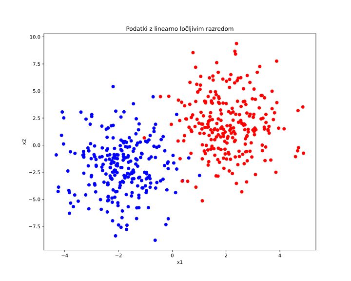
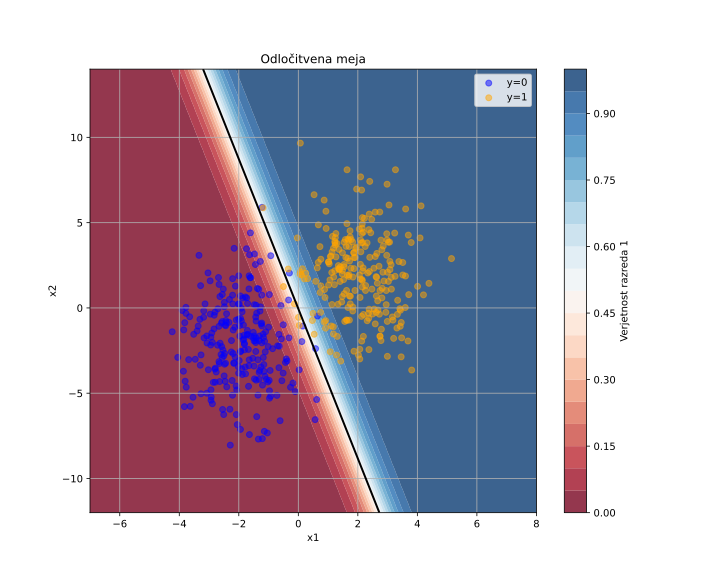

# Verjetje

Morda se bo bralcu zazdelo, da se v tem poglavju ukvarjamo z linearno in logistično regresijo. In res morda se, a ključen koncept poglavja je verjetje. Verjetje je mera, kako verjetno je, da bi opazili (ustvarili) dane učne podatke, če bi uporabili določen model. Model določa struktura in vrednost njegovih parametrov. Najboljši bo torej tisti model, ki ima parametre, za katere je ta model najbolj verjeten. ... z enačbo: označimo učne podatke z \( D \), model s parametri \( \theta \), verjetje pa z \( P(D \mid \theta) \). Najboljši model poiščemo z maksimizacijo verjetja (angl. *maximum likelihood*):

\[
\hat{\theta} = \arg\max_{\theta} P(D \mid \theta)
\]

Uporabimo najrprej metodo največjega verjetja za modele linearne regresije. Rezultat sicer že poznamo, do najboljšega modela nas pripelje minimizacija vsote kvadriranih napak, a nas tu zanima pot do tega rezultata in pogoji, ki morajo zanj veljati.

## Verjetnostni model za linearno regresijo

V osnovi linearne regresije je želja po modeliranju povezave med odvisno spremenljivko \( y \) in vhodnimi podatki \( \mathbf{x} \) s pomočjo linearne funkcije. Za vsak primer iz učne množice lahko potem zapišemo:

\[
y_i = \mathbf{x}_i^\top \boldsymbol{\beta} + \varepsilon_i,
\]

kjer so \( \mathbf{x}_i \in \mathbb{R}^p \) značilke oziroma atributi modela, \( \boldsymbol{\beta} \in \mathbb{R}^p \) parametri modela, ki jih želimo oceniti, in \( \varepsilon_i \) naključna napaka. Napaka \( \varepsilon_i \) zajema vse, česar model ne zna razložiti: merilne napake, vpliv neznanih spremenljivk, naključnost ipd.

**Ključna predpostavka linearne regresije je, da so napake \( \varepsilon_i \) porazdeljene normalno s pričakovano vrednostjo 0 in varianco \( \sigma^2 \).** Z matematično oznako to zapišemo kot

\[
\varepsilon_i \sim \mathcal{N}(0, \sigma^2).
\]

Oznaka \( \sim \) pomeni "je porazdeljen po" oziroma "sledi porazdelitvi". Zapis \( \varepsilon_i \sim \mathcal{N}(0, \sigma^2) \) torej pomeni, da je \( \varepsilon_i \) naključna spremenljivka, ki sledi normalni porazdelitvi s srednjo vrednostjo 0 in varianco \( \sigma^2 \). Če to predpostavimo, potem sledi tudi, da je vsaka izmerjena vrednost \( y_i \) pri danih vrednostih atributov \( \mathbf{x}_i \) prav tako normalno porazdeljena:

\[
y_i \sim \mathcal{N}(\mathbf{x}_i^\top \boldsymbol{\beta}, \sigma^2).
\]

To pomeni, da model napove pričakovano vrednost \( \mathbf{x}_i^\top \boldsymbol{\beta} \), okoli katere pa se izmerjena vrednost \( y_i \) porazdeli skladno z noramlno porazdelitvijo. S tem smo uvedli **verjetnostni model linearne regresije**.

Predpostavimo tudi, da so posamezni primeri \( i = 1, \dots, n \) v učni množici med seboj **neodvisni in enako porazdeljeni** – v statistiki za to pogosto uporabljamo kratico **i.i.d.** (angl. *independent and identically distributed*). Neodvisnost pomeni, da vrednosti enega primera nimajo vpliva na vrednosti drugega, enaka porazdeljenost pa pomeni, da vse napake sledijo isti porazdelitvi (v našem primeru normalni porazdelitvi z enako varianco). Zato lahko zapišemo skupno verjetnost (imenovano verjetnostna funkcija ali angl. *likelihood*) kot produkt posameznih verjetnosti:

\[
L(\boldsymbol{\beta}) = \prod_{i=1}^n \frac{1}{\sqrt{2\pi\sigma^2}} \exp\left( -\frac{(y_i - \mathbf{x}_i^\top \boldsymbol{\beta})^2}{2\sigma^2} \right).
\]

Verjetnostna funkcija meri, kako verjetno je, da bi ob danih parametrih \( \boldsymbol{\beta} \) in \( \sigma^2 \) dobili točno te podatke \( y_1, \dots, y_n \). **Cilj linearne regresije je poiskati parametre, ki maksimizirajo to verjetnost – torej takšne, pod katerimi so podatki v učni množici najbolj verjetni.**

Tako določeno verjetje bo pri velikih učnih množicah neko zelo majhno število, saj množimo verjetnosti. Numerično se nam prav lahko zgodi, da je to število manjše, kot ga lahko predstavimo v računalniku. Zato namesto, da bi maksimizirali produkt, raje maksimiziramo logaritem te funkcije, saj se logaritem produkta pretvori v vsoto, kar poenostavi računanje:

\[
\log L(\boldsymbol{\beta}) = -\frac{n}{2} \log(2\pi\sigma^2) - \frac{1}{2\sigma^2} \sum_{i=1}^n (y_i - \mathbf{x}_i^\top \boldsymbol{\beta})^2.
\]

Prvi člen v tej vsoti ne vpliva na izbiro parametrov \( \boldsymbol{\beta} \). Tudi člena pred vsoto v drugem delu, torej tistega, ki vsebuje varianco, lahko spustimo, saj je to le neko število. Zato je maksimizacija log-verjetnosti povsem enakovredna minimizaciji vsote kvadratov napak:

\[
\sum_{i=1}^n (y_i - \mathbf{x}_i^\top \boldsymbol{\beta})^2.
\]

Ta cenilka, torej vsota kvadratov napak, je prav tista, ki jo v klasični linearni regresiji minimiziramo – vsoto kvadratov razlik med napovedanimi in dejanskimi vrednostmi. Kvadratna funkcija napake izhaja neposredno iz predpostavke, da so napake porazdeljene normalno, in ima zato močno teoretično utemeljitev. Predpostavka normalne porazdelitve napak pa ni naključna – zanjo obstaja globlja statistična osnova. Po **centralnem limitnem izreku** bo namreč vsota (ali povprečje) velikega števila neodvisnih naključnih vplivov – četudi sami niso normalno porazdeljeni – približno sledila normalni porazdelitvi. Ker so napake v regresiji pogosto rezultat množice majhnih, nepovezanih vplivov, je normalna porazdelitev naravna in smiselna izbira.

Z drugimi besedami: metoda najmanjših kvadratov, ki jo običajno uporabljamo pri linearni regresiji, ni le praktična izbira, ampak je posledica verjetnostnega modela z normalno porazdeljenimi napakami, ki je podprt z načelom maksimalne verjetnosti in centralnim limitnim izrekom. Kvadrat razlike med napovedjo in izmerjeno vrednostjo tako ni zgolj tehnična podrobnost, temveč logična posledica tega, kako razumemo naravo naključnosti in porazdelitev napak v modelu.

## Verjetje za logistična regresija

Za linearno regresijo smo verjetje oziroma njen logaritem razvili zgoraj. Tu sledi novi primer, kjer bomo verjetje razvili za klasifikacijo, to je razvrščanje primerov v razrede. Omejili se bomo na binarno klasifikacijo, za katero od modela pričakujemo, da nam za dani primer \( x \) poda verjetnost, da razredna spremenljivka \( y \) zavzame ciljno vrednost 1. Gradimo torej model, ki ... za vsak primer \( x \) napove verjetnost \( P(y = 1 \mid x; \theta) \). Pri tem predpostavimo, da so primeri neodvisni, zato je skupno verjetje za učne podatke \( D = \{(x_i, y_i)\}_{i=1}^n \) produkt posameznih verjetnosti:

\[
P(D \mid \theta) = \prod_{i=1}^n P(y_i \mid x_i; \theta)
\]

Ker gre za binarno klasifikacijo, lahko to zapišemo kot:

\[
P(D \mid \theta) = \prod_{i=1}^n \left( p(x_i; \theta) \right)^{y_i} \left(1 - p(x_i; \theta) \right)^{1 - y_i}
\]

kjer je \( p(x_i; \theta) = P(y_i = 1 \mid x_i; \theta) \). Za optimizacijo navadno uporabimo logaritem verjetja:

\[
\log P(D \mid \theta) = \sum_{i=1}^n \left[ y_i \log p(x_i; \theta) + (1 - y_i) \log (1 - p(x_i; \theta)) \right]
\]

To je logaritem verjetja, ki jo želimo maksimizirati. 

Vse do sedaj je precej abstraktno. Namreč, tu moramo šele izbrati, kakšna bo struktura modela in kaj bodo njegovi parametri. Vse to potrebujemo za izračun verjetnosti \( P(y_i = 1 \mid x_i; \theta) \). Najbolje, da začnemo z najenostavnejšim modelov. Ta bo za izračun verjetnosti uporabil linearno kombinacijo značilk \( \mathbf{x}_i^\top \boldsymbol{\beta} \) ter tako izračunano vrednost preoblikoval tako, da bo ta zavzela vrednosti med 0 in 1, torej, da bo izhod verjetnost:

\[
P(y_i = 1 \mid \mathbf{x}_i) = \sigma(\mathbf{x}_i^\top \boldsymbol{\beta}) = \frac{1}{1 + e^{-\mathbf{x}_i^\top \boldsymbol{\beta}}}.
\]

Funkcija \( \sigma(\cdot) \), imenovana **logistična funkcija**, preslika poljubno realno vrednost v interval \( (0, 1) \), kar je popolno za modeliranje verjetnosti. Rezultat modela je torej napovedana verjetnost, da bo posamezen izid enak 1. Ker smo skombinirali uteženo vsoto in preslikavo z logistično funkcijo, se model, ki ga gradimo na ta način imenuje **logistična regresija**.

Določimo sedaj verjetnost, da nam model logistične regresije za dani primer \( x_i \) napove razred \( y_i \):

\[
P(y_i \mid \mathbf{x}_i) = \sigma(\mathbf{x}_i^\top \boldsymbol{\beta})^{y_i} \cdot \left(1 - \sigma(\mathbf{x}_i^\top \boldsymbol{\beta})\right)^{1 - y_i}.
\]

Tudi pri logistični regresiji predpostavljamo, da so primeri med seboj **neodvisni in enako porazdeljeni** (i.i.d.). Zato lahko zapišemo skupno verjetnost za celotno učno množico kot produkt verjetnosti za posamezne primere:

\[
L(\boldsymbol{\beta}) = \prod_{i=1}^n \sigma(\mathbf{x}_i^\top \boldsymbol{\beta})^{y_i} \cdot \left(1 - \sigma(\mathbf{x}_i^\top \boldsymbol{\beta})\right)^{1 - y_i}.
\]

Tako kot pri linearni regresiji tudi tukaj zaradi numerične stabilnosti in lažjega računanja uporabimo logaritem te funkcije. Log-verjetnost (log-likelihood) zapišemo kot:

\[
\log L(\boldsymbol{\beta}) = \sum_{i=1}^n \left[ y_i \log \sigma(\mathbf{x}_i^\top \boldsymbol{\beta}) + (1 - y_i) \log \left(1 - \sigma(\mathbf{x}_i^\top \boldsymbol{\beta}) \right) \right].
\]

To je funkcija, logaritem verjetja, ki jo maksimiziramo v logistični regresiji. Ne uporabljamo vsote kvadratov napak, ker dvojiški izidi \( y_i \in \{0, 1\} \) niso primerni za modeliranje z normalno porazdelitvijo in bi kvadratna napaka lahko vodila v napovedi izven intervala [0, 1]. Namesto tega uporabimo verjetnostni pristop, ki temelji na **Bernoullijevi porazdelitvi**, saj vsak izid \( y_i \) razumemo kot realizacijo naključne spremenljivke z verjetnostjo uspeha \( \pi_i = \sigma(\mathbf{x}_i^\top \boldsymbol{\beta}) \). Zapišemo to kot

\[
y_i \sim \mathrm{Bernoulli}(\pi_i),
\]

kjer oznaka \( \sim \) pomeni, da je \( y_i \) porazdeljen po Bernoullijevi porazdelitvi z verjetnostjo uspeha \( \pi_i \). Gostota Bernoullijeve porazdelitve je:

\[
P(y_i \mid \pi_i) = \pi_i^{y_i} (1 - \pi_i)^{1 - y_i}.
\]

Ko namesto \( \pi_i \) vstavimo modelirano verjetnost \( \sigma(\mathbf{x}_i^\top \boldsymbol{\beta}) \), dobimo:

\[
P(y_i \mid \mathbf{x}_i) = \sigma(\mathbf{x}_i^\top \boldsymbol{\beta})^{y_i} \cdot \left(1 - \sigma(\mathbf{x}_i^\top \boldsymbol{\beta})\right)^{1 - y_i}.
\]

To je prav ta izraz, iz katerega sestavimo verjetje (angl. *likelihood*) in logaritem verjetja (angl. *log-likelihood*). Bernoullijeva porazdelitev je torej ključna sestavina verjetnostnega modela za dvojiške izide, in prav iz nje izhaja oblika funkcije, ki jo 

Tako kot v linearni regresiji kvadratna napaka izhaja iz normalne porazdelitve in centralnega limitnega izreka, logistična regresija uporabi obliko, ki je skladna z naravo dvojiških podatkov. Uporaba log-verjetnosti nam omogoča stabilno in smiselno učenje modela brez skritih predpostavk o varianci napake – vse je zajeto v obliki Bernoullijeve verjetnosti.

## Implementacija logistične regresije

Dovolj enačb. Čas je, da vse skupaj sprogramiramo in preiskusimo. Na vhodu potrebujemo podatke, določiti moramo strukturo modela ter vlogo parametrov v modelu, in potem spisati kriterijsko funkcijo, ki pride iz verjetja. Začnimo s podatki.

```python
n = 500
X0 = [[random.gauss(-2, 1), random.gauss(-2, 2.5)] for _ in range(n//2)]
X1 = [[random.gauss(2, 1), random.gauss(2, 2.5)] for _ in range(n//2)]
X = X0 + X1
ys = [0] * (n//2) + [1] * (n//2)
```

Generirali smo torej 500 primerov, opisanih z dvemi atributi, kjer je razred vsaj približno linearno ločljiv. Najbolje je ta podatke, ker so pač namenoma dvorazsežni, izrisati v razsevnem diagramu.

```python
plt.figure(figsize=(10, 8))
plt.scatter([x[0] for x in X0], [x[1] for x in X0], c='blue', label='y=0')
plt.scatter([x[0] for x in X1], [x[1] for x in X1], c='red', label='y=1')
plt.xlabel('x1')
plt.ylabel('x2')
plt.title('Podatki z linearno ločljivim razredom')
plt.savefig("logreg-data.svg")
```



Implementacija razreda za logistično regresijo bo močno podobna tej za večvariatno linearno regresijo iz prejšnjega poglavja:

```python
class LogReg:
    def __init__(self, n_inputs):
        # začetne vrednosti parametrov
        self.weights = [Value(random.uniform(-1,1), label=f'w{i}') for i in range(n_inputs)]
        self.b = Value(0.0, label='b')
    
    def __call__(self, x):
        # linearna kombinacija vhodov
        z = sum(w * xi for w, xi in zip(self.weights, x)) + self.b
        # sigmoid aktivacijska funkcija
        return z.sigmoid()
    
    def parameters(self):
        return self.weights + [self.b]
    
    def __repr__(self):
        weights_str = ', '.join(f'w{i}={w.data:.3f}' for i, w in enumerate(self.weights))
        return f"LogReg({weights_str}, b={self.b.data:.3f})"
    
    def loss(self, X, ys):
        # izguba za binarno klasifikacijo (binary cross-entropy)
        yhats = [self(x) for x in X]
        return -sum(y * yhat.log() + (1-y) * (1-yhat).log() for y, yhat in zip(ys, yhats)) / len(ys)
    
    def batch_loss(self, X, ys, m=10):
        indices = random.sample(range(len(X)), m)
        batch_X = [X[idx] for idx in indices]
        batch_ys = [ys[idx] for idx in indices]
        return self.loss(batch_X, batch_ys)
```

Funkcija izgube `loss()` predvideva, da razred `Value` podpira dve novi operaciji, logaritem in sigmoidno funkcijo. Logaritem enostavno dodamo v ta razred:

```python
    def log(self):
        out = Value(math.log(self.data), (self,), 'log')
        
        def _backward():
            # d(ln(x))/dx = 1/x
            self.grad += (1 / self.data) * out.grad
        out._backward = _backward
        
        return out
```

Zgornje nam ni bilo pretežko: za izračun logaritma smo uporabili funkcijo iz standardne knjižnice `math`, pri odvodu pa izkoristimo vedenje, da je odvod logaritma spremenljivke njena inverzna vrednost. Spomnimo se sicer: funkcija `_backward` uporablja verižno pravilo, ki pravi, da je za funkcijo \( b = \log(a) \) parcialni odvod naše kriterijske funkcije \( L \) po \( a \)-ju enak:

\[
\frac{dL}{da} = \frac{dL}{db} \cdot \frac{db}{da}
\]

Ker je \( \frac{db}{da} = \frac{1}{a} \), dobimo:

\[
\frac{dL}{da} = \frac{dL}{db} \cdot \frac{1}{a}
\]

V funkciji `_backward` torej dodamo k gradientu spremenljivke \( a \) vrednost \( b.\text{grad} \cdot \frac{1}{a.\text{data}} \).

Podobno storimo za sigmoidno funkcijo.

```python
    def sigmoid(self):
        # σ(x) = 1 / (1 + e^(-x))
        out = Value(1 / (1 + math.exp(-self.data)), (self,), 'sigmoid')
        
        def _backward():
            # dσ/dx = σ(x) * (1 - σ(x))
            self.grad += out.data * (1 - out.data) * out.grad
        out._backward = _backward

        return out
```

A pozor: logistično funkcijo bi tu lahko razvili na njene dele, jo implementirali kot deljenje vsote konstante in eksponente funkcije. A to nismo storili in jo namesto tega, zaradi enostavnosti in pohitritve, izračunali direktno, prav tako pa direktno izračunali njen gradient, namesto da ga v računskem grafu računamo z verižnim pravilom iz ostalih funkcij. Odvod sigmoidne funkcije \( \sigma(x) \) je namreč \( \sigma(x) \cdot (1 - \sigma(x)) \), bralec pa lahko to izpelje sam.

Delovanje kode, ki smo jo spisali do sedaj, preiskusimo:

```python
>>> model = LogReg(2) 
LogReg(w0=-0.947, w1=-0.705, b=0.000)
>>> model(X[0])
Value(: 0.9492439636885595)
>>> model.loss(X, ys)
Value(: 3.5391733261782243)
```

Zgornje je samo potrdilo, da naša koda dela, za njeno pravilnost pa bi morali žrtvovati več časa in ročnega preverjanja. A imamo tu prednost, ker približno vemo, kakšen naj bo rezultat logistične regresije in njena odločitvena meja, zato nadaljujmo z določitvijo postopka učenja, oziroma funkcijo za določitev parametrov modela logistične regresije z gradientnim sestopom. Ta bo identična funkciji, ki smo jo že razvili za linearno regresijo v prejšnjem poglavju, a jo tu vseeno prikažimo še enkrat:

```python
def train(model, X, ys, learning_rate=0.001, n_epochs=1000, batch_size=10):
    for k in range(n_epochs):
        # izračunamo napovedi in iz njih izgubo
        loss = model.batch_loss(X, ys, m=batch_size)

        # izračunamo gradiente
        loss.backward()

        # osvežimo parametre
        for p in model.parameters():
            p.data -= learning_rate * p.grad
        
        if k % 50 == 0:
            print(f"{k:3} Loss: {model.loss(X, ys).data:5.3f} {model}")
    return model
```

Učenje zaženimo, rezultate pa prikažimo v razsevnem diagramu s konturnim izrisom verjetnosti ciljnega razreda (kodo za izris smo implementirali v knjižnici `mplot`, ki pa ni dovolj zanimiva, da bi jo vključili sem in si jo bralec lahko ogleda posebej, v repozitoriju kode, ki spremlja te zapiske).

```python
>>> model = train(model, X, ys, n_epochs=2000, batch_size=20, learning_rate=0.03)
  0 Loss: 0.566 LogReg(w0=-0.194, w1=0.644, b=0.002)
 50 Loss: 0.219 LogReg(w0=0.515, w1=0.612, b=-0.001)
100 Loss: 0.144 LogReg(w0=0.842, w1=0.561, b=-0.007)
...
1850 Loss: 0.039 LogReg(w0=2.649, w1=0.632, b=0.036)
1900 Loss: 0.038 LogReg(w0=2.669, w1=0.627, b=0.038)
1950 Loss: 0.038 LogReg(w0=2.693, w1=0.615, b=0.037)
>>> model
LogReg(w0=2.611, w1=0.492, b=-0.158)
>>> fig = mplot.plot_decision_boundary(model, X, ys, grid_size=100)
>>> fig.savefig("logreg-meja.svg")
```



Odločitvena meja je tam, kjer smo jo pričakovali. Zanimive so tudi konture verjetnosti, in sicer so te precej zgoščene ob meji in verjetnost ciljnega razreda hitro naraste na 1.0 oziroma pade na 0.0.

> **Poskusi:** poglej, kako se konturni izris verjetnosti spremeni oziroma kako meja "zadiha" če sta dve gruči podatkov bližje ali dlje druga od druge.

## V nadaljevanju...

Logistična regresija je eden najbolj uporabljanih modelov nasploh. Odlikuje jo enostavnost, hitrost, razložljivost. A gre za linearni model, ki odpove, če meje med razredi niso hiperravnine. Kaj storimo takrat? Tole bo predmet naslednjega poglavje.