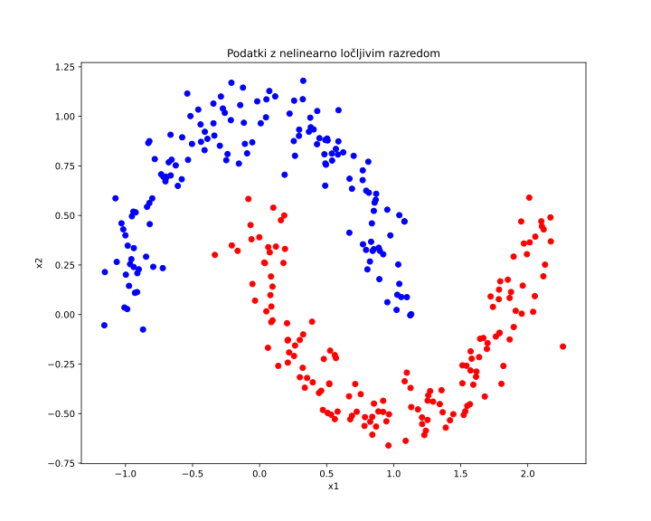
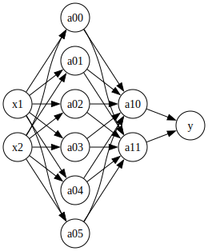
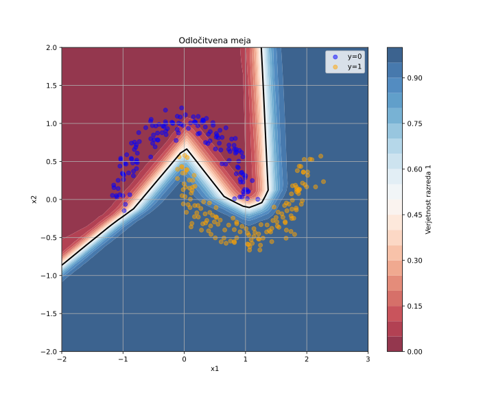
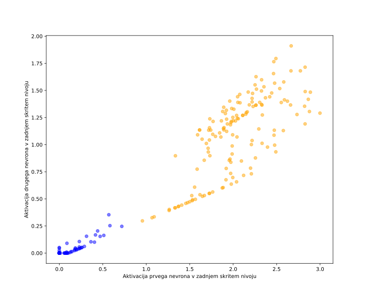
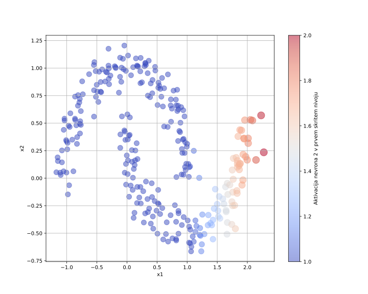

# Nevronske mreže

Tokratno poglavje začnemo s podatki. 

```python
n = 300
from sklearn.datasets import make_moons, make_blobs
X, ys = make_moons(n_samples=n, noise=0.1)
X0 = [x for x, y in zip(X, ys) if y == 0]
X1 = [x for x, y in zip(X, ys) if y == 1]
```

Podatke izrišimo v razsevnem diagramu.



Če podatke uporabimo za učenje logistične regresije, ta sicer poišče mejo med razredi, a z veliko izgubo (`model.loss`), ki znaša okoli 0.3. 

Mejo med dvema razredoma za te podatke lahko sestavimo iz več linearnih odsekov, ki pa jih bi morali nekako zlepiti skupaj. Linearne odseke, vsaj v teoriji, lahko zgradimo z logistično regresijo, njih kombinacijo pa spet poiščemo s tem istim modelom. **Tako kombinacijo logističnih regresij imenujemo nevronska mreža**.

> **Opomba**: Nevronske mreže so dobile ime po podobnosti z biološkimi nevroni v človeških možganih. Prve modele je v štiridesetih letih prejšnjega stoletja razvila dvojica McCulloch in Pitts, sledil pa je večnivojski perceptron Franka Rosenblatta konec petdesetih let. V osemdesetih letih je pomemben preboj omogočila metoda povratnega razširjanja napake (angl. *backpropagation*), ki omogoča učinkovito učenje večnivojskih mrež in ki seveda ni nič drugega kot gradientni sestop z uporabo verižnega pravila pri odvajanju. Tudi perceptron ni nič drugega kot malce slabša logistična regresija. Za nazaj se seveda lahko vprašamo, zakaj se takrat računalničarji niso zgledovali po rešitvah, ki so že obstajale na področju statističnega modeliranja, a zgodovina ne gre vedno naravnost. Ime "nevronske mreže" se je do danes ohranilo, čeprav so sodobne nevronske mreže predvsem matematični modeli brez neposredne povezave z delovanjem pravih možganov.

> **Koda**: programska koda tega poglavja zapiskov s predavanj je dostopna na [GitHub-u](https://github.com/BlazZupan/uozp-zapiski/tree/main/zapiski/080-nevronske-mreže/koda).

## Struktura modela in skriti nivoji

Za modeliranje podatkov z lunicami smo se odločili za nevronsko mrežo s šestimi računskimi enotami na prvem skritem nivoju in dvema na drugem skritem nivoju. Skriti nivoji v nevronskih mrežah so sloji mreže, ki ne komunicirajo neposredno z vhodnimi ali izhodnimi podatki, temveč med sabo obdelujejo vmesne predstavitve podatkov. Računske enote v nevronskih mrežah imenujemo tudi nevroni, iz zgodovinskih razlogov, saj naj bi posnemali delovanje živčnih celic v možganih. V bistvu pa so to preproste funkcije, ki izračunajo uteženo vsoto vhodov, prištejejo pristranskost (angl. *bias*) in rezultat pošljejo skozi neko nelinearno prenosno funkcijo.

> Vprašanje: zakaj mora biti prenosna funkcija nelinearna? Zakaj ne bi bilo čisto v redu, če bi ostali pri linearni funkciji, oziroma enotski prenosni funkciji?

Arhitektura naše nevronske mreže je prikazana na sliki spodaj. Spremenljivki \( x_1 \) in \( x_2 \) sta na vhodu, spremenljivke prvega skritega nivoja so \( a_{0,1} \) do \( a_{0,6} \), spremenljivki drugega skritega nivoja pa \( a_{1,0} \) in \( a_{1,1} \). Spremenljivke \( a_{i,j} \) imenujemo tudi aktivacije nevronov. Aktivacijo \( a_{0,3} \), na primer, izračunamo kot

\[
a_{0,3} = \phi(w_{3,1} x_1 + w_{3,2} x_2 + b_3),
\]

kjer sta \( w_{3,1} \) in \( w_{3,2} \) uteži povezav iz vhodnih spremenljivk \( x_1 \) in \( x_2 \) do tretjega nevrona v prvem skritem nivoju, \( b_3 \) pa je njegova pristranskost. Funkcija \( \phi \) je prenosna funkcija, na primer sigmoida, ki poskrbi za nelinearnost modela.

Na sliki so prikazane povezave, ki predstavljajo uteži \( w_{i,j} \), za večjo preglednost pa povezav za pristranskosti \( b_j \) nismo posebej prikazali. Te si lahko predstavljamo kot dodatne vhodne povezave iz enice (vhodna vrednost 1), ki jih utežimo z \( b_j \).

 

## Prenosne funkcije

Tu omenimo, da bomo v implementaciji kot prenosno funkcijo za nevrone na vseh nivojih, razen za zadnjega, ki izračuna izhod \( y \), uporabili funkcijo ReLU. Funkcija ReLU (angl. *Rectified Linear Unit*) je določena kot

\[
\text{ReLU}(z) = \max(0, z),
\]

torej vrne vhod, če je ta pozitiven, sicer pa nič. Gre za preprosto, a zelo učinkovito nelinearno funkcijo, ki omogoča hitrejše učenje in zmanjšuje problem izginjajočega gradienta. Ta nastane, kadar so gradienti, ki jih pri učenju po metodi gradientnega spusta verižimo nazaj skozi sloje mreže, zelo majhni – kar se pogosto zgodi pri prenosnih funkcijah, kot sta sigmoidna funkcija ali hiperbolični tangens. V tem primeru se uteži v zgodnjih slojih skoraj ne spreminjajo in učenje zastane. Funkcija ReLU ta problem ublaži, saj ima konstanten odvod (enak 1) za pozitivne vrednosti, kar omogoča učinkovitejše širjenje gradienta in s tem hitrejše in stabilnejše učenje.

Za zadnji nevron, ki izračuna izhod \( y \), pa bomo uporabili sigmoidno funkcijo. 

\[
\sigma(z) = \frac{1}{1 + e^{-z}}.
\]

S tem je zadnji nevron pravzaprav logistična regresija, nevronska mreža pa postane nekakšna predobdelava vhodnega signala tako, da problem preslikamo v prostor, kjer so razredi linearno ločljivi. Sigmoida oziroma logistična regresija nam izhodno vrednost omeji na interval med 0 in 1, kar je primerno, saj model napoveduje verjetnost, da primer spada v razred 1. Vrednost izhodne spremenljivke \( y \) torej interpretiramo kot verjetnost, da vhod pripada pozitivnemu razredu.

V namene podpore ReLU moramo knjižnici za strojno odvajanje oziroma razredu `Value` dodati implementacijo za izračun te funkcije in njenega vzvratnega razširjanja gradienta:

```python
    def relu(self):
        out = Value(0 if self.data < 0 else self.data, (self,), 'ReLU')

        def _backward():
            self.grad += (out.data > 0) * out.grad
        out._backward = _backward

        return out
```

## Implementacija nevronske mreže

Nevronsko mrežo zgradimo iz treh razredov: nevrona (računske enote), sloja nevronske mreže, ki ga sestavljajo nevroni v enem nivoju, in nevronske mreže, ki poveže sloje med sabo.

```python
class Neuron:

    def __init__(self, nin, activation='relu'):
        self.w = [Value(random.uniform(-1,1)) for _ in range(nin)]
        self.b = Value(0)
        self.activation = activation
        self.out = None

    def __call__(self, x):
        act = sum((wi*xi for wi,xi in zip(self.w, x)), self.b)
        out = act.sigmoid() if self.activation == 'sigmoid' else act.relu()
        self.out = out
        return out

    def parameters(self):
        return self.w + [self.b]

    def __repr__(self):
        return f"Neuron({len(self.w)})"
```

Razred `Neuron` implementira funkcionalnost posameznega nevron, ki sprejme `nin` vhodov, izračuna uteženo vsoto vhodov z dodano pristranskostjo in rezultat pošlje skozi prenosno funkcijo (privzeta je ReLU, lahko pa je tudi sigmoidno). Funkcija `parameters()` vrne seznam parametrov (uteži) nevrona.

```python
class Layer:

    def __init__(self, nin, nout, **kwargs):
        self.neurons = [Neuron(nin, **kwargs) for _ in range(nout)]

    def __call__(self, x):
        out = [n(x) for n in self.neurons]
        return out[0] if len(out) == 1 else out

    def parameters(self):
        return [p for n in self.neurons for p in n.parameters()]

    def __repr__(self):
        return f"Layer of [{', '.join(str(n) for n in self.neurons)}]"
```

Razred `Layer` predstavlja en nivo mreže, torej sloj nevronov, ki vsi prejmejo enak vhod. Izračun sloja v funkciji `__call__` kliče nevron, ki torej  neodvisno izračuna svojo aktivacijo. Če sloj vsebuje le en nevron (to je, če gre za izhodni nevron), klic vrne skalar, sicer pa seznam aktivacij. Parametri sloja so kar v seznam združeni parametri vseh nevronov v sloju.

```python
class NeuralNetwork:

    def __init__(self, nin, nouts):
        sz = [nin] + nouts
        self.layers = [Layer(sz[i], sz[i+1], \ 
            activation="sigmoid" if i == len(nouts)-1 else "relu") 
            for i in range(len(nouts))]

    def __call__(self, x):
        for layer in self.layers:
            x = layer(x)
        return x

    def parameters(self):
        return [p for layer in self.layers 
            for p in layer.parameters()]

    def __repr__(self):
        return f"NN of [{', '.join(str(layer) 
            for layer in self.layers)}]"
```

Razred `NeuralNetwork` sestavi mrežo tako, da zaporedno poveže njene sloje. Uporabnik določi število vhodov in v seznamu število nevronov v posameznem sloju. Vsi nevroni na skritih nivojih  uporabljajo ReLU, zadnji sloj pa sigmoidno funkcijo za izračun verjetnosti. V funkciji `__call__()` je elegantno implementiran izračun napovedi nevronske mreže, tako da nivoji predajajo aktivacije prejšnjih nivojev naslednjim, vse do zadnjega, izhodnega nivoja, ki ga funkcija vrne. Parametre modele nevronska mreža nabere iz parametrov slojev, ti pa iz parametrov njihovih nevronov. Spomnimo: te parametre (spremenljivke) bomo potrebovali pri gradientnem sestopu, ki jih bo osveževal skladno z njihovimi gradienti.

V zgornji implementaciji razreda `NeuralNetwork` manjkata le funkciji `loss()` in `batch_loss`, ki pa sta identični tem, ki smo jih že spisali za logistično regresijo in jih tu ne navajamo. Enakost seveda ni naključna; za klasifikacijsko nevronsko mrežo je funkcija izgube, oziroma funkcija, ki jo optimiziramo, identična tej od logistične regresije in izvira iz identično podanega verjetja.

## Gradnja modela in njegova modela

Kodo za gradnjo modela nevronske mreže v osnovi že poznamo, a jo vseeno tu navedimo v celoti:

```python
n_hidden = [6, 2]
model = NeuralNetwork(2, n_hidden + [1])

max_iter = 2000
prev_loss = float('inf')

for k in range(max_iter):
    loss = model.batch_loss(X, ys)  # izračunaj izgubo
    loss.backward()  # izračunaj gradiente

    # stopnja učenja se zmanjšuje s časom
    learning_rate = 0.1 - 0.09*k/max_iter 
    for p in model.parameters():
        p.data -= learning_rate * p.grad
    
    if k % 100 == 0:
        current_loss = model.loss(X, ys).data
        print(f"{k:3} Full loss: {current_loss:5.3f}")
        prev_loss = current_loss
```

Nov del je le inicializacija nevronske mreže in pa spremenljiva stopnja učenja. 

Arhitekturo nevronske mreže, čisto iskreno, dobim s poskušanjem, prav tako pa tudi meta parametre učenja, kot so število iteracij, stopnjo učenja in velikost posameznih skritih slojev, ki jih običajno določimo z eksperimentiranjem – najprej preizkusimo preproste nastavitve in nato opazujemo, kako se mreža uči, pri čemer pazimo predvsem na spreminjanje  izgube skozi optimimizacijo. Problem lahko predstavlja tudi preveliko prileganje učnim podatkom, o čemer bomo še razmišljali v prihodnjih poglavjih.

Konvergenca optimizacije za naš model je relativno hitra, seveda pa precej odvisna od inicializacije parametrov modela. Primer konvergence kaže spodnji izpis:

```python
   0 Full loss: 0.774
 100 Full loss: 0.390
 200 Full loss: 0.317
 ...
1800 Full loss: 0.050
1900 Full loss: 0.047
```

Odločitvena meja v prostoru vhodnih atributov idealno razdeli oba razreda, tudi zato, ker sta ta dobro ločljiva. Spomnimo se, da je za ta primer izguba za logistično regresijo bila 0.3.



Zanimivo bi bilo seveda poskusiti z dodajanjem šuma, a se bo s tem in podobnimi eksperimenti morda ukvarjal bralec. Poleg izrisa odločitvene meje v prostoru vhodnih atributov pa je zanimiv tudi izris aktivacijskega prostora v zadnjem skritem nivoju mreže, torej tik preden smo z mrežo preoblikovane podatke podali logistični regresiji, oziroma zadnjemu nevronu v mreži.



Po pričakovanju so razredi v tem prostoru linearno ločljivi. Če ne bi bili, tudi odločitvena meja ne bi bila "čista" oziroma ne bi idealno ločila primere v prostoru vhodnih atributov. Kot smo sicer predvideli že v začetku tega poglavja, gre pri arhitekturi modela, kot smo ga opisali v tem poglavju, za logistično regresijo, ki ji ves preostali del pripravi podatke tako, da so v njih razredi (čimbolj) linearno ločljivi. Nevronska mreža torej služi nekakšni predobdelavi podatkov.

Kaj so potem nevroni v prvem nivoju naše arhitekture? Pričakujemo, da njihove aktivacije izpostavijo posamezne dele prostora vhodnih atributov. Na to kaže tudi primer aktivacije enega od nevronov na tem nivoju, ki jo izrišemo v prostoru vhodnih atributov in ponazorimo z velikostjo točk (primerov v učni množici) in barvo.



## Kam naprej?

Nevronske mreže so seveda pomembne, a s primeri uporabe strojnega odvajanja in gradientnega sestopa še nismo končali. Manjka nam morda še kakšen model, ki bi bil morda drugačen od linearne regresije in klasifikacije. Enega spoznamo že v naslednjem poglavju, kasneje pa izkoristimo izraznost nevronskih mrež za še bolj kompleksne modele.