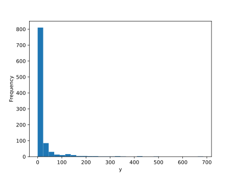

# Poissonova regresija in generalizirani linearni modeli

Začnimo tokrat s podatki. Na voljo imamo tokrat 1000 primerov, danih v datoteki `data.xlsx`, kjer je prvih nekaj primerov prikazanih v spodnji tabeli.

|     x1      |     x2      |     x3      |  y  |
|------------|------------|------------|-----|
|  0.940140  |  0.413858  |  0.710434  | 25  |
|  0.845709  | -0.646196  | -0.713395  |  8  |
| -0.773716  |  0.036149  | -0.168921  |  0  |
|  0.244791  |  0.549901  | -0.439098  | 40  |
| -0.814901  |  0.274670  |  0.718515  |  2  |

Podatki vsebujejo tri neodvisne spremenljivke in eno odvisno, in zanima nas seveda model, ki bi znal dobro napovedovati vrednost odvisne spremenljivke iz vrednosti neodvisnih.

> **Koda**: programska koda tega poglavja zapiskov s predavanj je dostopna na [GitHub-u](https://github.com/BlazZupan/uozp-zapiski/tree/main/zapiski/090-poisson/koda).

## Poskus z linearno regresijo

Problem izgleda kot nalašč za našo mutlivariatno linearno regresijo iz prejšnjih poglavij, in kot inženirji lahko kar poskusimo z njo.

```python
>>> df = pd.read_excel('data.xlsx')
>>> X = df.iloc[:, :-1].values  # vsi stolpci razen zadnjega
>>> ys = df.iloc[:, -1].values  # zadnji stolpec
>>> X_train, X_test, ys_train, ys_test = \
       train_test_split(X, ys, test_size=0.5, random_state=42)
>>> model = LinReg(n_inputs=X.shape[1])
>>> model = train(model, X_train, ys_train, n_epochs=1000, \ 
                  batch_size=20, learning_rate=0.01)
  0 Loss: 3560.577 LinReg(w0=0.160, w1=-0.565, w2=-0.864, b=0.174)
 50 Loss: 2455.258 LinReg(w0=12.366, w1=14.525, w2=-7.967, b=15.864)
100 Loss: 2162.275 LinReg(w0=20.024, w1=23.600, w2=-11.793, b=19.947)
150 Loss: 2069.020 LinReg(w0=23.508, w1=28.634, w2=-13.533, b=20.525)
...
900 Loss: 1969.908 LinReg(w0=30.793, w1=40.072, w2=-15.648, b=21.281)
950 Loss: 1967.754 LinReg(w0=31.061, w1=40.743, w2=-16.373, b=21.409)
>>> model
LinReg(w0=31.356, w1=41.147, w2=-16.639, b=20.958)
```

Podatke smo tokrat razdelili na učno in testno množico, ter parametre modela izluščili samo iz učne množice. Optimizacija na teh podatkih nam sicer hitro skonvergira, a so izgube na učni množici velike. Poglejmo, kakšna je srednja absolutna napaka na testni množici, in jo za občutek primerjajmo s srednjo vrednostjo razreda in njenim standardnim odklonom:

```python
>>> mae = sum([abs(y - model(x).data) 
              for x, y in zip(X_test, ys_test)]) / len(X_test)
>>> y_mean = np.mean(ys_test)
>>> y_std = np.std(ys_test)
>>> print(f"MAE {mae:.1f}, mean {y_test_mean:.1f}, std {y_std:.1f}")
MAE 24.2, mean 18.9, std 53.1
```

Glede na srednjo vrednost je napaka kar velika. Ker so vse razredne vrednosti pozitivne, nas preseneti tudi velik standardni odklon. 

## Vrnitev na podatke

Morda bi morali podatke najprej pogledati in si ogledati, kakšna je porazdelitev vrednosti razreda.



Hm, ni ravno normalna. Veliko je vrednosti blizu nič in zelo malo visokih vrednosti. 

## Poissonova porazdelitev in verjetje

Seveda bi se že pred našim modeliranjem morali zamisliti, kakšna so dejansko porazdelitve vrednosti razreda in kakšen je proces, ki je te vrednosti generiral (domensko znanje). A grad porazdelitve nakazuje, da je šlo za Poissonov proces.

Poissonov proces je stohastični proces, pri katerem modeliramo število pojavov v določenem časovnem ali prostorskem intervalu, pod predpostavko, da se pojavi dogajajo neodvisno in z enakomerno povprečno hitrostjo. Rezultirajoča porazdelitev, ki opisuje verjetnost pojava določenega števila dogodkov \( y \in \{0, 1, 2, \dots\} \), je **Poissonova porazdelitev**. Ta porazdelitev ima en sam parameter, označen z \( \lambda \), ki predstavlja pričakovano število dogodkov v enoti časa ali prostora. Verjetnost, da opazimo točno \( y \) dogodkov, podana z \( \lambda \), je:

\[
P(Y = y \mid \lambda) = \frac{e^{-\lambda} \lambda^y}{y!}
\]

Za Poissonovo porazdelitev je značilno, da je določena samo s tem enim parametrom \( \lambda \), ki določa tako **srednjo vrednost** kot tudi **varianco**:

\[
\mathbb{E}[Y] = \lambda, \text{Var}(Y) = \lambda
\]


Če želimo uporabiti to porazdelitev v regresijskem kontekstu, moramo modelirati parameter \( \lambda \) kot funkcijo značilnosti posameznega opazovanca, to je, kot funkcijo vrednosti atributov. Tipičen pristop je, da \( \lambda \) izrazimo kot eksponent utežene vsote vhodnih spremenljivk:

\[
\lambda = e^{\beta_0 + \beta_1 x_1 + \beta_2 x_2 + \cdots + \beta_p x_p}
\]

ali v vektorski obliki:

\[
\lambda = e^{\boldsymbol{\beta}^\top \mathbf{x}}
\]

Model, kjer predpostavimo, da je odvisna spremenljivka Poissonovo porazdeljena in da je njen parameter \( \lambda \) log-linearna funkcija vhodov, imenujemo **Poissonova regresija**.

Verjetnost, da pri danih vhodih \( \mathbf{x} \) opazimo izhodno vrednost \( y \), je:

\[
P(y \mid \mathbf{x}, \boldsymbol{\beta}) = \frac{e^{-e^{\boldsymbol{\beta}^\top \mathbf{x}}} \cdot \left(e^{\boldsymbol{\beta}^\top \mathbf{x}}\right)^y}{y!}
\]

Ker želimo model naučiti iz podatkov, maksimiziramo verjetnost celotne učne množice. Če predpostavimo, da so primeri \( (\mathbf{x}_i, y_i) \) za \( i = 1, \dots, n \) **neodvisni**, potem je skupna verjetnost produkt posameznih:

\[
P(\mathbf{y} \mid \mathbf{X}, \boldsymbol{\beta}) = \prod_{i=1}^n P(y_i \mid \mathbf{x}_i, \boldsymbol{\beta})
\]

Logaritem te skupne verjetnosti, to je, **logaritem verjetja**, je torej vsota logaritemskih izrazov:

\[
\log P(\mathbf{y} \mid \mathbf{X}, \boldsymbol{\beta}) = \sum_{i=1}^n \left( y_i \cdot \boldsymbol{\beta}^\top \mathbf{x}_i - e^{\boldsymbol{\beta}^\top \mathbf{x}_i} - \log y_i! \right)
\]

Ker člen \( \log y_i! \) ne vsebuje parametrov \( \boldsymbol{\beta} \) je torej konstanten in ga lahko pri optimizaciji izpustimo. Dobimo poenostavljeno kriterijsko funkcijo:

\[
\ell(\boldsymbol{\beta}) = \sum_{i=1}^n \left( y_i \cdot \boldsymbol{\beta}^\top \mathbf{x}_i - e^{\boldsymbol{\beta}^\top \mathbf{x}_i} \right)
\]

To je funkcija, ki jo maksimiziramo pri učenju modela s pomočjo gradientnega spusta ali drugih optimizacijskih tehnik.

Pri napovedovanju s takim modelom upoštevamo, da je pričakovana vrednost Poissonove porazdelitve s parametrom \( \lambda \) določena kot:

\[
\mathbb{E}[Y] = \lambda
\]

Ker v Poissonovi regresiji modeliramo parameter \( \lambda \) kot funkcijo vhodnih podatkov \( \mathbf{x} \):

\[
\lambda = e^{\boldsymbol{\beta}^\top \mathbf{x}}
\]

je napovedana pričakovana vrednost ciljne spremenljivke \( y \) enaka:

\[
\hat{y} = \mathbb{E}[y \mid \mathbf{x}] = e^{\boldsymbol{\beta}^\top \mathbf{x}}
\]

## Poisonova regresija v kodi

Zgornje predstavimo v kodi. Ta bo močno podobna kodi, ki smo jo že razvili za linearno regresijo, in zato tu samo nadaljujmo:

```python
class PoissonReg(LinReg):
    def __call__(self, x):
        return super().__call__(x).exp()
    
    def loss(self, X, ys):
        yhats = [self(x) for x in X]
        return -sum([y * yhat.log() - yhat for y, yhat in zip(ys, yhats)]) \
               / len(ys)
```

Močno preprosto! V našo implementacijo razreda `Value` moramo sicer dodati še eksponentno funkcijo:

```python
    def exp(self):
        out = Value(math.exp(self.data), (self,), 'exp')

        def _backward():
            self.grad += out.data * out.grad
        out._backward = _backward
        return out
```

Čas je za test, kako se zgornje obnaša na naših podatkih:

```python
>>> model = PoissonReg(n_inputs=X.shape[1])
>>> model = train(model, X_train, ys_train, n_epochs=1000, batch_size=20, learning_rate=0.01)
  0 Loss: 9.152 LinReg(w0=-0.604, w1=-0.700, w2=-0.873, b=0.269)
 50 Loss: -74.255 LinReg(w0=1.633, w1=2.171, w2=-0.858, b=1.739)
100 Loss: -75.224 LinReg(w0=1.909, w1=2.643, w2=-0.911, b=1.362)
...
900 Loss: -75.402 LinReg(w0=2.007, w1=3.020, w2=-0.978, b=1.008)
950 Loss: -75.403 LinReg(w0=2.012, w1=3.007, w2=-0.959, b=1.013)
>>> model
LinReg(w0=2.010, w1=2.979, w2=-0.962, b=0.989)
```

> Opomba: `LinReg` zgoraj nam je seveda ostal iz implementacije linearne regresije in njene funkcije `__repr__()`. Bralcu prepuščamo, da implementira ustrezno spremembo na čim krajši način.

Konvergenca učenja je tokrat hitra, parametri modela pa pričakovano popolnoma drugačni od linearne regresije. V naslednjem koraku seveda ocenimo točnost modela na tesnih podatkih:

```python
>>> error = sum([abs(y - model(x).data) for x, y in zip(X_test, ys_test)]) 
>>> mae = error / len(X_test)
>>> print(f"{mae:.1f}")
2.2
```

Napaka je za faktor 10 manjša kot pri linearni regresiji! Linearna regresija, pravzaprav, na teh podatkih popolnoma odpove. Poissonova regresija pa se izkaže za odlično.

## Kje naletimo na takšne podatke?

Če smo iskreni: podatke smo za naš primer generirali:

```python
n = 1000
X = [[random.uniform(-1, 1) for _ in range(3)] 
     for _ in range(n)]
ys = [np.random.poisson(np.exp(2*x[0] + 3*x[1] - x[2] + 1))
      for x in X]
```

Zato ni čudno, da je Poissonova regresija zgradila tako dober model. Tudi uteži v linearni kombinaciji atributov je optimizacija dobro zadela. 

Ali lahko take podatke srečamo v praksi pogosto? Poissonova regresija bo posebej uporabna pri modeliranju številskih odzivov, kjer so vrednosti cela števila, nenegativne in asimetrično porazdeljene — pogosto z veliko vrednostmi blizu nič ter redkimi večjimi vrednostmi. Primeri, kjer srečamo take podatke, so:

- število obiskov določene spletne strani v danem časovnem intervalu,
- število klicev na telefonsko centralo na dan,
- število okvar na proizvodni liniji v določenem obdobju,
- število komentarjev pod spletnimi novicami ali objavami,
- število sprejemov pacientov v bolnišnico na dan,
- število prometnih nesreč na posameznih odsekih cest.

V vseh teh primerih je izhodna spremenljivka število dogodkov, ki jih lahko modeliramo s Poissonovo regresijo, medtem ko vhodne spremenljivke opisujejo okoliščine (atribute), ki vplivajo na pogostost teh dogodkov.

## Generalizirani linearni modeli

Linearna, logistična in Poissonova regresija so posebni primeri t. i. **generaliziranih linearnih modelov (GLM)**. Ti modeli predpostavljajo, da lahko pričakovano vrednost ciljne spremenljivke \( y \) izrazimo kot transformacijo linearne kombinacije vhodnih podatkov:  
\[
g(\mathbb{E}[y]) = \boldsymbol{\beta}^\top \mathbf{x}
\]  
kjer je \( g \) povezovalna funkcija (link function), izbrana glede na porazdelitev ciljne spremenljivke.

Koncept generaliziranih linearnih modelov omogoča modeliranje različnih vrst odvisnih spremenljivk, kot kaže spodnja tabela:

| Model                | Porazdelitev \( y \) | Povezovalna funkcija \( g \) | Primer uporabe                          |
|---------------------|----------------------|-------------------------------|-----------------------------------------|
| Linearna regresija   | Normalna             | identiteta                    | Napoved cene, temperature               |
| Logistična regresija | Bernoullijeva        | logit                         | Binarna klasifikacija          |
| Poissonova regresija | Poissonova           | logaritem                     | Štetje dogodkov (komentarji, klici)     |
| Binomska regresija   | Binomska             | logit ali probit             | Delež uspehov pri ponovitvah            |
| Negativna binomska   | Negativna binomska   | logaritem                     | Štetje z večjo varianco (overdispersion)|
| Gamma regresija      | Gamma                | inverz (ali logaritem)        | Modeliranje časa ali stroškov           |

Ta pristop omogoča uporabo enotnih metod za učenje in interpretacijo modelov, hkrati pa ponuja fleksibilnost pri izbiri porazdelitve glede na naravo podatkov.
