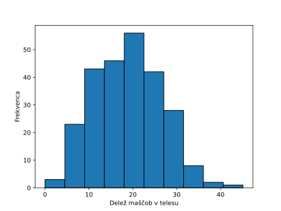

# PyTorch, regularizacija in odkrivanje znanj z rangiranjem značilk

> **Koda**: programska koda tega poglavja zapiskov s predavanj je dostopna na [GitHub-u](https://github.com/BlazZupan/uozp-zapiski/tree/main/zapiski/100-pytorch/koda).

V tem poglavju se seznanimo s knjižnico PyTorch, ki je danes ena najpogosteje uporabljenih knjižnic za razvoj modelov strojnega učenja in globokega učenja. V prejšnjih poglavjih smo razvili lastno knjižnico za strojno odvajanje, ki temelji na podobnih konceptih, kot jih uporablja PyTorch – vključno z gradniki modelov, izračunom modela, izračunom gradientov in optimizacijo. Ker pa je PyTorch veliko bolj splošen, zmogljiv in obenem optimiziran za hitro izvajanje na grafičnih procesorjih, bomo od tega poglavja naprej prešli na njegovo uporabo. Osnovno razumevanje konceptov strojnega odvajanja, cenovnih funkcij in uporabe strukture modelov, kot smo jih spoznali v prejšnjih poglavjih, nam bo pri tem v veliko pomoč.

Da pa ne bomo samo spoznavali PyTorcha, spodnje primere izkoristimo tudi za utrjevanje oziroma nadgradnjo znanj o pomembnih temah, kot so regularizacija, vrednotenje uspešnosti modelov ter iskanje optimalnih vrednosti parametrov učenja oziroma t. i. meta-parametrov.

V spodnji kodi bomo uporabljali podatkovni nabor, kjer je odvisna spremenljivka ocenjen delež telesne maščobe, pridobljene z metodo podvodnega tehtanja, neodvisne spremenljivke pa so različne telesne meritve za 252 moških. Podatki izvirajo iz leta 1985 in so se zgodaj pojavili v repozitorijih podatkov za strojno učenje, kjer so se pogosto uporabljali za raziskave in razvoj metod napovednega modeliranja. Naš cilj bo zgraditi model, ki iz telesnih meritev lahko napove ciljno spremenljivko (v originalnih podatkih je ta imenovana *body fat brozek*). Nekaj primerov z izbranimi atributi je, podatki v originalni obliki pa so sicer na voljo na spletnih straneh [Kaggle](https://www.kaggle.com/datasets/fedesoriano/body-fat-prediction-dataset).

| age | weight | height | adiposity | neck | body fat brozek |
|-----|--------|--------|-----------|------|-----------------|
| 23  | 154.25 | 67.75  | 23.7      | 36.2 | 12.6            |
| 22  | 173.25 | 72.25  | 23.4      | 38.5 | 6.9             |
| 22  | 154.00 | 66.25  | 24.7      | 34.0 | 24.6            |
| 26  | 184.75 | 72.25  | 24.9      | 37.4 | 10.9            |
| 24  | 184.25 | 71.25  | 25.6      | 34.4 | 27.8            |

Na tem mestu bi sicer bilo zelo dobro odlično se seznaniti s podatki, kar tu prepustimo bralcu. Povejmo le, da je vseh 14 vhodnih spremenljivk zveznih in da so njihove zaloge vrednosti lahko precej različne. Vrednosti obsega vratu bodo seveda nižje od obsega oprsja. Spodnji graf prikazuje porazdelitev vrednosti ciljne spremenljivke.



Izračunamo še povprečno vrednost in standardni odklon ciljne spremenljivke:

```python
>>> df.iloc[:, -1].mean()
18.938492063492063
>>> df.iloc[:, -1].std()
7.750855659481732
```

## Linearna regresija

Podatke najprej naložimo iz vhodne datoteke. Pomagamo si s knjižnico `Pandas`.

```python
df = pd.read_excel('body-fat-brozek.xlsx')
X = df.iloc[:, :-1].values
X = (X - X.mean(axis=0)) / X.std(axis=0)  # Z-score normalization
ys = df.iloc[:, -1].values
```

Spremenljivka `X` vsebuje vse vhodne spremenljivke, `ys` pa hrani vrednosti zveznega razreda. Vhodne spremenljivke standardiziramo, saj želimo, da jih linearna regresija obravnava enako oziroma da so uteži atributov, ki jih bomo dobili z učenjem modela, med seboj primerljive. Tako zapisani podatki niso kompatibilni s knjižnico PyTorch; za pretvorbo v 32-bitne zapise s tenzorji, ki jih ta knjižnica uporablja, bomo uporabili sledečo kodo:

```python
def to_tensor(X):
    return torch.tensor(X, dtype=torch.float32)

X_train, X_test, ys_train, ys_test = (
    to_tensor(d) for d in train_test_split(X, ys, \
       test_size=0.5, random_state=42))
ys_train = ys_train.view(-1, 1)
ys_test = ys_test.view(-1, 1)
```

Uporabili smo funkcijo `train_test_split`, ki nam razdeli podatke na učno in testno množico, vsak del podatkov pa nato pretvorimo v PyTorchove tenzorje. Ciljne vrednosti preoblikujemo z `.view(-1, 1)` v vektorsko obliko stolpca, saj PyTorchov razred `nn.Linear`, ki ga bomo uporabili za strukturo našega modela, pričakuje dvodimenzionalni vhod. Pri tem prvi argument `-1` pomeni, da naj PyTorch samodejno izračuna ustrezno število vrstic glede na velikost podatkov in drugo dimenzijo. V tem primeru bo to število enako številu vzorcev v učni ali testni množici. Drugi argument `1` pomeni, da naj ima vsaka vrstica eno samo vrednost – torej gre za vektor stolpca. Rezultat oblike `(-1, 1)` je torej tenzor oblike *[število vzorcev, 1]*, ki je združljiv z zahtevami modela.

Poleg podatkov sedaj določimo še strukturo modela. Začnemo z enostavnim linearnim modelom, kjer število spremenljivk ustreza številu vhodni atributov in je torej enako širini matrike `X`. Izhod je en sam. Uporabili bomo optimizacijo tipa `SGD` (stohastični gradientni spust) za posodabljanje uteži. Kot alternativo temu bi lahko sicer uporabili tudi sicer danes bolj popularen optimizator `Adam` (`torch.optim.Adam`). Atribut `lr` določa stopnjo učenja.

> **Opomba**: Adam (angl. *Adaptive Moment Estimation*) je optimizacijski algoritem, ki med učenjem samodejno prilagaja stopnje učenja posameznim parametrom. Uporablja kombinacijo dveh momentov: povprečje gradientov (prvi moment, tipa hitrost) in povprečje kvadratov gradientov (za prilagodljivo skaliranje, kot drugi moment, tipa pospešek). V primerjavi s preprostim gradientnim spustom, kjer je stopnja učenja določena in navadno fiksna ter enaka za vse parametre, Adam omogoča hitrejšo in stabilnejšo konvergenco, še posebej pri kompleksnejših modelih in podatkih z veliko dimenzijami.

```python
model = nn.Linear(X.shape[1], 1)
optimizer = torch.optim.SGD(model.parameters(), lr=0.001)
```

Za učenje potrebujemo le še določiti funkcijo izgube. Skladno z modelom uporabimo povprečno vrednost kvadratne napake, `MSELoss`. Osnovna zanka, ki vsakič izvede en korak optimizacije, je:

```python
for epoch in range(10000):
    optimizer.zero_grad()
    loss = nn.MSELoss()(model(X_train), ys_train)
    loss.backward()
    optimizer.step()

    if (epoch+1) % 1000 == 0:
        print(f"Epoch {epoch+1:5d}/1000, Loss: {loss.item():.4f}")
```

Model se uči skozi 10.000 iteracij oziroma epoh. V vsakem koraku gradiente nastavimo na nič, nato izračunamo izgubo po kriteriju srednje kvadratne napake, izračunamo gradiente spremenljivk modela (uteži) in te skladno z izračunanimi gradienti ustrezno posodobimo. Izgubo izpišemo vsakih 1000 epoh. Konvergenca je relativno hitra, pomagal pa bi večji učni korak in morda Adam.

```python
Epoch  1000/1000, Loss: 28.4076
Epoch  2000/1000, Loss: 19.7636
...
Epoch  9000/1000, Loss: 15.8355
Epoch 10000/1000, Loss: 15.6135
```

Dobljeni model lahko ovrednotimo na testni množici. 

```python
with torch.no_grad():
    mae = torch.mean(torch.abs(model(X_test) - ys_test)).item()
```

Zgoraj smo s `torch.no_grad()` izklopili izračun gradientov; ta izklop sicer ni potreben, pomaga pa pri pohitritvi izračunov in privarčuje nekaj spomina. 

```python
>>> mae
3.3760273456573486
```

S to srednjo absolutno napako smo skoraj zadovoljni. Napaka je precej manjša, kot če bi napovedovali s srednjo vrednostjo razreda učne množice (MAE=6.12), tudi R2 je pri skoraj 0.70 precej visok. Bralcu prepuščamo razvoj kode za vse te ocene, tu pa raje poglejmo, kakšne so uteži atributov:

```python
with torch.no_grad():
    weights = model.weight.data.squeeze()
    features = df.columns[:-1]
    sorted_weights = sorted(zip(weights, features), 
                          key=lambda x: abs(x[0]), 
                          reverse=True)
    for weight, name in sorted_weights:
        print(f"{name}: {weight:.4f}")
```

Rezultati so lepo razložljivi:

```python
abdomen  :  8.5340
hip      : -1.4323
age      :  1.2968
wrist    : -1.2908
chest    : -1.2765
adiposity:  0.9341
weight   : -0.7431
tight    :  0.7068
height   : -0.6726
biceps   :  0.5828
knee     :  0.5098
neck     : -0.2434
ankle    :  0.0959
forearm  :  0.0405
```

Faktor, ki je najbolj povezan z deležem maščob v telesu moških je, pričakovano, obseg trebuha. Ostali atributi sicer tudi sodelujejo v tem modelu, a z znatno manjšo stopnjo.

## Regularizacija

Recimo, da je naš cilj zgraditi model, ki bi uporabil čim manj vhodnih spremenljivk oziroma zahteval čim manj meritev, ob tem, da še vedno čimbolj obdržimo njegovo točnost. Klasično bi to v strojnem učenju izvedli s postopkom izločanja spremenljivk, na primer eno za drugo, tako, da bi iz npr. zgornje analize izključili spremenljivko `forearm` ter nadaljevali postopek, kjer bi vsakič izključili spremenljivko, ki je najslabše rangirana. Pri tem bi merili točnost na testni množici in se ustavili takrat, ko bi se ta neprimerno poslabšala.

Zgoraj opisani postopek ima vrsto problemov, eden je na primer že ta, da smo testno množico pravzaprav zlorabili za ugotavljanje ustavitvenega pogoja in je na ta način potem ne smemo več uporabljati v namene ocenjevanja točnosti (tole pisci tega besedila vedo, da ni enostavno, a se na koncept popolne ločenosti učne in testne množice podatkov še vrnemo). 

Linearna regresija, kot tudi postopki, ki sicer temeljijo na določitvi modela z utežmi, pa v optimizaciji podpirajo popolnoma drugačni pristop. Ta se imenuje regularizacija: namesto da bi ročno izključevali posamezne spremenljivke, dodamo k funkciji napake še kazen za velikost uteži v modelu. S tem model kaznujemo, kadar uporablja preveč ali prevelike uteži, kar ga prisili, da raje poišče preprostejšo rešitev z manjšim številom aktivnih vhodnih spremenljivk. Takšen pristop ne potrebuje neposrednega poseganja v strukturo podatkov in omogoča, da proces ostane znotraj ene same optimizacijske naloge, pri čemer še vedno lahko ohranimo ločeno testno množico za končno oceno točnosti modela.

Najpogosteje sta v uporabi dva tipa regularizacije: **L2-regularizacija** (angl. *ridge regression*) in **L1-regularizacijo** (angl. *lasso regression*). Ime *ridge* izhaja iz oblike rešitvene površine pri optimizaciji, kjer se zaradi kvadratnega pogoja nad vrednostmi uteži rešitve ahajajo na grebenih (angl. *ridges*) eliptičnih kontur. Po drugi strani pa *lasso* pomeni *Least Absolute Shrinkage and Selection Operator* – torej operator za krčenje in izbor – kar opisuje njen glavni učinek: zmanjševanje (angl. *shrinking*) uteži in hkrati izbor značilk, saj se nekatere uteži med optimizacijo zmanjšajo točno na nič. L2-regularizacija dodaja k funkciji napake vsoto kvadratov uteži, kar vodi do bolj stabilnih rešitev, odpornih na šum, a ohrani vse značilke. L1-regularizacija pa dodaja vsoto absolutnih vrednosti uteži in omogoča redčenje modela, saj izloči nepomembne vhodne spremenljivke. Zato je L1 še posebej primerna, kadar želimo model, ki uporablja le najpomembnejše značilke.

Po tem daljšem uvodu je čas, da uvedemo spremembe v naši kodi za učenju. Idealno bi sicer bilo, da je sprememba ena sama, torej ta, ki nam določa izgubo:

```python
    lambda_reg = 0.5
    mse_loss = nn.MSELoss()(model(X_train), ys_train)
    l1_norm = sum(param.abs().sum() for name, param \
       in model.named_parameters() if 'weight' in name)
    loss = mse_loss + lambda_reg * l1_norm
```

Stopnjo regularizacije določa `lambda_reg`; če ta zavzame vrednost 0, bodo rezultati enaki kot pri neregularizirani regresiji. Kaj pa se zgodi, če ta zavzame zelo visoko vrednost? Ob tem bi veljajo izpostaviti, da regulariziramo samo uteži spremenljivk, in ne konstante vrednost (angl. *intercept*) v enačbi linearne regresije.

Problem je sedaj več. Prvi je, da moramo primerno določiti stopnjo regularizacije. Obstaja pa še večji: sprememba, ki smo jo zgoraj opisali, ni dovolj. Če se še tako trudimo z izborom optimizacijskih parametrov, nam rešitev ne skonvergira tako, da bi bile katere od uteži točno enake nič. Vendar PyTorchov optimizator SGD (ali Adam) sam po sebi tega ne zmore, saj gradientna metoda zaradi narave odvajanja absolutne vrednosti ne more proizvesti natančne ničle. Da bi dosegli pravin učinek regularizacije L1, moramo uporabiti poseben postopek, imenovan mehko pragovno filtriranje (angl. *soft thresholding*), ki ga po vsakem koraku optimizacije uporabimo neposredno na utežeh. To dosežemo z naslednjo funkcijo:

```python
def soft_threshold(param, lmbd):
    with torch.no_grad():
        param.copy_(param.sign() * torch.clamp(param.abs() - lmbd, min=0.0))
```

Vrstica `param.copy_(param.sign() * torch.clamp(param.abs() - lmbd, min=0.0))` izvede mehko pragovno filtriranje, ki vsak parameter zmanjša za vrednost `lmbd`, če je ta večja od `lmbd`, in ga postavi na nič, če je manjša. To naredi tako, da najprej izračuna absolutno vrednost parametra in od nje odšteje `lmbd`, negativne vrednosti nastavi na 0, nato pa rezultat pomnoži z znakom originalnega parametra, da ohrani predznak. S tem neposredno popravimo uteži modela in dosežemo pravi učinek L1-regularizacije – izničevanje majhnih uteži in redčenje modela. Ukaz `param.copy_(...)` v PyTorch neposredno prepiše vsebino tenzorja `param` z novo vrednostjo, brez ustvarjanja novega objekta in brez sledenja gradientom (še posebej znotraj `torch.no_grad()`). Uporablja se, kadar želimo ročno spremeniti uteži modela.

Koda z optimizacijo z vsemi zgornjimi spremembami je zdaj:

```python
for epoch in range(1000):
    optimizer.zero_grad()
    mse_loss = nn.MSELoss()(model(X_train), ys_train)
    l1_norm = sum(param.abs().sum() for name, param in model.named_parameters() if 'weight' in name)
    loss = mse_loss + lambda_reg * l1_norm
    loss.backward()
    optimizer.step()
    soft_threshold(model.weight, lambda_reg * 0.1)
```

ima dobro konvergenco:

```python
Epoch 100/1000, Loss: 30.3964
Epoch 200/1000, Loss: 22.6228
...
Epoch 900/1000, Loss: 20.1499
Epoch 1000/1000, Loss: 20.1249
```

in ob primerni točnosti na testnih podatkih (MAE=3.50) izbere, pri naših nastavitvah učnih parametrov, samo nekaj spremenljivk:

```python
abdomen  :  6.0088
height   : -0.9168
age      :  0.7826
biceps   :  0.0076
wrist    : -0.0025

```

Število teh bi lahko pri povečanju stopnje regularizacije še zmanjšali, a morda tudi na račun točnosti.

## Prestrukturiranje kode

Zgornja koda naše regularizirane linearne regresije se je razrasla, in tudi če bralec pogleda datoteko z njeno celotno implementacijo (glej [GitHub](https://github.com/BlazZupan/uozp-zapiski/tree/main/zapiski/100-pytorch/koda)), nam kača, ki smo jo zgradili, ni ravno v ponos. Pa tudi, nestrukturiranost nas bo ovirala pri razvoju konceptov, ki jih v nadaljevanju tega poglavja nameravamo še zgraditi. Primer lepo strukturirane kode za gradnjo modelov strojnega učenja je knjižnica scikit-learn (oziroma krajše `sklearn`), ki v osnovi v razredih modelov implementira funkciji `.fit` za učenje in `.predict` za napovedovanje. Primer linearne regresije v tej knjižnici je na primer:

```python
from sklearn.linear_model import LinearRegression

model = LinearRegression()      # ustvarimo model
model.fit(X_train, y_train)     # učimo model
y_pred = model.predict(X_test)  # zgradimo napovedi
```

Želja v tem podpoglavju je strukturirati našo kodo tako, da bo njena zgradba podobna modelom iz knjižnice `sklearn`:

```python
class LassoRegression():
    def __init__(self, lr=0.001, lambda_reg=0.5, epochs=1000):
        self.lr = lr
        self.lambda_reg = lambda_reg
        self.epochs = epochs
        self.model = None
        self.optimizer = None
        self.feature_names_ = None
        
    def _soft_threshold(self, param, lmbd):
        with torch.no_grad():
            param.copy_(param.sign() * torch.clamp(param.abs() - lmbd, min=0.0))
    
    def fit(self, X, y):
        # učenje modela
        X = torch.tensor(X, dtype=torch.float32)
        y = torch.tensor(y, dtype=torch.float32).view(-1, 1)
        
        self.model = nn.Linear(X.shape[1], 1)
        # self.optimizer = torch.optim.Adam(self.model.parameters(), lr=self.lr)
        self.optimizer = torch.optim.SGD(self.model.parameters(), lr=self.lr)
        
        for epoch in range(self.epochs):
            self.optimizer.zero_grad()
            preds = self.model(X)
            mse_loss = nn.MSELoss()(preds, y)
            l1_norm = sum(param.abs().sum() for name, 
                          param in self.model.named_parameters() 
                          if 'weight' in name)
            loss = mse_loss + self.lambda_reg * l1_norm
            loss.backward()
            self.optimizer.step()
            self._soft_threshold(self.model.weight, self.lambda_reg)
            
            if (epoch + 1) % 100 == 0:
                print(f"Epoch {epoch+1:4d}/{self.epochs}, Loss: {loss.item():.4f}")
                non_zero = (self.model.weight.data.abs() > 1e-6).sum().item()
                print(f"Non-zero weights: {non_zero}")
        
        return self
    
    def predict(self, X):
        # napovedovanje
        check_is_fitted(self)
        X = check_array(X)
        X = torch.tensor(X, dtype=torch.float32)
        
        with torch.no_grad():
            return self.model(X).numpy()
    
    def get_feature_importance(self):
        # izlušči pomembnosti značilk
        check_is_fitted(self)
        with torch.no_grad():
            weights = self.model.weight.data.squeeze().numpy()
            return weights
    
    def set_feature_names(self, feature_names):
        # nastavi imena značilk
        self.feature_names_ = feature_names
        return self
```

Od metod ki so lastne razredu smo zgoraj še izpustili `print_feature_importance()`, ki pa se ukvarja v glavnem samo z izpisom in jo zato tu ne bomo posebej obravnavali.

Uporaba našega modela je zdaj preprosta:

```python
model = LassoRegression(lr=0.001, lambda_reg=0.001, epochs=1000)
model.set_feature_names(df.columns[:-1])
model.fit(X_train, y_train)

# vrednotenje
y_pred = model.predict(X_test)
mae = np.mean(np.abs(y_pred - y_test))
print(f"\nTest MAE: {mae:.4f}")

# izpis uteži značilk
print("\nFeature importance:")
model.print_feature_importance()
```

## Paketno učenje

Pozoren bralec bo opazil, da smo v zgornji kodi v vsakem koraku optimizacije uporabili vse učne podatke in pozabili na paketno učenje. To lahko enostavno popravimo in uvedemo paketno učenje. Tokrat tako, da bomo v vsaki iteraciji učenja, torej, v vsaki eophi, uporabili celotno učno množico, a bo učenje iz nje potekalo po paketih. Torej, zanka v zanki. Sprememba zadeva samo funkcijo `fit()`, ter nastavitev parametra `batch_size` ob inicializaciji razreda `LassoRegression`.

```python
dataset = TensorDataset(X, y)
dataloader = DataLoader(dataset, batch_size=self.batch_size, shuffle=True)

for epoch in range(self.epochs):
    epoch_loss = 0.0
    for X_batch, y_batch in dataloader:
        self.optimizer.zero_grad()
        y_hat = self.model(X_batch)
        mse_loss = nn.MSELoss()(y_hat, y_batch)
        l1_norm = sum(param.abs().sum() for name, 
                        param in self.model.named_parameters() 
                        if 'weight' in name)
        loss = mse_loss + self.lambda_reg * l1_norm
        loss.backward()
        self.optimizer.step()
        self._soft_threshold(self.model.weight, self.lambda_reg)
        epoch_loss += loss.item()
```

Optimizacija z enakim številom epoh, torej, zunanjih iteracij optimizacije bo seveda počasnejša kot prej, a bo konvergenca hitrejša in načeloma omogočala manjše število iteracij:

```python
Epoch  100/1000, Loss: 20.3806
Epoch  200/1000, Loss: 19.3669
Epoch  300/1000, Loss: 19.3277
Epoch  400/1000, Loss: 19.3285
...
```

Pravzaprav bi bilo nekaj sto epoh sedaj za učenje dovolj.

## Učenje standardizacije podatkov

Vsa koda zgoraj vsebuje dokaj prikrito napako, ki morda ni usodna, ampak konceptualno še vedno velika. In sicer standardiziramo vse podatke naenkrat, potem pa razdelimo podatke na učno in testno množico. Standardizacija je torej testno množico že "videla", kar je seveda narobe in vsaj v nekem majhnem delu vodi v preoptimistične napovedi. Pravilno bi bilo, da bi se standardizacije naučili na učni množici ter jo potem kot tako uporabili vsakič, ko napovedujemo. Naučiti se standardizacije v našem primeru pomeni, da na učni množici ocenimo povprečje in standardni odklon, si ga zapomnimo, in potem to uporabimo na podatkih, za katere napovedujemo razred.

Zgornji popravek lahko implementiramo na dva načina. Po "domače" bi lahko iz učne množice izračunali standardizacijske parametere in si jih zapomnili, lahko pa uporabimo from `StandardScaler` iz knjižnice `sklearn`, ki je bil razvit v prav te namene, torej ločeno učenje in uporabo. Koda, ki jo moramo primerno razporediti po naši implementaciji je:

```python
self.scaler = StandardScaler()  # ob inicializaciji razreda
X = self.scaler.fit_transform(X)  # ob klicu fit()
X = self.scaler.transform(X)  # ob klicu predict()
```

## Vpliv stopnje regularizacije na točnost

Točnost modela tako na učnih kot na testnih podatkih je seveda odvisna od stopnje regularizacije. Vsaj na učnih podatkih je ta povezava zelo jasna: višja je stopnja regularizacije, bolj se optimizacija usmeri v zmanjšanje vrednosti uteži in manj je osredotočena na zmanjševanje napake. Kako to vpliva na točnost na testnih podatkih pa bo zelo odvisno od podatkov, a kar pričakujemo je: kompleksni (neregularizirani) modeli se morda lahko preveč prilagodijo učnim podatkom in je zato njihova točnost na testnih podatkih manjša. Prav tako pa bo točnost na testnih podatkih majhna pri enostavnejših, močno zreguliranih modelih. Morda te razlike, vsaj pri manjših regularizacijah, ne bodo tako opazne pri linearni regresiji saj je model že sam po sebi enostaven. Čas je sicer, da poskusimo.

```python
print("lambda atts  MAE-test MAE-train")
for lambda_reg in lambda_regs:
    model = LassoRegression(lr=0.01, lambda_reg=lambda_reg, epochs=1000)
    model.set_feature_names(df.columns[:-1])

    mae_test = learn_and_score(model, X_train, y_train, X_test, y_test)
    y_pred = model.predict(X_train)
    mae_train = np.mean(np.abs(y_pred - y_train))

    k = sum(model.get_feature_importance() != 0)
    print(f"{lambda_reg:5.3f}    {k:2d}    {mae_test:.2f}    {mae_train:.2f}")
```

Naše hipoteze so se, vsaj na tej učni množici, izkazale kot točne (z `lambda` smo označili stopnjo regularizacije, `atts` število atributov z neničelno utežjo, preostali dve koloni pa poročajo o napaki na testni in učni množici):

```python
lambda atts  MAE-test MAE-train
0.001    14    3.52    3.02
0.002    13    3.44    3.12
0.005    11    3.30    3.42
0.010    11    3.42    3.54
0.025     4    3.57    3.88
0.040     1    3.73    4.16
0.050     1    3.88    4.36
0.100     4    5.18    5.74
0.200     0    6.13    6.56
0.500     0    6.13    6.56
```

Kot smo že predpostavili so razlike pri manjših regularizacijah manjše in najbrž statistično neznačilne. Seveda so ti rezultati tudi odvisni od vzorčenja, zato moramo biti pri zaključkih previdni. Je res prav, da na podlagi zgornjega izberemo stopnjo regularizacije okoli 0.025?

## Izbor stopnje regularizacije z notranjim prečnim preverjanjem

Najbrž smo ob kodi, kot je zgornja, v skušnjavi, da že kar rečemo, kakšna je "prava" vrednost regularizacije z ozirom na točnost na testnih podatkih in potem iz zgornje tabele to točnost odčitali in jo vzeli za oceno našega modela. To bi bilo napačno: vrednost parametra optimizacije bi na ta način prilagodili naši testni množici, torej na množici, ki jo pri izboru modela, njegovih parametrov, ali pa meta parametrov postopka učenja sploh ne bi smeli uporabiti in bi jo lahko uporabili samo za ocenjevanje točnost že zgrajenega modela po tem, ko sprejmemo vse odločitve, kako bomo model dejansko zgradili.

Ocena točosti je namreč tista, ki nam pove, kako natančen bo model takrat, ko ga bomo uporabili na novih podatkih. Del gradnje modela je tudi ocena primerne vrednosti stopnje regularizacije, za katero nikakor ne smemo uporabiti testne podatke.

Ocenjevanje stopnje regularizacije moramo torej opraviti samo na učnih podatkih. Ta tudi ne bi smela biti odvisna od ene same delitve učnih podatkov na tiste, na katerih bomo model gradili in na tiste, ki jih bomo uporabili za oceno učinka regularizacije.

Postopamo sledeče. Testnih podatkov se pri gradnji modela ne bomo dotaknili. Stopnjo regularizacije bomo ocenili na učnih podatkih, te pa bomo v ta namen večkrat delili na podatke za učenje in podatke za oceno točnosti modela pri izbrani stopnji regularizacije. To točnost bomo povprečili in na ta način dobili seznam regularizacijskih stopenj in povprečnih točnosti takih modelov. Nato bomo izbrali regularizacijo z najboljšo ocenjeno točnostjo in to uporabili za učenje našega končnega modela, katerega točnost bomo potem ocenili na ločeni testni množici, ki se je v celotnem procesu učenja nismo dotaknili. Spodaj je koda za učenje takega modela:

```python
def fit_one(self, X, y, lambda_reg=None):
    """Fit the model with a single regularization parameter."""
    if lambda_reg is not None:
        self.lambda_reg = lambda_reg
        
    # Fit scaler only on training data
    X = self.scaler.fit_transform(X)
    
    # pretvori podatke v tenzorje
    X = torch.tensor(X, dtype=torch.float32)
    y = torch.tensor(y, dtype=torch.float32).view(-1, 1)
    
    # postavi model in optimizator
    self.model = nn.Linear(X.shape[1], 1)
    self.optimizer = torch.optim.SGD(self.model.parameters(), lr=self.lr)
    
    # pripravi podatke za paketno učenje
    dataset = TensorDataset(X, y)
    dataloader = DataLoader(dataset, batch_size=self.batch_size, shuffle=True)

    # učenje modela
    for epoch in range(self.epochs):
        epoch_loss = 0.0
        for X_batch, y_batch in dataloader:
            self.optimizer.zero_grad()
            y_hat = self.model(X_batch)
            mse_loss = nn.MSELoss()(y_hat, y_batch)
            l1_norm = sum(param.abs().sum() for name, 
                            param in self.model.named_parameters() 
                            if 'weight' in name)
            loss = mse_loss + self.lambda_reg * l1_norm
            loss.backward()
            self.optimizer.step()
            self._soft_threshold(self.model.weight, self.lambda_reg)
            epoch_loss += loss.item()
        
    return self

def score_mse(self, X, y):
    """Calculate MSE score for given data."""
    check_is_fitted(self)
    X = check_array(X)
    X = self.scaler.transform(X)
    X = torch.tensor(X, dtype=torch.float32)
    y = torch.tensor(y, dtype=torch.float32).view(-1, 1)
    
    with torch.no_grad():
        y_pred = self.model(X)
        return nn.MSELoss()(y_pred, y).item()

def fit(self, X, y, lambda_values=[0.001, 0.01, 0.02, 0.05, 0.1, 0.2, 0.5]):
    """Fit the model using cross-validation to choose the best regularization parameter."""
    best_lambda = None
    best_mse = float('inf')
    
    # Perform 3-fold cross-validation for each lambda
    kf = KFold(n_splits=3, shuffle=True, random_state=42)
    
    for lambda_reg in lambda_values:
        mse_scores = []
        
        for train_idx, val_idx in kf.split(X):
            X_train, X_val = X[train_idx], X[val_idx]
            y_train, y_val = y[train_idx], y[val_idx]
            
            # Fit model with current lambda
            self.fit_one(X_train, y_train, lambda_reg)
            
            # Calculate MSE on validation set
            mse = self.score_mse(X_val, y_val)
            mse_scores.append(mse)
        
        # Calculate average MSE for current lambda
        avg_mse = np.mean(mse_scores)
        
        if avg_mse < best_mse:
            best_mse = avg_mse
            best_lambda = lambda_reg
            self.best_lambda = best_lambda
    
    # Fit final model with best lambda on entire dataset
    self.fit_one(X, y, best_lambda)
    return self
```

Prikazali smo samo implementacijo treh funkcij spremenjenega razreda `LassoRegression`, ostali deli tega razreda so ostali večinoma taki, kot smo jih razvili v prejšnjih delih tega poglavja. Učenje modela linearne regresije z dano regularizacijsko stopnjo tokrat opravi `fit_one()`, v funkciji `fit()` pa s prečnim preverjanjem najprej ocenimo predvidene točnosti pri različnih izbranih stopnjah regularizacije, nato pa za gradnjo modela na celotnih učnih podatkih izberemo tisto z največjo ocenjeno točnostjo.

Dobljeni model, katerega gradnja ni videla testnih podatkov, zdaj testiramo na teh, in obenem še izpišemo v notranjem prečnem preverjanju (tako imenujemo zgornji postopek) ocenjeno stopnjo regularizacije.

```python
    X_train, X_test, y_train, y_test = train_test_split(X, y, test_size=0.5, random_state=42)
    
    model = LassoRegression(lr=0.01, epochs=1000,
                            verbose=1)
    model.set_feature_names(df.columns[:-1])
    mae_test = learn_and_score(model, X_train, y_train, X_test, y_test)
    print(f"MAE-test: {mae_test:.2f}, lambda: {model.best_lambda:.4f}")
```

Poženemo vse skupaj:

```python
MAE-test: 3.53, lambda: 0.0010
```

## Še en dodatek in smo končali

Še zadnji problem, ki ga moramo rešiti: točnost našega modela smo zgoraj ocenili z enim samim vzorčenjem, in ta je pri majhnin podatkih lahko odvisna od vzorca. Boljša ocena točnosti bi uporabila prečno preverjanje. Pri vsakem od teh bi dobili "najboljšo" stopnjo regularizacije, poročati pa bi torej morali potem o povprečni točnosti, in povprečni najboljši stopnji regularizacije. Končni model, za katerega veljajo te ocene, zgradimo s to stopnjo potem na celotnih podatkih. Nekako takole:

```python
# naloži podatke
df = pd.read_excel('body-fat-brozek.xlsx')
X = df.iloc[:, :-1].values
y = df.iloc[:, -1].values

# pripravi prečno preverjanje
kf = KFold(n_splits=5, shuffle=True, random_state=42)
mae_scores = []
lambda_values = []

# izvedi prečno preverjanje
for train_idx, test_idx in kf.split(X):
    X_train, X_test = X[train_idx], X[test_idx]
    y_train, y_test = y[train_idx], y[test_idx]
    
    model = LassoRegression(lr=0.01, epochs=1000, verbose=0)
    model.set_feature_names(df.columns[:-1])
    
    mae_test = learn_and_score(model, X_train, y_train, X_test, y_test)
    mae_scores.append(mae_test)
    lambda_values.append(model.best_lambda)

# izračunaj povprečja
avg_mae = np.mean(mae_scores)
avg_lambda = np.mean(lambda_values)
std_mae = np.std(mae_scores)

print(f"Povprečni MAE: {avg_mae:.2f} ± {std_mae:.2f}")
print(f"Povprečna lambda: {avg_lambda:.4f}")

# zgradi končni model na vseh podatkih
final_model = LassoRegression(lr=0.01, epochs=1000, verbose=1)
final_model.set_feature_names(df.columns[:-1])
final_model.fit_one(X, y, avg_lambda)
final_model.print_feature_importance()
```

Dobimo:

```python
Povprečni MAE: 3.51 ± 0.23
Povprečna lambda: 0.0028
abdomen  :  7.3878
wrist    : -1.2954
age      :  0.7022
neck     : -0.6561
height   : -0.5165
forearm  :  0.5151
weight   : -0.2435
hip      : -0.1484
knee     : -0.0188
biceps   :  0.0164
adiposity:  0.0125
tight    :  0.0088
ankle    : -0.0049
```

Programske kode je zdaj že kar veliko. Tudi izvaja se še kar dolgo, saj smo uporabili tako notranje kot zunanje prečno preverjanje. S kodiranje smo končali, v razmislek pa samo še: optimizirali smo točnost. Pri končnem izboru modela in njegovi regularizaciji pa bi morali upoštevati tudi enostavnost modela, kar seveda lahko vključuje tudi domensko znanje in vedenje o kompleksnosti in cenah meritev, ki jih rabimo izvesti za pridobivanje novih podatkov. Vse to presega vsebino tega poglavja, je sicer lahko v praksi zelo pomembno, a se z domenskimi detalji v tem poglavju ne bomo ukvarjali.