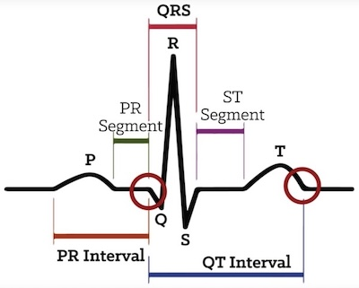
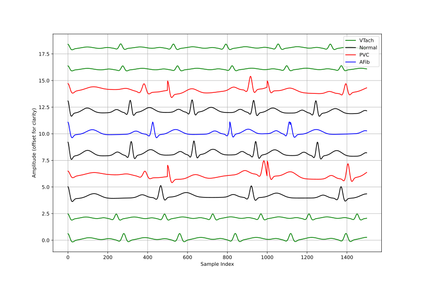
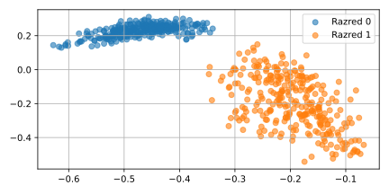
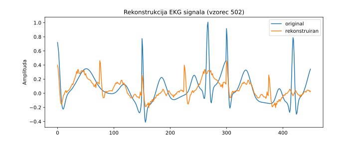

# Čas, mreže, konvolucijske mreže in avtokodirniki

Tokrat je naslov tega poglavja kar dolg, a snov morda niti ne preveč naporna. Ideja je, da posežemo po nekaterih tipičnih gradnikih nevronskih mrež in pričnemo sestavljati različne modele. Gradniki in zgradba mreže bo seveda odvisna od želene funkcije mreže, podobno bo od nje odvisen tudi tip kriterijske funkcije, ki jo bomo pri iskanju uteži optimizirali. Ukvarjali se bomo kar s tremi različnimi nalogami: klasifikacijo, predstavitvijo vhodnih podatkov (meritev) v vektorskem prostoru (angl. *embedding*) in generiranjem novih meritev (angl. *generative machine learning*). Da ne bo vse skupaj preveč v oblakih, bomo vse skupaj razvili na primeru. Tokrat bodo podatki meritve v času, oziroma časovne vrste. Tega do sedaj še nismo počeli: čeprav smo nize in časovne vrste omenili pri tipih podatkov na samem začetku semestra, smo potem obdelovali le podatke v atributnem zapisu, kjer smo predpostavili, da so atributi med seboj neodvisni in je bil rezultat strojnega učenja neodvisen od zaporedja atributov.

## Podatki

EKG (elektrokardiogram) je meritev električne aktivnosti srca, ki jo izvajamo s postavitvijo elektrod na površino kože, običajno na prsni koš, roke in noge. Meritve se izvajajo v mirovanju, med telesno aktivnostjo ali ob sumu na srčne bolezni, saj EKG pomaga pri prepoznavanju motenj v srčnem ritmu in prevodnosti. Normalen EKG zapis prikazuje značilen vzorec valov: P-val (depolarizacija preddvorov), QRS-kompleks (hitro širjenje impulza in kontrakcija prekatov) ter T-val (ponovna repolarizacija prekatov). 


**Slika:** Tipičen EKG val z označenimi segmenti.

Srčne aritmije so odstopanja od običajnega ritma ali oblike teh valov, kar lahko kaže na prezgodnje utripe, počasno ali hitro bitje srca ali druge nepravilnosti v delovanju srčnega prevodnega sistema. Srčne aritmije so odstopanja od običajnega ritma ali oblike EKG valov, kar lahko kaže na prezgodnje utripe, počasno ali hitro bitje srca ali druge nepravilnosti v delovanju srčnega prevodnega sistema. Med pogostejšimi aritmijami so prezgodnji ventrikularni utripi (PVC), kjer prekat sproži utrip brez ustreznega signala iz preddvorov; atrijska fibrilacija, pri kateri preddvori trzajo namesto da bi se usklajeno krčili; bradikardija, kjer srce bije prepočasi; in tahikardija, kjer srce bije prehitro.

V tem poglavju bomo delali s simuliranimi EKG signali. (Veliko bolje bi sicer bilo delati s pravimi signali in uporabiti kakšno knjižnico z meritvami in anotacijami, a to prepustimo kakšni dobri diplomsk(i) nalogi.) Signale smo generirali s knjižnico `neurokit2`, ki omogoča realistično simulacijo EKG signalov z nadzorom nad parametri, kot so srčni utrip, šum, amplituda in oblika vala. Za prvi podatkovni nabor smo ustvarili dva razreda signalov: normalne EKG-je in signale z motnjo, imenovano prezgodnji ventrikularni utrip (PVC). Vsak signal je dolg 500 vzorcev in vsebuje tri zaporedne utripe; pri normalnih so vsi trije utripi običajni, pri motenih pa je eden od njih nadomeščen s širšim, manj izrazitim PVC utripom. Za zbirko, ki naj vsebuje različne signale, smo dodali tudi nekaj šuma in počasno nihanje osnovne črte kot posledica dihanja, da so podatki bolj podobni resničnim meritvam. 

Drugi podatkovni nabor poleg zgornjih dveh razredov vsebuje tudi signale z atrijsko fibrilacijo (AFib) in ventrikularno tahikardijo (VTach). Pri AFib gre za hitro in nepravilno bitje preddvorov brez jasnih P-valov, kar smo simulirali z nihanjem med naključno dolgimi srčnimi cikli. VTach pa je nevarna oblika tahikardije z visokim srčnim utripom, širokimi QRS kompleksi in pogosto zmanjšano amplitudo, ki smo jo ustvarili z raztezanjem in oslabljenjem osnovnega signala. Vsak razred vsebuje 250 signalov, skupaj 1000 primerov, ki jih lahko uporabimo za klasifikacijo več razredov, vizualizacijo v nizko-dimenzionalnih prostorih in generativno modeliranje.


**Slika:** Primeri generiranih signalov.

Generirali smo 300 različnih signalov za vsak razred podatkov. Podatke smo zapisali v dve NumPy strukturi: matrika `X` vsebuje signale, vektor `y` pa pripadajoče razrede. Vsak signal je dolg 450 točk (meritev), kar ustreza 3 sekundam vzorčenja pri 150 Hz. Matrika `X` ima pri varianti dveh razredov torej obliko `(600, 450)` – 300 normalnih in 300 PVC signalov. Vektor `y` vsebuje 600 celih števil, 0 za normalne in 1 za PVC primere. Za kasnejšo uporabo smo obe strukturi shranili v datoteko s funkcijo `np.savez`, kar omogoča enostavno nalaganje in uporabo v eksperimentih.

> **Opomba:** koda za generiranje signalov je malce dolgočasna in je tu ne prikazujemo, je pa na voljo v spremljajočem repozitoriju kode za to poglavje.

## Priprava podatkov za učenje

Pričnemo sicer z manj zanimivim delom: pripravo podatkov za uporabo v PyTorch knjižnici. Najprej postavimo razred, ki spremeni matrike in vektorja tipa NumPy v tenzorje:

```python
class ToTensorDataset(Dataset):
    def __init__(self, X, y):
        self.X = torch.tensor(X, dtype=torch.float32)
        if self.X.ndim == 2:
            # dodaj dimenzijo kanala, če je potrebno
            self.X = self.X.unsqueeze(1)  
        self.y = torch.tensor(y, dtype=torch.long)

    def __len__(self):
        return len(self.X)

    def __getitem__(self, idx):
        return self.X[idx], self.y[idx]
```

Razred `ToTensorDataset` pretvori vhodne podatke v matriki `X` in oznake v vektorju `y` v PyTorch tenzorje za nadaljnjo uporabo v modelih. Oznake `y` pretvorimo v tip `torch.long`, ker PyTorch funkcija izgube `CrossEntropyLoss`, ki se pogosto uporablja pri klasifikaciji, zahteva, da so razredi predstavljeni kot celoštevilski tenzor tipa `long`. Če je vhod `X` dvodimenzionalen (npr. oblika `(n, d)`), funkcija `unsqueeze(1)` doda dodatno dimenzijo, s čimer dobimo obliko `(n, 1, d)`; to omogoča, da lahko podatke uporabimo kot enokanalne časovne vrste v konvolucijskih mrežah, ki pričakujejo vhod oblike `(batch_size, channels, length)`.

Podatke preberemo in jih pripravimo za učenje s spodnjim razredom:

```python
class LoadData:
    def __init__(self, filename, batch_size=32):
        data = np.load(filename)
        X = data['X']
        y = data['y']
        self.batch_size = batch_size

        # razdelitev podatkov na učno in testno množico
        self.X_train, self.X_test, self.y_train, self.y_test = train_test_split(
            X, y, test_size=0.2, random_state=42, stratify=y
        )

        # določitev števila razredov
        self.num_classes = len(np.unique(y))

    def get_train_loader(self, ToTensorDataset):
        train_dataset = ToTensorDataset(self.X_train, self.y_train)
        train_loader = DataLoader(train_dataset, \
            batch_size=self.batch_size, shuffle=True)
        return train_loader

    def get_test_data(self, device=None):
        X_test_tensor = torch.tensor(self.X_test, dtype=torch.float32)
        if X_test_tensor.ndim == 2:
            X_test_tensor = X_test_tensor.unsqueeze(1)
        y_test_tensor = torch.tensor(self.y_test, dtype=torch.long)
        if device is not None:
            X_test_tensor = X_test_tensor.to(device)
            y_test_tensor = y_test_tensor.to(device)
        return X_test_tensor, y_test_tensor

    def get_num_classes(self):
        return self.num_classes
```

Razred `LoadData` je pomožni razred za nalaganje in pripravo podatkov za učenje in testiranje modelov v PyTorch okolju. Ob inicializaciji prebere podatke iz datoteke `.npz`, v kateri pričakuje dve spremenljivki: matriko `X` (vhodni signali) in vektor `y` (oznake razredov). Nato podatke razdeli na učno in testno množico v razmerju 80:20. Za razdelitev uporabi funkcijo `train_test_split` iz knjižnice `sklearn`, pri čemer stratificira razrede glede na razred, da se ohrani njihova porazdelitev tudi po razdelitvi.

Metoda `get_train_loader` ustvari učni `DataLoader`, ki podatke ponudi v paketih. Uporabi razred `ToTensorDataset`, ki podatke pretvori v tenzorje.

Metoda `get_test_data` vrne testne podatke kot PyTorch tenzorje. Če so podatki dvodimenzionalni, se jim doda kanalna dimenzija z `unsqueeze(1)`, kar je potrebno za delo s konvolucijskimi modeli. Po potrebi se podatki prenesejo na določeno strojno opremo, če to uporabljamo (npr. GPU).

Metoda `get_num_classes` vrne število razredov v podatkih, kar je priročno za konfiguracijo modela.

## Klasifikacija s polno povezanimi nivoji nevronske mreže

Tu smo pravzaprav že bili: naša nevronska mreža nekaj lekcij nazaj je služila transformaciji prostora tako, da je logistična regresija na koncu mreže lahko dobro ločila med razredi. Tudi tokrat ne bo prav drugače. Ta del zapiskov torej ponovi vajo, a tokrat na podatkih EKG meritev.

Uporabimo spodnji model:

```python
class Model(nn.Module):
    def __init__(self, num_classes, signal_length):
        super().__init__()
        self.fc = nn.Sequential(
            nn.Linear(signal_length, 128),
            nn.ReLU(),
            nn.Linear(128, 64),
            nn.ReLU(),
            nn.Linear(64, num_classes)
        )

    def forward(self, x):
        # oblika x: [serija, 1, dolžina_signala] ali 
        # [serija, dolžina_signala]
        x = x.view(x.size(0), -1)  # splošči na [serija, dolžina_signala]
        return self.fc(x)
```

Gre za preprost nevronski model za klasifikacijo signalov, zgrajen kot t. im. večnivojska perceptronska mreža (angl. *multi-layered perceptron*). Razred dedujemo je iz razreda `nn.Module`, kar omogoča integracijo z ostalimi deli PyTorch okolja.

V konstruktorju `__init__` razred prejme število razredov (`num_classes`) in dolžino vhodnega signala (`signal_length`). Vhodni nivo je linearen (utežena vsota vhodov) z 128 nevroni, sledi aktivacijska funkcija ReLU, nato še en nivo z 64 nevroni in ponovno ReLU, ter na koncu izhodni nivo, ki ima toliko nevronov, kolikor je razredov. Ta zadnja plast vrača neskalirane vrednosti (logite), ki jih uporabimo v funkciji izgube.

Torej ne uporabljamo logistične regresije za klasifikacijo? Ni ravno res. Uporabili bomo ekvivalent logistične regresije, t. i. regresijo softmax, kjer bomo z ustrezno kriterijsko funkcijo poskrbeli, da bodo izhodi interpretirani kot verjetnosti. Konkretno, če je izhod modela vektor $z \in \mathbb{R}^{C}$, kjer je $C$ število razredov, potem softmax funkcija pretvori ta vektor v verjetnosti po formuli:

$$
\text{softmax}(z_i) = \frac{e^{z_i}}{\sum_{j=1}^{C} e^{z_j}}, \quad i = 1, \ldots, C
$$

Model sam tega ne izračuna, saj PyTorch funkcija izgube `CrossEntropyLoss` že vključuje softmax in log verjetnosti ter optimizira negativno log-verjetnost pravega razreda. Na ta način dobimo večrazredno logistično regresijo – softmax regresijo – le da je pred njo večplastna nevronska mreža, ki signal najprej nelinearno transformira.

Funkcija `CrossEntropyLoss` meri razliko med napovedano verjetnostno porazdelitvijo in dejansko porazdelitvijo razredov, ki je v primeru klasifikacije predstavljena z eno vročo kodirano (one-hot) vektorjem cilja. Gre za standardno funkcijo izgube pri večrazredni klasifikaciji, ki je za en primer:

$$
\mathcal{L}(x, y) = -\log \left( \frac{e^{x_y}}{\sum_{j=1}^C e^{x_j}} \right) = -x_y + \log \left( \sum_{j=1}^C e^{x_j} \right)
$$

kjer so:

* $x = (x_1, x_2, \ldots, x_C) \in \mathbb{R}^C$ je vektor logitov (izhodi modela pred softmaxom),
* $y \in \{1, \ldots, C\}$ je indeks pravega razreda,
* $C$ je število razredov.

Ta izraz združuje funkciji *softmax* in *negativno logaritem verjetnosti* v eno samo funkcijo, ki jo lahko učinkovito optimiziramo z gradientnim spustom. Pri učenju želimo minimizirati povprečno izgubo čez vse primere v učni množici.

`CrossEntropyLoss` je torej negativni logaritem napovedane verjetnosti pravega razreda, izračunane s softmax funkcijo. Če model za primer napove verjetnosti $p_1, p_2, \ldots, p_C$, in je pravi razred $y$, potem je izguba:

$$
\mathcal{L} = -\log(p_y)
$$

To pomeni: čim manjšo verjetnost model pripiše pravemu razredu, tem večja bo izguba. Model se torej uči tako, da povečuje verjetnost pravega razreda.

Omenimo naj še, da je funkcija softmax za dva razreda ekvivalentna logistični regresiji. V primeru dveh razredov je izhod modela vektor z dvema komponentama, npr. $z = (z_0, z_1)$. Softmax funkcija nato izračuna verjetnosti:

$$
p_0 = \frac{e^{z_0}}{e^{z_0} + e^{z_1}}, \quad p_1 = \frac{e^{z_1}}{e^{z_0} + e^{z_1}}
$$

Če definiramo razliko $a = z_1 - z_0$, lahko verjetnost za razred 1 izrazimo kot:

$$
p_1 = \frac{1}{1 + e^{-a}}
$$

To je ravno sigmoidna funkcija:

$$
p_1 = \sigma(a) = \frac{1}{1 + e^{-a}}
$$

kar je osnovna oblika logistične regresije. Torej, če model za dva razreda vrne logita $z_0$ in $z_1$, je softmax klasifikacija ekvivalentna temu, da uporabimo sigmoidno funkcijo na razliki $z_1 - z_0$, kar je enako standardni binarni logistični regresiji.

Ostala nam je le še metoda `forward`. Ta določa, kako model obdeluje podatke. Ne glede na to, ali ima vhod obliko `[batch_size, 1, signal_length]` ali `[batch_size, signal_length]`, z ukazom `x.view(x.size(0), -1)` signal sploščimo v dvodimenzionalno obliko `[batch_size, signal_length]`, saj model ne uporablja konvolucij, temveč deluje na vektorjih. Rezultat `self.fc(x)` je izhod modela za vsak signal posebej.

Sledi koda za učenje. Tudi to smo delno že spoznali. V prevem delu pripravimo podatke, model, se odločimo za kriterijsko funkcijo in določimo, kako bomo izvajali optimizacijo.

```python
loader = LoadData('ecg-two-classes.npz', batch_size=BATCH_SIZE)
num_classes = loader.get_num_classes()
signal_length = loader.X_train.shape[-1]
train_loader = loader.get_train_loader(ToTensorDataset)

model = Model(num_classes, signal_length)
criterion = nn.CrossEntropyLoss()
optimizer = torch.optim.Adam(model.parameters(), lr=LEARNING_RATE)

```

V drugem delu se naučimo uteži:

```python
for epoch in range(EPOCHS):
    model.train()
    total_loss, correct, total = 0, 0, 0
    
    for X_batch, y_batch in train_loader:
        optimizer.zero_grad()
        outputs = model(X_batch)
        loss = criterion(outputs, y_batch)
        loss.backward()
        optimizer.step()
        
        total_loss += loss.item()
        _, predicted = torch.max(outputs.data, 1)
        total += y_batch.size(0)
        correct += (predicted == y_batch).sum().item()
    
    train_accuracy = 100 * correct / total
    print(f"Epoch {epoch+1}/{EPOCHS}, \
        Loss: {total_loss/len(train_loader):.4f}, "
          f"Train Accuracy: {train_accuracy:.2f}%")
```

Učenje nevronske mreže izvedemo skozi več epoh. Na začetku vsake epohe model preklopi v učeči način z `model.train()`, kar pomeni, da se aktivirajo mehanizmi, specifični za fazo učenja, kot sta *dropout* (za boljšo generalizacijo) in *batch normalization* (ki uporablja statistike trenutnega paketa). Nato se za vse pakete izvede standardni cikel učenja: najprej se ponastavijo gradienti (`optimizer.zero_grad()`), nato model izračuna napovedi za trenutni batch, izračuna se izguba (`loss = criterion(...)`), izvede povratno širjenje napake (`loss.backward()`) in posodobljanje uteži modela (`optimizer.step()`). V kodi tudi beležimo kumulativna izguba in natančnost napovedi glede na resnične razrede. Povprečje teh izpišemo na koncu.

Rezultate učenje preverimo na testni množici:

```python
model.eval()
with torch.no_grad():
    X_test_tensor, y_test_tensor = loader.get_test_data()
    outputs = model(X_test_tensor)
    _, predicted = torch.max(outputs, 1)
    accuracy = (predicted == y_test_tensor).float().mean().item()
print(f"Test accuracy: {accuracy:.4f}")
print(f"Test loss: {loss:.4f}")
print("Confusion matrix:")
print(confusion_matrix(y_test_tensor.numpy(), predicted.numpy()))
```

Konvergenca je tako pri dvorazredni kot štirirazredni množici podatkov hitra, rezultati pa, skoraj malce presentljivo, odlični:

```python
Test accuracy: 0.9750
Test loss: 0.0000
Confusion matrix:
[[60  0  0  0]
 [ 0 60  0  0]
 [ 3  0 54  3]
 [ 0  0  0 60]]
```

Razlog za tako odlične rezultate je prav gotovo v veliki podobnosti signalov v učni in testni množici. Pri pravih podatkih bi se morali npr. učiti na eni množici preiskovancev, testirali pa bi na drugih preiskovancih in tu rezultati prav gotovo ne bi bili tako dobri.

Zaključimo le še z razmišljanjem o kompleksnosti tovrstnega modela. Dolžina vsakega vhodnega EKG signala je 450 točk. Model ima tri popolnoma povezane (linearne) plasti, vsaka s svojimi utežmi in pristranskostmi (bias).

1. **Prvi nivo**: `nn.Linear(450, 128)`
   Ta nivo pretvori vhodni signal dolžine 450 v vektor dolžine 128.

   * Matrika uteži: `(128, 450)`
   * Pristranskosti: `(128,)`
   * Skupno število parametrov: `128 × 450 + 128 = 57.728`

2. **Drugi nivo**: `nn.Linear(128, 64)`
   Pretvori 128-dimenzionalen vektor v vektor dolžine 64.

   * Matrika uteži: `(64, 128)`
   * Pristranskosti: `(64,)`
   * Skupno število parametrov: `64 × 128 + 64 = 8.256`

3. **Tretji nivo**: `nn.Linear(64, 4)` (ker imamo 4 razrede)
   Pretvori 64-dimenzionalen vektor v 4 logite, ki jih interpretiramo kot verjetnosti za posamezni razred.

   * Oblika uteži: `(4, 64)`
   * Oblika pristranskosti: `(4,)`
   * Skupno število parametrov: `4 × 64 + 4 = 260`

Skupno število parametrov je zato:

$$
57.728 + 8.256 + 260 = \boxed{66.244}
$$

Te uteži so shranjene v modelu kot tenzorji, povezani z vsakim slojem, in se med učenjem prilagajajo. Lahko jih izpišemo z ukazom:

```python
for name, param in model.named_parameters():
    print(name, param.shape)
```

Dobimo:

```python
fc.0.weight torch.Size([128, 450])
fc.0.bias torch.Size([128])
fc.2.weight torch.Size([64, 128])
fc.2.bias torch.Size([64])
fc.4.weight torch.Size([4, 64])
fc.4.bias torch.Size([4])
```

# Klasifikacija s konvolucijsko nevronsko mrežo

Model s polno povezanimi nivoji je kompleksen, in bi bil še kompleksnejši, če bi uporabili ali časovno daljše vhodne signale ali pa če bi bolj pogosto vzorčili. Tudi v namene zmanjšanja te kompleksnosti, pa tudi zaradi tega, ker bi bilo prav, da se na vhodnem delu mreže nevroni osredotočijo le na del vhodnega signala, je bila predlagana t.im. konvolucijska nevronska mreža. Začnimo kar z modelom:

```python
class Model(nn.Module):
    def __init__(self, num_classes):
        super().__init__()
        self.conv_layers = nn.Sequential(
            # prvi konvolucijski blok
            nn.Conv1d(1, 16, kernel_size=5, stride=3, padding=2),
            nn.BatchNorm1d(16),
            nn.ReLU(),
            nn.MaxPool1d(kernel_size=2),
            
            # drugi konvolucijski blok
            nn.Conv1d(16, 16, kernel_size=5, stride=3, padding=2),
            nn.BatchNorm1d(16),
            nn.ReLU(),
            nn.AdaptiveAvgPool1d(1)  # globalno povprečno združevanje
        )
        
        # popolnoma povezane plasti
        self.fc = nn.Sequential(
            nn.Linear(16, 16),
            nn.ReLU(),
            nn.Linear(16, num_classes)
        )

    def forward(self, x):
        x = self.conv_layers(x)
        x = x.view(x.size(0), -1)
        return self.fc(x)
```

Konvolucijska nevronska mreža (CNN) temelji na ideji, da se posamezni nevroni ne povežejo z vsemi vhodi, temveč le z lokalnim delom vhodnega signala. To omogoča učinkovitejše učenje, saj se mreža osredotoči na lokalne vzorce, ki se v signalu lahko pojavljajo na različnih mestih. Takšna arhitektura je posebej primerna za obdelavo časovnih vrst, kot je EKG, kjer nas zanimajo lokalni dogodki, kot so posamezni utripi ali njihova deformacija.

Osnovna gradnika CNN sta konvolucijska plast in funkcija združevanja. Konvolucija v enodimenzionalnem primeru pomeni, da skozi signal premikamo majhno okno (filter ali jedro) in za vsak položaj izračunamo uteženo vsoto. Matematično je izhod konvolucije podan z:

$$
y[n] = \sum_{k=0}^{K-1} x[n - k] \cdot w[k]
$$

kjer je $x[n]$ vhodni signal, $w[k]$ uteži filtra dolžine $K$, in $y[n]$ izhodni signal. V PyTorchu plast `nn.Conv1d` takih filtrov ustvari več hkrati, vsak z lastnimi utežmi. V našem primeru prvi konvolucijski sloj uporabi 16 filtrov dolžine 5 nad enokanalnim signalom in s tem izdela 16 novih kanalov, ki vsak poudarijo določene vzorce v signalu.

Plast `nn.Conv1d(1, 16, kernel_size=5, stride=3, padding=2)` je enodimenzionalna konvolucijska plast, ki vhodni enokanalni signal pretvori v 16 izhodnih kanalov z uporabo 16 različnih filtrov dolžine 5. Parameter `kernel_size=5` določa velikost filtrov, ki pokrivajo 5 zaporednih točk signala, `stride=3` pomeni, da se filter pomika po signalu v korakih po 3 točke, kar zmanjša dolžino izhoda, in `padding=2` doda 2 ničli na začetek in konec signala, da filter lahko deluje tudi na robovih. Ta plast bo pretvorila vhod oblike `[batch, 1, 500]` v izhod oblike `[batch, 16, 167]`, saj se dolžina signala z zmanjšanjem zaradi koraka 3 zmanjša približno na tretjino (500 / 3 ≈ 167).

`nn.BatchNorm1d(16)` normalizira vrednosti v vseh 16 kanalih tako, da imajo povprečje približno 0 in standardni odklon približno 1, kar prispeva k stabilnejšemu in hitrejšemu učenju; `nn.ReLU()` doda nelinearnost tako, da negativne vrednosti nadomesti z ničlo; `nn.MaxPool1d(kernel_size=2)` pa prepolovi dolžino signala, saj iz vsakega zaporednega para vrednosti izbere največjo, s čimer zmanjša dimenzionalnost in poudari najizrazitejše lokalne značilnosti.

Če je vhodna oblika signala **\[batch, 1, 450]** (kjer je batch število primerov v paketu, pri nas 32), potem so dimenzije izhoda po prvem nivoju naslednje:

1. **`nn.Conv1d(1, 16, kernel_size=5, stride=3, padding=2)`**
   Izhodna dolžina:

   $$
   \left\lfloor \frac{450 + 2 \cdot 2 - 5}{3} \right\rfloor + 1 = \left\lfloor \frac{449}{3} \right\rfloor + 1 = 149 + 1 = 150
   $$

   Oblika: **\[batch, 16, 150]**

2. **`nn.BatchNorm1d(16)`** in **`ReLU()`** ne spremenita oblike: **\[batch, 16, 150]**

3. **`nn.MaxPool1d(kernel_size=2)`**
   Zmanjša dolžino za polovico:

   $$
   \left\lfloor \frac{150}{2} \right\rfloor = 75
   $$

Končna oblika podatkov po prvem nivoju: [batch, 16, 75].

Drugi konvolucijski blok še dodatno obdeluje 16 kanalov z novimi 16 filtri dolžine 5, pri čemer se signal zaradi `stride=3` dodatno skrči. Sledi normalizacija in nelinearnost, nato pa `AdaptiveAvgPool1d(1)`, ki vsak kanal povpreči po celotni dolžini in rezultat skrči v obliko `[batch, 16, 1]`, kar omogoča fiksno velik izhod, neodvisen od dolžine signala.

Del `self.fc` je zaključni klasifikacijski del mreže. Prva plast `nn.Linear(16, 16)` prejme 16 povprečnih vrednosti (po ena za vsak kanal) in jih pretvori v nov 16-dimenzionalni predstavitveni vektor. `ReLU()` doda nelinearnost, nato pa `nn.Linear(16, num_classes)` pretvori ta vektor v toliko logitov, kolikor je razredov. Ti logiti se nato uporabijo v funkciji izgube (npr. `CrossEntropyLoss`) za izračun napake in učenje modela.

Model ima skupaj (samo!) 1796 učljivih parametrov. Primerjaj z mrežo iz prejšnjega poglavja, s skoraj 40-krat več parametri! Prva konvolucijska plast ima 96 parametrov, druga 1296, vsaka normalizacija po 32. Popolnoma povezani del doda še 272 parametrov v prvi linearni plasti in 68 v izhodni (pri 4 razredih). Gre za lahek model, primeren za klasifikacijo krajših časovnih signalov.

Funkcija `forward` določa, kako model obdeluje vhodne podatke. Najprej `x` (vhodni signal oblike `[batch, 1, length]`) potuje skozi konvolucijske plasti (`self.conv_layers`), kjer se izračunajo lokalne spremenljivke in zmanjša dimenzija. Nato se rezultat preoblikuje z `x.view(x.size(0), -1)` v matriko oblike `[batch, features]`, torej splošči vse dimenzije razen velikosti paketa. Na koncu se ta vektor pošlje polno povezanim plastem (`self.fc`), ki vrnejo logite za razvrščanje v razrede.

Del z učenjem in vrednotenjem ostane enak. Kar je odlično, saj smo tu zato le spremenili model. Konvergenca je tu sicer malce počasnejša, a so rezultati tipično dobri:

```python
Test accuracy: 0.9875
Test loss: 0.0249
Confusion matrix:
[[60  0  0  0]
 [ 0 60  0  0]
 [ 3  0 57  0]
 [ 0  0  0 60]]
```

## Avtokodirnik

Avtokodirnik je nevronska mreža, ki se uči stisniti vhodne podatke v manjšo, informativno predstavitev (t. i. vgrajeni prostor ali *embedding*) in nato iz te predstavitve rekonstruirati izvirni vhod. Sestavljen je iz dveh delov: kodirnika, ki vhod transformira v krajšo latentno predstavitev, in dekodirnika, ki poskuša iz te predstavitve čim bolj natančno rekonstruirati vhod. Uporablja se za stiskanje podatkov, odstranjevanje šuma, vizualizacijo, zaznavanje nenavadnosti in kot predtrening za druge naloge strojnega učenja. Pomembno je, da se učenje izvaja brez nadzora – model se uči le iz samih podatkov, brez oznak.

Za kodirinik bomo uporabili isto kovolucijsko mrežo kot zgoraj, in sestavili strukturo avtokodirnika, kot jo prikazuje spodnja koda:

```python
class Autoencoder(nn.Module):
    def __init__(self, signal_length):
        super().__init__()
        self.encoder = nn.Sequential(
            # prvi konvolucijski blok
            nn.Conv1d(1, 16, kernel_size=5, stride=3, padding=2),
            nn.BatchNorm1d(16),
            nn.ReLU(),
            nn.MaxPool1d(kernel_size=2),
            
            # drugi konvolucijski blok
            nn.Conv1d(16, 16, kernel_size=5, stride=3, padding=2),
            nn.BatchNorm1d(16),
            nn.ReLU(),
            nn.AdaptiveAvgPool1d(1)  # globalno povprečno združevanje
        )
        self.bottleneck = nn.Linear(16, 2)
        self.decoder_fc = nn.Linear(2, 16)
        self.decoder = nn.Sequential(
            nn.ConvTranspose1d(16, 16, kernel_size=signal_length//2,\ 
                stride=signal_length//2),
            nn.ReLU(),
            nn.ConvTranspose1d(16, 1, kernel_size=1),
        )
        self.signal_length = signal_length
```

Avtokodirnik v tej kodi sestoji iz treh delov: kodirnika, ozkega grla (*bottleneck*) in dekodirnika. Kodirnik je enak kot v prejšnjem modelu za klasifikacijo — uporablja dve konvolucijski plasti z normalizacijo, nelinearnostjo in združevanjem, kar postopoma zmanjša dolžino signala in izlušči 16 značilnosti, ki jih `AdaptiveAvgPool1d(1)` skrči na velikost `[batch, 16, 1]`. Nato sledi linearni sloj `self.bottleneck`, ki to 16-dimenzionalno predstavitev stisne v le 2 številski vrednosti — to je latentni prostor ali *embedding*, kjer se nahaja bistvo informacije. Ta vektor se nato s pomočjo `decoder_fc` najprej razširi nazaj v 16 dimenzij, nato pa dekodirnik, ki uporablja transponirane konvolucijske plasti (`ConvTranspose1d`), signal postopoma razširi nazaj na prvotno dolžino. S tem se model nauči, kako iz zelo stisnjene oblike rekonstruirati originalni signal, kar omogoča uporabo avtokodirnika pri stiskanju, odstranjevanju šuma ali vizualizaciji skritih vzorcev.

`ConvTranspose1d` (tudi *dekonvolucija* ali *transponirana konvolucija*) je operacija, ki obrne učinek običajne konvolucije — namesto da signal krajša, ga razširja. Uporablja se predvsem v dekodirnikih, kjer želimo iz kratkega predstavitvenega vektorja rekonstruirati signal prvotne dolžine.

Če običajna konvolucija dolžino signala zmanjša (npr. zaradi `stride > 1`), potem transponirana konvolucija to dolžino spet poveča. Matematično to lahko razumemo kot obrat operacije:

Če ima navadna konvolucija izhodno dolžino:

$$
L_{\text{out}} = \left\lfloor \frac{L_{\text{in}} + 2p - k}{s} \right\rfloor + 1
$$

kjer so:

* $L_{\text{in}}$: vhodna dolžina,
* $k$: velikost jedra (*kernel\_size*),
* $s$: korak (*stride*),
* $p$: robna obloga (*padding*),

potem transponirana konvolucija izračuna dolžino izhoda z:

$$
L_{\text{out}} = (L_{\text{in}} - 1) \cdot s - 2p + k
$$

Na primer, če imamo vhod dolžine 1 in uporabimo `ConvTranspose1d(16, 16, kernel_size=225, stride=225)`, potem bo izhod dolžine:

$$
L_{\text{out}} = (1 - 1) \cdot 225 - 0 + 225 = 225
$$

To pomeni, da z enim korakom razširimo signal iz dolžine 1 na 225 — zelo učinkovito za rekonstrukcijo dimenzij.

Tako v tvojem avtokodirniku `ConvTranspose1d` poskrbi, da se 16-dimenzionalna predstavitev, ki ima dolžino 1, razširi na dolžino, ki približno ustreza polovici vhodnega signala, nato pa še z drugo transponirano konvolucijo (z `kernel_size=1`) končno pretvori nazaj v enokanalni signal želene dolžine.

Aplikacija tega modela pri učenju je tokrat malce bolj kompleksna:

```python
    def forward(self, x):
        x = self.encoder(x)
        x = x.view(x.size(0), -1)  # iz [batch, 16, 1] v [batch, 16]
        z = self.bottleneck(x)
        x = self.decoder_fc(z)
        x = x.unsqueeze(-1)  # [batch, 16, 1]
        # povečaj na [batch, 16, signal_length//2]
        x = x.repeat(1, 1, self.signal_length // 2)
        x = self.decoder(x)
        # zagotovi, da dolžina izhoda ustreza vhodu
        x = x[:, :, :self.signal_length]  
        return x, z
```

Funkcija `forward` najprej poda vhodni signal skozi kodirnik, kjer se iz enokanalnega signala dolžine 450 izlušči 16 značilnosti, ki jih nato s pomočjo `bottleneck` plasti stisnemo v 2-dimenzionalni vektor `z`. Nato sledi dekodiranje: vektor `z` se najprej linearno razširi nazaj v 16-dimenzionalen vektor, mu dodamo dimenzijo dolžine 1, nato pa ga s funkcijo `repeat` razširimo po časovni dimenziji do dolžine `signal_length // 2`, kar omogoči uporabo transponirane konvolucije. Te plasti signal postopoma razširijo skoraj do prvotne dolžine, zadnja vrstica pa izhod natančno prireže na dolžino vhodnega signala. Funkcija vrne tako rekonstruiran signal kot tudi stisnjen vmesni vektor `z`, kar omogoča uporabo modela za učenje latentne predstavitve brez oznak.

Kriterij za uspešnost učenja tokrat ni vezan za razred, ampak opazujemo rekonstrukcijsko napako:

```python
criterion = nn.MSELoss()
```
Razredne spremenljivke pri učenju sploh ne uporabljamo. Jo pa lahko uporabimo pri izrisu vložitve v vektorski prostor:

```python
embeddings = embeddings.numpy()
y_np = y.numpy()
plt.figure(figsize=(8, 6))
for c in np.unique(y_np):
    plt.scatter(embeddings[y_np == c, 0], embeddings[y_np == c, 1], \
        label=f"Razred {c}", alpha=0.6)
```



Presenetljivo dobro! Presenetljivo zaradi relativno enostavnosti mreže, in ker učnih podatkov ni prav mnogo. V vložitvenem prostoru sta razreda popolnoma ločena, čeprav informacijo o njih v postopku gradnje sploh nismo uporabili.

Izrišemo lahko tudi rekonstrukcijo za dani signal, na primer:

```python
idx = 502
X_random = X[idx:idx+1]  # oblika [1, 1, signal_length]
with torch.no_grad():
    X_recon, _ = model(X_random)
X_orig = X_random.squeeze().numpy()
X_recon = X_recon.squeeze().numpy()

plt.figure(figsize=(10, 4))
plt.plot(X_orig, label='Original')
plt.plot(X_recon, label='Rekonstruiran')
```


Rekonstrukcija morda ni najboljša (mreža je preenostavna, učnih podatkov je premalo), a vsekakor kaže na neke kvalitativne podobnosti med signaloma. Z dodatnimi prilagoditvami mreže in povečanju množice vhodnih podatkov bi se je dalo še izboljšati.

Čeprav je torej naša mreža zelo preprosta in učni podatki niso označeni, se avtokodirnik uspešno nauči vektorske vložitve, ki loči razrede ter rekonstruira signal s prepoznavno obliko. To kaže, da lahko mreža iz samih podatkov izlušči pomembne značilnosti, kar je bistvo nenadzorovanega učenja. Ena od možnih izboljšav bi bila uporaba variacijskega avtokodirnika (VAE), ki uvede stohastično komponento in omogoča (boljšo) generativno modeliranje porazdelitve nad latentnim prostorom. Vendar bomo variacijski pristop v tem poglavju izpustili.
