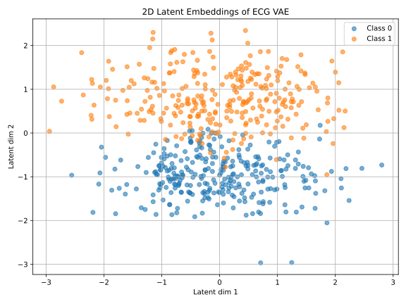
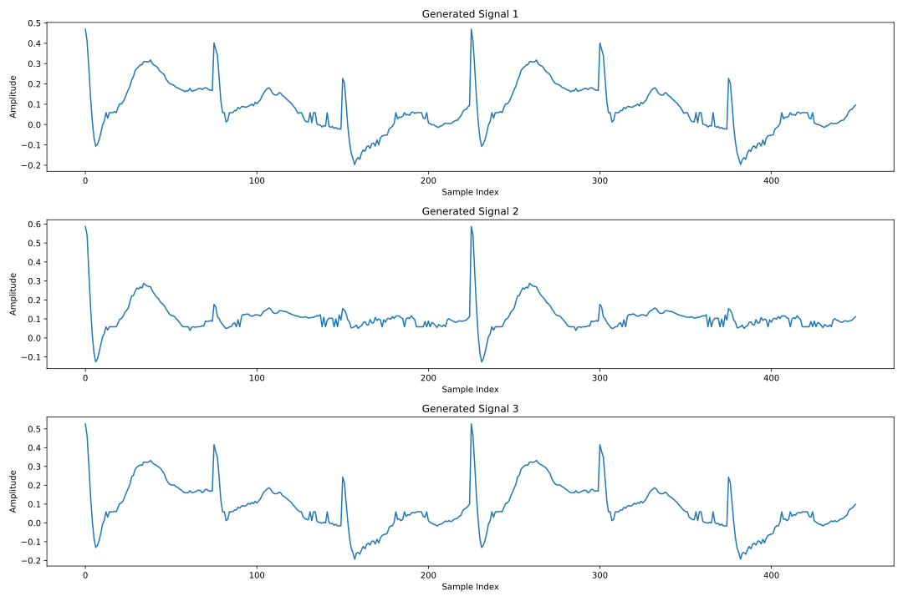

## Samokodirniki

Samokodirnik (angl. *autoencoder*) je nevronska mreža, ki se uči stisniti vhodne podatke v manjšo, informativno predstavitev (t. i. vgrajeni prostor ali *embedding*) in nato iz te predstavitve rekonstruirati izvirni vhod. Sestavljen je iz dveh delov: kodirnika, ki vhod transformira v krajšo latentno predstavitev, in dekodirnika, ki poskuša iz te predstavitve čim bolj natančno rekonstruirati vhod. Uporablja se za stiskanje podatkov, odstranjevanje šuma, vizualizacijo, zaznavanje nenavadnosti in kot predtrening za druge naloge strojnega učenja. Pomembno je, da se učenje izvaja brez nadzora – model se uči le iz samih podatkov, brez oznak.

Za kodirinik bomo uporabili isto kovolucijsko mrežo kot zgoraj, in sestavili strukturo samokodirnika, kot jo prikazuje spodnja koda:

```python
class Autoencoder(nn.Module):
    def __init__(self, signal_length):
        super().__init__()
        self.encoder = nn.Sequential(
            # prvi konvolucijski blok
            nn.Conv1d(1, 16, kernel_size=5, stride=3, padding=2),
            nn.BatchNorm1d(16),
            nn.ReLU(),
            nn.MaxPool1d(kernel_size=2),
            
            # drugi konvolucijski blok
            nn.Conv1d(16, 16, kernel_size=5, stride=3, padding=2),
            nn.BatchNorm1d(16),
            nn.ReLU(),
            nn.AdaptiveAvgPool1d(1)  # globalno povprečno združevanje
        )
        self.bottleneck = nn.Linear(16, 2)
        self.decoder_fc = nn.Linear(2, 16)
        self.decoder = nn.Sequential(
            nn.ConvTranspose1d(16, 16, kernel_size=signal_length//2,\ 
                stride=signal_length//2),
            nn.ReLU(),
            nn.ConvTranspose1d(16, 1, kernel_size=1),
        )
        self.signal_length = signal_length
```

Samokodirnik v tej kodi sestoji iz treh delov: kodirnika, ozkega grla (*bottleneck*) in dekodirnika. Kodirnik je enak kot v prejšnjem modelu za klasifikacijo — uporablja dve konvolucijski plasti z normalizacijo, nelinearnostjo in združevanjem, kar postopoma zmanjša dolžino signala in izlušči 16 značilnosti, ki jih `AdaptiveAvgPool1d(1)` skrči na velikost `[batch, 16, 1]`. Nato sledi linearni sloj `self.bottleneck`, ki to 16-dimenzionalno predstavitev stisne v le 2 številski vrednosti — to je latentni prostor ali *embedding*, kjer se nahaja bistvo informacije. Ta vektor se nato s pomočjo `decoder_fc` najprej razširi nazaj v 16 dimenzij, nato pa dekodirnik, ki uporablja transponirane konvolucijske plasti (`ConvTranspose1d`), signal postopoma razširi nazaj na prvotno dolžino. S tem se model nauči, kako iz zelo stisnjene oblike rekonstruirati originalni signal, kar omogoča uporabo samokodirnika pri stiskanju, odstranjevanju šuma ali vizualizaciji skritih vzorcev.

`ConvTranspose1d` (tudi *dekonvolucija* ali *transponirana konvolucija*) je operacija, ki opravlja obratno operacijo običajne konvolucije. Medtem ko navadna konvolucija s pomočjo filtrov izračuna povzetek lokalnih značilnosti in s tem pogosto skrajša signal (na primer zaradi koraka večjega od ena), transponirana konvolucija signal postopoma razširja. V samokodirnikih jo uporabljamo zlasti v dekodirnem delu, kjer želimo iz kratke, stisnjene predstavitve rekonstruirati signal prvotne dolžine. Transponirana konvolucija med posamezne točke v vhodnem signalu vstavljamo presledke oziroma ničle, s čimer umetno povečamo njegovo dolžino. Po tako razmaknjenem signalu premikamo filter na enak način kot pri običajni konvoluciji, le da zdaj vsak premik prispeva vrednosti k večjemu številu izhodnih točk. Vrednosti, ki jih filter generira na različnih položajih, se v izhodnem signalu seštevajo, kar ustvari nov, daljši signal. Na ta način lahko iz zelo kratkega vektorja, na primer dolžine ena, z uporabo enega samega koraka transponirane konvolucije pridobimo signal poljubno večje dolžine. Če izberemo ustrezne parametre, kot so velikost jedra in korak, lahko rezultat natančno uskladimo z želeno dimenzijo izhoda.

Če torej običajna konvolucija dolžino signala zmanjša (npr. zaradi `stride > 1`), potem transponirana konvolucija to dolžino spet poveča. Matematično to lahko razumemo kot obrat operacije. Če ima navadna konvolucija izhodno dolžino:

$$
L_{\text{out}} = \left\lfloor \frac{L_{\text{in}} + 2p - k}{s} \right\rfloor + 1
$$

kjer so:

* $L_{\text{in}}$: vhodna dolžina,
* $k$: velikost jedra (*kernel\_size*),
* $s$: korak (*stride*),
* $p$: robna obloga (*padding*),

potem transponirana konvolucija izračuna dolžino izhoda z:

$$
L_{\text{out}} = (L_{\text{in}} - 1) \cdot s - 2p + k
$$

V kodi našega avtokodirnika vhodni signal z dolžino `signal_length` najprej postopoma krajšamo skozi dve konvolucijski plasti in združevanja, dokler ga z `AdaptiveAvgPool1d(1)` ne skrčimo na dolžino 1. Tako na koncu kodirnika dobimo tenzor oblike `[batch, 16, 1]`, kar pomeni, da ima vsaka vzorčna enota v paketu 16 značilnosti na enem samem časovnem koraku. Ta oblika se zatem linearno pretvori v 2-dimenzionalni vektor in nato zopet razširi nazaj v `[batch, 16, 1]`.

Ker je signal na tem mestu dolg 1, uporabimo `ConvTranspose1d` s `kernel_size` in `stride` nastavljenima na `signal_length // 2`. Ta operacija razširi signal na dolžino `signal_length // 2`. Uporabimo torej en sam korak, ki iz dolžine 1 neposredno ustvari izhod dolžine `signal_length // 2`. To lahko preverimo z enačbo za dolžino izhoda transponirane konvolucije:

$$
L_{\text{out}} = (1 - 1) \cdot s - 0 + k = k,
$$

kjer sta `stride` in `kernel_size` enaka, torej `signal_length // 2`. Tako dobimo:

$$
L_{\text{out}} = (1 - 1) \cdot \frac{L}{2} + \frac{L}{2} = \frac{L}{2}.
$$

Nato sledi še ena transponirana konvolucija z `kernel_size=1`, ki signal ohrani na isti dolžini, a ga pretvori iz 16 kanalov nazaj v enega, s čimer zaključimo rekonstrukcijo. Celotni dekodirnik torej z dvema korakoma razširi signal iz oblike `[batch, 16, 1]` nazaj v `[batch, 1, signal_length]`, pri čemer drugi korak rekonstruira končno obliko in število kanalov.

S tem model zelo učinkovito rekonstruira celoten signal iz kompaktne latentne predstavitve dolžine 2, kar kaže na moč in enostavnost uporabe transponiranih konvolucij v dekodirnih arhitekturah.

Tako v samokodirniku `ConvTranspose1d` poskrbi, da se 16-dimenzionalna predstavitev, ki ima dolžino 1, razširi na dolžino, ki približno ustreza polovici vhodnega signala, nato pa še z drugo transponirano konvolucijo (z `kernel_size=1`) končno pretvori nazaj v enokanalni signal želene dolžine.

Morda koristi še dodatno pojasnilo: v kodi samokodirnika vhodni signal z dolžino `signal_length` najprej postopoma krajšamo skozi dve konvolucijski plasti in združevanja, dokler ga z `AdaptiveAvgPool1d(1)` ne skrčimo na dolžino 1. Tako na koncu kodirnika dobimo tenzor oblike `[batch, 16, 1]`, kar pomeni, da ima vsaka vzorčna enota v paketu 16 značilnosti na enem samem časovnem koraku. Ta oblika se zatem linearno pretvori v 2-dimenzionalni vektor in nato zopet razširi nazaj v `[batch, 16, 1]`. Ker je signal na tem mestu dolg 1, uporabimo `ConvTranspose1d` z `kernel_size` in `stride` nastavljenima na `signal_length // 2`. Ta operacija razširi signal na dolžino `signal_length // 2`. Uporabimo torej en sam korak, ki iz dolžine 1 neposredno ustvari izhod dolžine `signal_length // 2`. Nato sledi še ena transponirana konvolucija z `kernel_size=1`, ki signal ohrani na isti dolžini, a ga pretvori iz 16 kanalov nazaj v enega, s čimer zaključimo rekonstrukcijo. Celotni dekodirnik torej z dvema korakoma razširi signal iz oblike `[batch, 16, 1]` nazaj v `[batch, 1, signal_length]`, pri čemer drugi korak rekonstruira končno obliko in število kanalov.

Aplikacija tega modela pri učenju je tokrat malce bolj kompleksna:

```python
    def forward(self, x):
        x = self.encoder(x)
        x = x.view(x.size(0), -1)  # iz [batch, 16, 1] v [batch, 16]
        z = self.bottleneck(x)
        x = self.decoder_fc(z)
        x = x.unsqueeze(-1)  # [batch, 16, 1]
        # povečaj na [batch, 16, signal_length//2]
        x = x.repeat(1, 1, self.signal_length // 2)
        x = self.decoder(x)
        # zagotovi, da dolžina izhoda ustreza vhodu
        x = x[:, :, :self.signal_length]  
        return x, z
```

Seveda. Tukaj je izboljšana različica z jasnejšim opisom delovanja `repeat`:

Funkcija `forward` najprej poda vhodni signal skozi kodirnik, kjer se iz enokanalnega signala dolžine 450 izlušči 16 značilnosti, ki jih nato s pomočjo plasti `bottleneck` stisnemo v 2-dimenzionalni vektor `z`. Nato sledi dekodiranje: vektor `z` se najprej linearno razširi nazaj v 16-dimenzionalen vektor, ki mu dodamo dodatno dimenzijo dolžine 1, da dobimo obliko `[batch, 16, 1]`. S funkcijo `repeat` to predstavitev raztegnemo vzdolž časovne osi tako, da vsakega od 16 kanalov podvojimo na `signal_length // 2` točkah — s tem umetno ustvarimo začasno strukturo, ki omogoča, da transponirana konvolucija začne s širšim signalom in ga postopoma rekonstruira proti izvirni dolžini. Funkcija `repeat(1, 1, signal_length // 2)` torej preprosto skopira vsako od 16 značilnosti vzdolž časovne dimenzije tolikokrat, da dobimo signal dolžine `signal_length // 2`. S tem umetno ustvarimo razširjen vhod za transponirano konvolucijo, ki nato rekonstruira signal nazaj v njegovo prvotno obliko. Transponirani konvoluciji signal razširita skoraj do prvotne dolžine, zadnja vrstica pa izhod natančno prireže na dolžino vhodnega signala. Funkcija vrne tako rekonstruiran signal kot tudi stisnjen vmesni vektor `z`, kar omogoča uporabo modela za učenje latentne predstavitve brez oznak.

Kriterij za uspešnost učenja tokrat ni vezan za razred, ampak opazujemo rekonstrukcijsko napako:

```python
criterion = nn.MSELoss()
```
Razredne spremenljivke pri učenju sploh ne uporabljamo. Jo pa lahko uporabimo pri izrisu vložitve v vektorski prostor:

```python
embeddings = embeddings.numpy()
y_np = y.numpy()
plt.figure(figsize=(8, 6))
for c in np.unique(y_np):
    plt.scatter(embeddings[y_np == c, 0], embeddings[y_np == c, 1], \
        label=f"Razred {c}", alpha=0.6)
```


Presenetljivo dobro! Presenetljivo zaradi relativno enostavnosti mreže, in ker učnih podatkov ni prav mnogo. V prostoru vložitev sta razreda popolnoma ločena, čeprav informacijo o njih v postopku gradnje sploh nismo uporabili.

Izrišemo lahko tudi rekonstrukcijo za dani signal, na primer:

```python
idx = 502
X_random = X[idx:idx+1]  # oblika [1, 1, signal_length]
with torch.no_grad():
    X_recon, _ = model(X_random)
X_orig = X_random.squeeze().numpy()
X_recon = X_recon.squeeze().numpy()

plt.figure(figsize=(10, 4))
plt.plot(X_orig, label='Original')
plt.plot(X_recon, label='Rekonstruiran')
```


Rekonstrukcija morda ni najboljša (mreža je preenostavna, učnih podatkov je premalo), a vsekakor kaže na neke kvalitativne podobnosti med signaloma. Z dodatnimi prilagoditvami mreže in povečanju množice vhodnih podatkov bi se je dalo še izboljšati.

Čeprav je torej naša mreža zelo preprosta in učni podatki niso označeni, se avtokodirnik uspešno nauči vektorske vložitve, ki loči razrede ter rekonstruira signal s prepoznavno obliko. To kaže, da lahko mreža iz samih podatkov izlušči pomembne značilnosti, kar je bistvo nenadzorovanega učenja. Ena od možnih izboljšav bi bila uporaba variacijskega samokodirnika (VAE, angl. *variational avtoencoder*), ki uvede stohastično komponento in omogoča (boljšo) generativno modeliranje porazdelitve nad latentnim prostorom. Vendar bomo variacijski pristop v tem poglavju izpustili.

# Variacijski avtoenkoder

Variacijski avtoenkoder (VAE) je izboljšana različica klasičnega avtoenkoderja, ki vpelje verjetnostni pogled na učenje skrite predstavitve. Klasični avtoenkoder, kot smo ga predstavili v prejšnjem poglavju, pretvori vhodni signal v latentni vektor in ga nato rekonstruira nazaj v signal. Vendar to naredi popolnoma deterministično – isti vhod vedno privede do istega izhoda. Posledično se mreža nauči latentnega prostora brez posebne strukture: podobni vhodi niso nujno blizu v tem prostoru, ni nadzora nad obliko prostora, prav tako pa ni mogoče iz njega smiselno vzorčiti novih podatkov. Če želimo ustvariti nove signale, ne vemo, kateri latentni vektorji so “veljavni”.

Variacijski avtoenkoder ta problem reši tako, da latentnega vektorja ne določi neposredno, temveč se nauči porazdelitve, iz katere lahko vzorčimo. Kodirni del mreže torej ne vrne enega samega vektorja, temveč raje parametre Gaussove porazdelitve – najpogosteje njeno povprečje $\mu$ in standardni odklon $\sigma$. Za generiranje signala iz te porazdelitve vzorčimo latentni vektor $\mathbf{z} \sim \mathcal{N}(\mu, \sigma^2)$, ki ga dekoder uporabi za rekonstrukcijo signala. Ker vzorčenje ni odvedljivo (in bi preprečilo učenje z gradientnim spustom), uporabimo trike, kot je reparametrizacija, kjer latentni vektor izrazimo kot

$$
\mathbf{z} = \mu + \sigma \odot \varepsilon, \quad \varepsilon \sim \mathcal{N}(0, I),
$$

kjer je $\varepsilon$ naključni vektor iz standardne normalne porazdelitve, $\odot$ pa elementno množenje. 

Učenje VAE temelji na maksimizaciji verjetnosti generiranja podatkov. Ker je ta integral po latentnem prostoru nedostopen, maksimiziramo spodnjo mejo te verjetnosti, t. i. variacijsko spodnjo mejo (ELBO, angl. *Evidence Lower Bound*):

$$
\mathcal{L} = \mathbb{E}_{q(\mathbf{z} | \mathbf{x})}[\log p(\mathbf{x} | \mathbf{z})] - D_{\mathrm{KL}}(q(\mathbf{z} | \mathbf{x}) \,\|\, p(\mathbf{z})),
$$

kjer:

* $\mathbf{x}$ je vhodni signal,
* $q(\mathbf{z} | \mathbf{x})$ je porazdelitev, ki jo napove kodirnik (aproksimacija posteriorja),
* $p(\mathbf{z})$ je predpisana porazdelitev (navadno $\mathcal{N}(0, I)$),
* $D_{\mathrm{KL}}$ je Kullback-Leiblerjeva divergenca, ki kaznuje razhajanje napovedane porazdelitve od standardne normalne.

Prvi člen v zgornjem izrazu meri **rekonstrukcijsko napako**, drugi pa **regularizira latentni prostor**, da ostane blizu normalni porazdelitvi. Rezultat je model, ki se nauči smiselnega, zveznega in strukturiranega latentnega prostora in ki lahko tako uspešno rekonstruira signale in kot tudi generira nove, še nevidene primere. Variacijski avtoenkoder lahko uporabljamo za generiranje podatkov, zapolnjevanje manjkajočih vrednosti, vizualizacijo in stiskanje. Zaradi verjetnostnega značaja modela lahko z vzorčenjem iz standardne normalne porazdelitve ustvarjamo nove primerke, ki so podobni tistim, ki jih je model videl med učenjem. Standardna normalna porazdelitev pomeni, da naključno izberemo vektor s povprečjem nič in standardnim odklonom ena – kar zagotavlja, da se gibljemo po prostoru, ki ga je model med učenjem »videl«. Ta vektor ima enako dolžino kot latentni prostor modela, ki ga določimo pri njegovi zasnovi. Če je dimenzionalnost latentnega prostora na primer 2, bo tudi ta vektor dolg 2; v bolj kompleksnih primerih pa je lahko dolg 8, 16 ali več, odvisno od tega, koliko informacij želimo, da jih latentni prostor zajame.

VAE se torej ne nauči zgolj kodiranja in dekodiranja signalov, temveč tudi, kako si predstavlja vse mogoče smiselne signale znotraj naučene porazdelitve. V praksi je potrebno poiskati dobro ravnotežje med obema kriteijskima funkcijama, torej med rekonstrukcijo in razhajanjem od normalne porazdelitve za učno množico signalov, ter seveda poiskati ustrezno strukturo mreže.

Predstavimo to sedaj v kodi, znova za obravnavo podatkov EKG. Spodnji model razširja klasični samokodirnik tako, da v latentnem prostoru modelira verjetnostno porazdelitev – namesto da vektor latentnih značilnosti določi deterministično, nauči dve projekciji: povprečje in logaritmirano varianco. Tako lahko iz vsakega vhoda vzorčimo več različnih latentnih predstavitev in omogočimo generiranje podatkov.

Začnemo z določitvijo razreda `VAE`, ki razširi `nn.Module` in implementira variacijski avtoenkoder. Uporabljali bomo podatke dolžine `signal_length`, latentni prostor pa naj bo dimenzije `latent_dim`, privzeto 2.


```python
class VAE(nn.Module):
```

Najprej določi kodirni del:

```python
self.encoder = nn.Sequential(
    nn.Conv1d(1, 16, kernel_size=5, stride=3, padding=2),
    nn.BatchNorm1d(16),
    nn.ReLU(),
    nn.MaxPool1d(kernel_size=2),
    nn.Conv1d(16, 16, kernel_size=5, stride=3, padding=2),
    nn.BatchNorm1d(16),
    nn.ReLU(),
    nn.AdaptiveAvgPool1d(1)
)
```

Kodirnik je enak kot v prejšnjem modelu: dve konvoluciji, vsaka s 16 kanali, z normalizacijo, aktivacijo ReLU in združevanjem. Na koncu `AdaptiveAvgPool1d(1)` poskrbi, da bo dolžina signala vedno skrčena na 1, ne glede na vhodno dolžino. Rezultat ima obliko `[batch, 16, 1]`.

Poskrbimo za projekciko v latentni prostor

```python
self.fc_mu = nn.Linear(16, latent_dim)
self.fc_logvar = nn.Linear(16, latent_dim)
```

Iz vektorja dolžine 16, ki ga pridobimo po `view`, naredimo dva ločena projekcijska sloja: `fc_mu` določi sredino (povprečje) latentne porazdelitve, `fc_logvar` pa logaritmirano varianco. Oba imata izhodno dimenzijo `latent_dim`, kar pomeni, da se vsaka vhodna enota projicira v `latent_dim`-dimenzionalno normalno porazdelitev.

Dekodirnik začne z razširitvijo latentnega vektorja nazaj v 16-dimenzionalno predstavitev, ki je potrebna za dekodiranje.

```python
self.decoder_fc = nn.Linear(latent_dim, 16)
```

Sledi del, podoben tistemu v navadnem avtoenkoderju: transponirani konvoluciji povrneta signal nazaj na dolžino `signal_length`. Prva razširi signal iz dolžine 1 na `signal_length // 2`, druga pa le pretvori 16 kanalov v enega.


```python
self.decoder = nn.Sequential(
    nn.ConvTranspose1d(16, 16, kernel_size=signal_length//2, stride=signal_length//2),
    nn.ReLU(),
    nn.ConvTranspose1d(16, 1, kernel_size=1),
)
```

Dodatne funckije modela so naslednje. Funkcija `encode` izračuna parametre Gaussove porazdelitve – sredino `mu` in logaritmirano varianco `logvar`.

```python
def encode(self, x):
    x = self.encoder(x)
    x = x.view(x.size(0), -1)
    mu = self.fc_mu(x)
    logvar = self.fc_logvar(x)
    return mu, logvar
```

Zaradi potrebe po odvedljivosti ne vzorčimo neposredno iz $\mathcal{N}(\mu, \sigma^2),$ temveč uporabimo reparametrizacijski trik: generiramo $\varepsilon \sim \mathcal{N}(0, I)$ in izračunamo $z = \mu + \sigma \cdot \varepsilon$:

```python
def reparameterize(self, mu, logvar):
    std = torch.exp(0.5 * logvar)
    eps = torch.randn_like(std)
    return mu + eps * std
```

`torch.randn_like(std)` ustvari nov tenzor enake oblike kot `std`, pri čemer so vrednosti vzorčene iz standardne normalne porazdelitve $\mathcal{N}(0, 1)$. To ustreza $\varepsilon \sim \mathcal{N}(0, I)$ v reparametrizacijskem triku — vsaka komponenta vektorja `eps` je neodvisno naključno izbrana iz $\mathcal{N}(0, 1)$. Torej:

* `std = torch.exp(0.5 * logvar)` izračuna standardni odklon $\sigma$ iz $\log(\sigma^2)$,
* `eps = torch.randn_like(std)` ustvari $\varepsilon$ iste oblike kot `std`,
* `mu + eps * std` vrne vzorec iz $\mathcal{N}(\mu, \sigma^2)$, vendar na način, ki omogoča odvedljivost.


Dekoder razširi latentni vektor nazaj v obliko `[batch, 16, signal_length // 2]`, ki jo nato transponirane konvolucije uporabijo za rekonstrukcijo signala. S končnim rezanjem `x[:, :, :self.signal_length]` zagotovimo, da dolžina izhoda ustreza vhodni dolžini.

```python
def decode(self, z):
    x = self.decoder_fc(z)
    x = x.unsqueeze(-1)
    x = x.repeat(1, 1, self.signal_length // 2)
    x = self.decoder(x)
    x = x[:, :, :self.signal_length]
    return x
```

Glavna funkcija modela je `forward`, ki kodira vhod, vzorči latentni vektor, dekodira rekonstrukcijo in vrne vse pomembne vmesne spremenljivke.

```python
def forward(self, x):
    mu, logvar = self.encode(x)
    z = self.reparameterize(mu, logvar)
    x_recon = self.decode(z)
    return x_recon, mu, logvar, z
```

Med učenjem uporabljamo tudi rekonstrukcijsko izgubo in Kullback-Leiblerjevo divergenco za regularizacijo latentnega prostora:

```python
def loss_function(x_recon, x, mu, logvar):
    recon_loss = nn.functional.mse_loss(x_recon, x, reduction='sum')
    kl_loss = -0.5 * torch.sum(1 + logvar - mu.pow(2) - logvar.exp())
    return recon_loss + kl_loss
```

Izraz za `kl_loss` izhaja iz analitične oblike Kullback-Leiblerjeve divergence med dvema večdimenzionalnima normalnima porazdelitvama:

* porazdelitvijo, ki jo napove kodirnik: $q(\mathbf{z}|\mathbf{x}) = \mathcal{N}(\mu, \sigma^2)$,
* in predpisano standardno normalno porazdelitvijo: $p(\mathbf{z}) = \mathcal{N}(0, I)$.

Analitična oblika divergence med opaženo in ciljno porazdelitvijo je:

$$
D_{\text{KL}}(q(\mathbf{z}|\mathbf{x}) \,\|\, p(\mathbf{z})) = \frac{1}{2} \sum_{i=1}^{d} \left( \mu_i^2 + \sigma_i^2 - \log \sigma_i^2 - 1 \right)
$$

Ker v kodi uporabljamo logaritmirano varianco (`logvar`), izraz preoblikujemo:

$$
\sigma^2 = \exp(\text{logvar}), \quad \log \sigma^2 = \text{logvar}
$$

Če to vstavimo v zgornjo formulo, dobimo:

$$
D_{\text{KL}} = -\frac{1}{2} \sum \left(1 + \text{logvar} - \mu^2 - \exp(\text{logvar}) \right)
$$

Tako dobimo merilo, kako daleč je naučena porazdelitev $q(\mathbf{z}|\mathbf{x})$ od standardne normalne $\mathcal{N}(0, I)$; ta razdalja predstavlja **regularizacijski člen** izgube v VAE.


Učenje izvaja naslednji del kode:

```python
for epoch in range(EPOCHS):
    model.train()
    total_loss = 0
    total_recon = 0
    total_kld = 0
    for X_batch, _ in data_loader:
        optimizer.zero_grad()
        X_recon, mu, logvar, _ = model(X_batch)
        loss, recon_loss, kld = vae_loss(X_recon, X_batch, mu, logvar, beta=beta)
        loss.backward()
        optimizer.step()
        total_loss += loss.item()
        total_recon += recon_loss.item()
        total_kld += kld.item()
    print(f"Epoch {epoch+1}/{EPOCHS}, Loss: {total_loss/len(data_loader):.4f}, "
          f"Recon: {total_recon/len(data_loader):.4f}, KLD: {total_kld/len(data_loader):.4f}")
```

Za vsak paket podatkov najprej model izračuna rekonstrukcijo signala ter parametre porazdelitve v latentnem prostoru, nato pa izračuna skupno izgubo, ki vključuje rekonstrukcijsko napako in Kullback-Leiblerjevo divergenco. Parameter `beta` uravnava razmerje med obema komponentama izgube, kar omogoča boljši nadzor nad strukturo latentnega prostora. Po izračunu izgube izvedemo standardni postopek optimizacije: ničlenje gradientov, preračun gradientov s pomočjo `backward()` in posodobitev uteži z `step()`. Na koncu vsake epohe se izpišejo povprečne vrednosti skupne izgube, rekonstrukcijske napake in KL-divergence, kar omogoča spremljanje napredka učenja in vpliva regularizacije.

Pri učenju smo uporabili šibko regularizacijo `beta = 0.005`. Model lepo kovergira, rekonstrukcijska napaka pa je podobna ti iz navadnega samokodirnika. Z višjo vrednostjo `beta` bi lahko zmanjšali odstopanje od čiste normalne porazdelitve parametrov v zoožitvenem pasu.

```python
Epoch 1/30, Loss: 0.1577, Recon: 0.1571, KLD: 0.1049
Epoch 2/30, Loss: 0.0661, Recon: 0.0646, KLD: 0.2957
Epoch 3/30, Loss: 0.0626, Recon: 0.0609, KLD: 0.3405
Epoch 4/30, Loss: 0.0615, Recon: 0.0602, KLD: 0.2703
Epoch 5/30, Loss: 0.0612, Recon: 0.0602, KLD: 0.2006
...
Epoch 29/30, Loss: 0.0556, Recon: 0.0533, KLD: 0.4673
Epoch 30/30, Loss: 0.0557, Recon: 0.0534, KLD: 0.4576
```

Ker je latentni prostor dvodimenzionalen, ga lahko neposredno prikažemo z razsevnim diagramom, kjer vsaka točka predstavlja en vhodni signal v stisnjeni obliki. V variacijskem avtoenkoderju teh koordinat ne dobimo neposredno – kodirnik nam za vsako dimenzijo latentnega prostora poda povprečje (*mu*) in logaritmirano varianco (*logvar*), kar opisuje verjetnostno porazdelitev, iz katere lahko vzorčimo. Dejanske koordinate, ki jih vidimo v prikazu (oznaka `z_np`), pa niso kar ta povprečja, temveč so rezultat t. i. reparametrizacijskega trika, kjer za vsako enoto naključno vzorčimo iz pripadajoče normalne porazdelitve. Tako dobimo malo drugačno predstavitev pri vsakem prehodu skozi mrežo, kar omogoča, da se model uči generativnega postopka na stohastičen, a nadzorovan način.



Spodaj je še koda, ki generira nove signale:

```python
model.eval()
with torch.no_grad():
    # Sample from standard normal distribution in latent space
    num_samples = 3
    z_new = torch.randn(num_samples, 2)  # 2 is the latent dimension
    # Decode the samples
    new_signals = model.decode(z_new)
    
    # Plot the generated signals
    plt.figure(figsize=(15, 10))
    for i in range(num_samples):
        plt.subplot(num_samples, 1, i+1)
        signal = new_signals[i].squeeze().numpy()
        plt.plot(signal)
        plt.title(f'Generated Signal {i+1}')
        plt.xlabel('Sample Index')
        plt.ylabel('Amplitude')
    plt.tight_layout()
    plt.savefig("generated-signals.svg")
    plt.show()
```

V latentnem prostoru naključno vzorčimo tri 2-dimenzionalne vektorje iz standardne normalne porazdelitve in jih nato dekodiramo v časovne signale z modelovo funkcijo `decode`:

```python
> z_new
tensor([[ 1.8041,  0.3315],
        [-0.0710, -0.5541],
        [-2.1782,  0.3675]])
```

Ti generirani signali so primeri, ki jih model še nikoli ni videl, a vseeno ohranjajo značilnosti podatkov, na katerih je bil učen. Rezultat vizualiziramo z ločenimi grafi, kar omogoča vpogled v raznolikost in smiselnost generiranih primerkov.


Ni ravno najbolje, boljšo generiranje bi dosegli z večjim številom primerov in bolj kakovostnim modelom, a za naš enostavni model presentljivo dobro:

