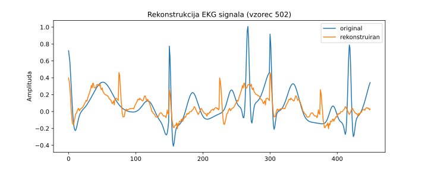

## Samokodirnik

Samokodirnik (angl. *autoencoder*) je nevronska mreža, ki se uči stisniti vhodne podatke v manjšo, informativno predstavitev (t. i. vgrajeni prostor ali *embedding*) in nato iz te predstavitve rekonstruirati izvirni vhod. Sestavljen je iz dveh delov: kodirnika, ki vhod transformira v krajšo latentno predstavitev, in dekodirnika, ki poskuša iz te predstavitve čim bolj natančno rekonstruirati vhod. Uporablja se za stiskanje podatkov, odstranjevanje šuma, vizualizacijo, zaznavanje nenavadnosti in kot predtrening za druge naloge strojnega učenja. Pomembno je, da se učenje izvaja brez nadzora – model se uči le iz samih podatkov, brez oznak.

Za kodirinik bomo uporabili isto kovolucijsko mrežo kot zgoraj, in sestavili strukturo samokodirnika, kot jo prikazuje spodnja koda:

```python
class Autoencoder(nn.Module):
    def __init__(self, signal_length):
        super().__init__()
        self.encoder = nn.Sequential(
            # prvi konvolucijski blok
            nn.Conv1d(1, 16, kernel_size=5, stride=3, padding=2),
            nn.BatchNorm1d(16),
            nn.ReLU(),
            nn.MaxPool1d(kernel_size=2),
            
            # drugi konvolucijski blok
            nn.Conv1d(16, 16, kernel_size=5, stride=3, padding=2),
            nn.BatchNorm1d(16),
            nn.ReLU(),
            nn.AdaptiveAvgPool1d(1)  # globalno povprečno združevanje
        )
        self.bottleneck = nn.Linear(16, 2)
        self.decoder_fc = nn.Linear(2, 16)
        self.decoder = nn.Sequential(
            nn.ConvTranspose1d(16, 16, kernel_size=signal_length//2,\ 
                stride=signal_length//2),
            nn.ReLU(),
            nn.ConvTranspose1d(16, 1, kernel_size=1),
        )
        self.signal_length = signal_length
```

Samokodirnik v tej kodi sestoji iz treh delov: kodirnika, ozkega grla (*bottleneck*) in dekodirnika. Kodirnik je enak kot v prejšnjem modelu za klasifikacijo — uporablja dve konvolucijski plasti z normalizacijo, nelinearnostjo in združevanjem, kar postopoma zmanjša dolžino signala in izlušči 16 značilnosti, ki jih `AdaptiveAvgPool1d(1)` skrči na velikost `[batch, 16, 1]`. Nato sledi linearni sloj `self.bottleneck`, ki to 16-dimenzionalno predstavitev stisne v le 2 številski vrednosti — to je latentni prostor ali *embedding*, kjer se nahaja bistvo informacije. Ta vektor se nato s pomočjo `decoder_fc` najprej razširi nazaj v 16 dimenzij, nato pa dekodirnik, ki uporablja transponirane konvolucijske plasti (`ConvTranspose1d`), signal postopoma razširi nazaj na prvotno dolžino. S tem se model nauči, kako iz zelo stisnjene oblike rekonstruirati originalni signal, kar omogoča uporabo samokodirnika pri stiskanju, odstranjevanju šuma ali vizualizaciji skritih vzorcev.

`ConvTranspose1d` (tudi *dekonvolucija* ali *transponirana konvolucija*) je operacija, ki obrne učinek običajne konvolucije — namesto da signal krajša, ga razširja. Uporablja se predvsem v dekodirnikih, kjer želimo iz kratkega predstavitvenega vektorja rekonstruirati signal prvotne dolžine.

Če običajna konvolucija dolžino signala zmanjša (npr. zaradi `stride > 1`), potem transponirana konvolucija to dolžino spet poveča. Matematično to lahko razumemo kot obrat operacije:

Če ima navadna konvolucija izhodno dolžino:

$$
L_{\text{out}} = \left\lfloor \frac{L_{\text{in}} + 2p - k}{s} \right\rfloor + 1
$$

kjer so:

* $L_{\text{in}}$: vhodna dolžina,
* $k$: velikost jedra (*kernel\_size*),
* $s$: korak (*stride*),
* $p$: robna obloga (*padding*),

potem transponirana konvolucija izračuna dolžino izhoda z:

$$
L_{\text{out}} = (L_{\text{in}} - 1) \cdot s - 2p + k
$$

Na primer, če imamo vhod dolžine 1 in uporabimo `ConvTranspose1d(16, 16, kernel_size=225, stride=225)`, potem bo izhod dolžine:

$$
L_{\text{out}} = (1 - 1) \cdot 225 - 0 + 225 = 225
$$

To pomeni, da z enim korakom razširimo signal iz dolžine 1 na 225 — zelo učinkovito za rekonstrukcijo dimenzij.

Tako v samokodirniku `ConvTranspose1d` poskrbi, da se 16-dimenzionalna predstavitev, ki ima dolžino 1, razširi na dolžino, ki približno ustreza polovici vhodnega signala, nato pa še z drugo transponirano konvolucijo (z `kernel_size=1`) končno pretvori nazaj v enokanalni signal želene dolžine.

Aplikacija tega modela pri učenju je tokrat malce bolj kompleksna:

```python
    def forward(self, x):
        x = self.encoder(x)
        x = x.view(x.size(0), -1)  # iz [batch, 16, 1] v [batch, 16]
        z = self.bottleneck(x)
        x = self.decoder_fc(z)
        x = x.unsqueeze(-1)  # [batch, 16, 1]
        # povečaj na [batch, 16, signal_length//2]
        x = x.repeat(1, 1, self.signal_length // 2)
        x = self.decoder(x)
        # zagotovi, da dolžina izhoda ustreza vhodu
        x = x[:, :, :self.signal_length]  
        return x, z
```

Funkcija `forward` najprej poda vhodni signal skozi kodirnik, kjer se iz enokanalnega signala dolžine 450 izlušči 16 značilnosti, ki jih nato s pomočjo `bottleneck` plasti stisnemo v 2-dimenzionalni vektor `z`. Nato sledi dekodiranje: vektor `z` se najprej linearno razširi nazaj v 16-dimenzionalen vektor, mu dodamo dimenzijo dolžine 1, nato pa ga s funkcijo `repeat` razširimo po časovni dimenziji do dolžine `signal_length // 2`, kar omogoči uporabo transponirane konvolucije. Te plasti signal postopoma razširijo skoraj do prvotne dolžine, zadnja vrstica pa izhod natančno prireže na dolžino vhodnega signala. Funkcija vrne tako rekonstruiran signal kot tudi stisnjen vmesni vektor `z`, kar omogoča uporabo modela za učenje latentne predstavitve brez oznak.

Kriterij za uspešnost učenja tokrat ni vezan za razred, ampak opazujemo rekonstrukcijsko napako:

```python
criterion = nn.MSELoss()
```
Razredne spremenljivke pri učenju sploh ne uporabljamo. Jo pa lahko uporabimo pri izrisu vložitve v vektorski prostor:

```python
embeddings = embeddings.numpy()
y_np = y.numpy()
plt.figure(figsize=(8, 6))
for c in np.unique(y_np):
    plt.scatter(embeddings[y_np == c, 0], embeddings[y_np == c, 1], \
        label=f"Razred {c}", alpha=0.6)
```


Presenetljivo dobro! Presenetljivo zaradi relativno enostavnosti mreže, in ker učnih podatkov ni prav mnogo. V prostoru vložitev sta razreda popolnoma ločena, čeprav informacijo o njih v postopku gradnje sploh nismo uporabili.

Izrišemo lahko tudi rekonstrukcijo za dani signal, na primer:

```python
idx = 502
X_random = X[idx:idx+1]  # oblika [1, 1, signal_length]
with torch.no_grad():
    X_recon, _ = model(X_random)
X_orig = X_random.squeeze().numpy()
X_recon = X_recon.squeeze().numpy()

plt.figure(figsize=(10, 4))
plt.plot(X_orig, label='Original')
plt.plot(X_recon, label='Rekonstruiran')
```


Rekonstrukcija morda ni najboljša (mreža je preenostavna, učnih podatkov je premalo), a vsekakor kaže na neke kvalitativne podobnosti med signaloma. Z dodatnimi prilagoditvami mreže in povečanju množice vhodnih podatkov bi se je dalo še izboljšati.

Čeprav je torej naša mreža zelo preprosta in učni podatki niso označeni, se avtokodirnik uspešno nauči vektorske vložitve, ki loči razrede ter rekonstruira signal s prepoznavno obliko. To kaže, da lahko mreža iz samih podatkov izlušči pomembne značilnosti, kar je bistvo nenadzorovanega učenja. Ena od možnih izboljšav bi bila uporaba variacijskega avtokodirnika (VAE), ki uvede stohastično komponento in omogoča (boljšo) generativno modeliranje porazdelitve nad latentnim prostorom. Vendar bomo variacijski pristop v tem poglavju izpustili.
