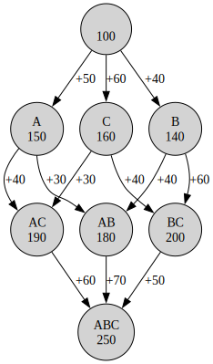
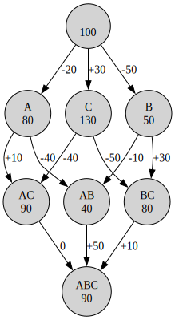
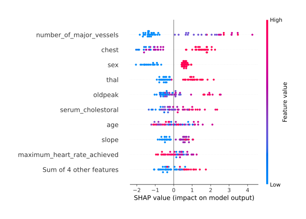
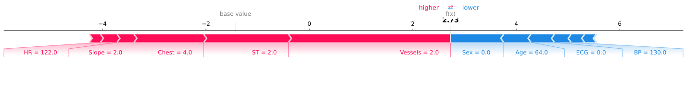
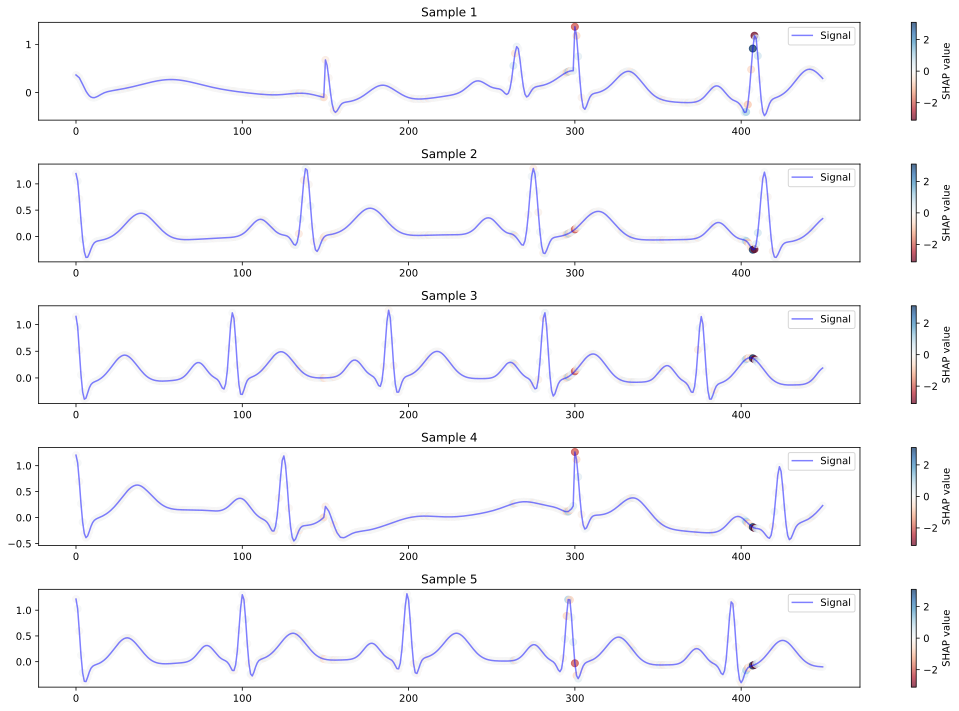

# Razložljivost v strojnem učenju

V bistvu smo se tega poglavja lotili samo zato, da na primeru razložimo, kaj je SHAP. A za uvod moramo razkriti še čisto malo podlage. O njej ste najbrž slišali tudi drugje, zato samo na kratko, bolj za uvod v to, kaj je SHAP.

## Kaj je in zakaj potrebujemo razložljivost?

V bistvu bi morali s tem vprašanje začeti naš predmet, saj se prvenstveno (v svojem nazivu) ukvarja s tem, da v podatkih nekaj odkrijemo, in so napovedi in ostalo drugotnega pomena. Čeprav morda ne; uporabni modeli morajo biti točno, šele potem lahko razmišljamo o razložljivosti. Razložljivost v strojnem učenju potrebujemo zato, da razumemo, zakaj je model sprejel določeno odločitev—kar je ključno za zaupanje, odpravljanje napak, zagotavljanje pravičnosti ter izpolnjevanje regulativnih zahtev. Še posebej pri občutljivih področjih, kot so medicina, pravo ali finance, je pomembno, da lahko napovedi utemeljimo s konkretnimi vhodnimi podatki. Namesto da slepo verjamemo "črni škatli", želimo vedeti, kateri dejavniki so prispevali k napovedi in kako. 

Z besedo *dejavniki* tu lahko mislimo na vhodne atribute oziroma značilke, a je to res samo v najbolj enostavni obliki. Na splošno bi nas zanimale namreč kombinacije značilk oziroma njihove interakcije, še posebej pomembno pa bi bilo vse to povezati z obstoječim domenskim znanjem in morda z razlago, ki bi to znanje povezalo z vedenjem o interakcijah in pomembnih značilkah. A na splošno temu ni ravno tako in so take, bolj kompleksne a direktne razlage redke in zaenkrat bolj predmet človekove interpretaciji, strojno učenje pa se bolj ukvarja s tem, katere značilke so pomembne in katere ne.

Razložljivost (angl. *explainability*) pomeni sposobnost modela, da človeku razumljivo utemelji svoje odločitve oziroma napovedi. Gre za to, da znamo odgovoriti na vprašanje: zakaj je model za določen vhod napovedal točno ta rezultat? Razložljivost ločimo na **globalno**, kjer nas zanima splošno delovanje modela (npr. kateri atributi so najpomembnejši pri odločitvah), in **lokalno**, kjer pojasnjujemo konkretno napoved za posamezen primer. Razložljivost je pomembna zato, ker omogoča nadzor nad modelom, krepi zaupanje uporabnikov ter omogoča zaznavo pristranskosti ali napak v podatkih ali v dobljenem modelu.

## Razložljivi modeli

Razložljivi modeli so, poenostavljeno, modeli strojnega učenja, katerih delovanje lahko enostavno interpretiramo, saj njihova struktura neposredno odraža logiko odločanja. Med takšne modele sodijo vsi linearni modeli (linearna regresija, logistična regresija), odločitvena drevesa in modeli na osnovi pravil (modeli kot so CN2, Ripple Down Rules, odločitvene tabele). Pri teh modelih lahko jasno vidimo, kako posamezne značilnosti vplivajo na napoved: npr. kako vsak atribut prispeva k rezultatu, ali kateri pogoji vodijo do določenega razreda. Zaradi svoje preglednosti so ti modeli primerni za uporabo v okoljih, kjer je razlaga odločitev ključna, vendar pogosto niso dovolj natančni pri kompleksnih problemih, kjer so potrebni močnejši, a manj razložljivi pristopi.

> **Opomba:** pri zgornji definiciji se velja zamisliti. Recimo, kako res razložljivo je odločitveno drevo s sto notranjimi vozlišči? Kako stabilno, glede na majhne spremembe vhodnih podatkov je? Je smiselno razlagati nestabilne modele? So za razlago zato boljši nomogrami? Kateri od vseh teh modelov je najbolj razširjen? Zakaj ne uporabljamo odločitvenih tabel in točkovalnih tehnik (angl. *scoring sheet*).

## Razlaga črnih škatel

Modeli, kot so naključni gozdovi, gradientno ojačani modeli (npr. XGBoost), metode podpornih vektorjev s kakšnimi bolj kompleksnimi jedri ter globoke nevronske mreže pogosto označujemo kot *črne škatle*, ker njihova notranja logika ni neposredno razumljiva človeku ali pa je matematično ali pa kombinatorično prekompleksna. Čeprav lahko matematično opišemo njihovo delovanje, je zaradi njihove kompleksnosti težko intuitivno razumeti, zakaj je model pri nekem vhodu podal točno določeno napoved.

A črne škatle niso povsem neprozorne—le sami po sebi ne nudijo jasne razlage. Zato razvijamo metode, ki obravnavajo razvite modele in pomagajo razložiti njihove odločitve. Te metode lahko razdelimo na tri glavne pristope: 

* **perturbacijske metode**, ki model večkrat poženemo z rahlo spremenjenimi vhodnimi podatki, da ocenimo vpliv posameznih značilk. Ta pristop uporabljata *LIME* in *SHAP*, 

* **gradientne metode**, ki za odvedljive modele uporabijo informacije o gradientih napovedi glede na vhodne vrednosti. Primer takega pristopa so t.im. *saliency maps* za razlago odločitev na slikah,

* tehnike z **nadomestnimi modeli** (angl. *surrogatne models*), kjer črno škatlo v dani točki (torej, pri danem vhodnem primeru) predstavimo z enostavnim razložljivim modelom (npr. drevesom, ali še bolje nomogramom), ki vedenje modela predstavi na omejenem območju vhodnega prostora.

> **Opomba:** Zgoraj smo že večkrat omenili nomograme, a je nekako zanimivo, da se tem  inženirji na področju strojnega nekako izogibajo in pri razložljivih modelih prednjačijo drevesa. Področje kar kliče po dodatnih raziskavah.

Cilj teh tehnik je torej ne razkriti notranjosti modela, temveč razumeti njegove izhode in pridobiti vpogled v to, kako vhodne značilnosti vplivajo na napovedi—kar je pogosto dovolj za zaupanje in uporabo v praksi.

## O perturbacijskih metodah

Omenili smo dve, SHAP in LIME. Prav je, da preden predstavimo primer s SHAPom, razložimo razliko. Razlika med obema je predvsem v tem, kako določita vpliv posameznih značilnosti na napoved za dani vhodni primer:

* **LIME** (*Local Interpretable Model-agnostic Explanations*) za vsak primer generira lokalni nadomestni model (npr. linearno regresijo), ki poskuša čim bolje aproksimirati delovanje originalnega modela v okolici vhodnega primera. Pri tem naključno perturbira vhodne podatke in opazuje spremembe v napovedih. Rezultat so uteži značilnosti v tem lokalnem modelu. LIME je preprost in učinkovit, vendar lahko rezultati niso vedno konsistentni, saj so odvisni od izbire lokalnega območja okoli izbranega primera in tipa perturbacij.

* **SHAP** (*SHapley Additive exPlanations*) temelji na Shapley vrednostih iz teorije iger in vsakemu atributu dodeli povprečen prispevek k napovedi glede na vse možne kombinacije prisotnosti/odsotnosti atributov. SHAP ima močne teoretične temelje in zadovoljuje pomembne lastnosti, kot so aditivnost, simetrija in odsotnost. Rezultati SHAP so zaradi tega bolj stabilni in interpretabilni, a izračun je bistveno bolj zahteven (razen pri posebej optimiziranih modelih, kot je XGBoost).

V splošnem naj bi bil LIME hitrejši in enostavnejši, SHAP pa je počasnejši, teoretično utemeljen in doslednejše pri razlagi.

## Razlaga naključnih gozdov (in podobnih modelov)

Preden pogledamo, kaj je SHAP, povejmo samo, da obstajajo tudi drugi pristopi k razlagam modelov. Dva, ki sta primerna za na primer naključne gozdove, sta: analiza pomembnosti značilnosti z zmanjšanjem entropije (angl. *mean decrease in impurity*) ter analiza z permutacijami značilnosti (angl. *permutation feature importance*).

Pri prvem pristopu, **analizi pomembnosti značilnosti z zmanjšanjem entropije** model beleži, koliko posamezna značilnost v povprečju prispeva k zmanjšanju nečistosti pri razvejitevah v odločitvenih drevesih. Kadar se določena značilnost pogosto pojavlja visoko v drevesu in pri tem povzroči močno znižanje entropije ali Gini indeksa, bo njena pomembnost visoka. Metoda je preprosta in učinkovita, vendar lahko daje pristranske rezultate, saj daje prednost značilnostim z več vrednostmi, kot so številčne spremenljivke ali tiste s številnimi kategorijami.

Drugi pristop, **permutacijska analiza pomembnosti**, temelji na ideji, da izničimo informacijo o določeni značilnosti tako, da njene vrednosti zmešamo. Nato primerjamo uspešnost modela pred in po taki permutaciji. Če zamenjava vrednosti določene značilnosti močno poslabša delovanje modela, lahko sklepamo, da je bila ta značilnost pomembna. Ta pristop je modelno neodvisen in deluje tudi za kompleksne modele, vendar je razmeroma drag, saj zahteva ponovno vrednotenje modela za vsako permutacijo.

Ob tem opozorimo, da gre pri zgornjih za **globalno razložljivost**, in ne za razlago vpliva vrednosti spremenljivk na napoved za dani primer.

## SHAP: primer

Recimo, da opazujemo ceno enosobnih stanovanj v nekem malem mestecu v odvisnosti od oddaljenosti stanovanja od centra, starosti stanovanja in lege. Zgradili smo model iz podatkov, zdaj pa nas zanima, kako razložiti njegovo napoved, da za novo sončno stanovanje blizu centra plačamo 250,000 €. 

Želeli bi vedeti, koliko k tej napovedi prispeva vsak atribut posebej. Da bi pravično ocenili prispevek vsakega atributa, oziroma bolje, atributne vrednosti, moramo njegov prispevek opazovati v kontekstu koalicij: ko nekaj že vemo, na primero poznamo starost stanovanja, koliko nam prispeva vedenje o oddaljenosti od centra. Ali pa ko ne vemo še ničesar, torej model napove vrednost stanovanja brez danih vrednosti atributov, kako se napovedana cena spremeni, če poznamo starost. Ali, še tretji primer, če vemo, da imamo opravka z novih stanovanjem v centru mesta, kakšna je sprememba napovedane cene če zvemo, da je stanovanje obrnjeno proti soncu.

Za poenostavitev notacije naše atributne vrednosti poimenujmo:

* A: oddaljenost (blizu)
* B: starost (novo)
* C: lega (sonce)

Nato pa povprašajmo model o napovedi vrednosti stanovanja pri vseh možnih kombinacijah atributov. Vrednosti teh, in spremembe pri dodajanju enega od atributnih vrednosti na vhod modela, lahko predstavimo s sponjim grafom, ki ga lahko imenujemo mreža podmnožic (angl. *subset lattice*) ali pa kar mreža koalicij atributov (angl. *Shapley coalition lattice*), saj nam vsako vozlišče predstavlja možno kombinacijo, oziroma koalicijo atributov na vhodu modela.

Če ne vemo ničesar o stanovanju (\( \varnothing \)), je napovedana vrednost 100,000 € (recimo, malo je nizka, a za primer bo zadoščalo). Če zvemo, da je stanovanje blizu centra mesta (A), se vrednost poveča na 150,000 €, razlika, ki nam jo prinese vedenje vrednosti o tem atributu, pa je +50 €. Če po drugi strani vemo, da gre za novo stanovanje v centru mesta (AB), za katerega nam model napove, da stane 180,000 €, nam dodatno vedenje o njegovi sončni legi (C) doprinese k ceni 70,000 €.

Shapley vrednosti razdelijo razliko med napovedjo, ko poznamo vrednosti vseh atributov in napovedjo, ko vrednosti teh atributov ne poznamo. Zanima nas sedaj, od kod razlika z novim sončnim stanovanjem v centru, oziroma kateri od atributov prinese največ k tej razliki. Ta je po Shapley-ju enaka povprečni dodani vrednosti cene stanovanja ob katerikoli situaciji, torej pri vseh možnih koalicijah ostalih atributnih vrednosti. Da bi te opazovali, poglejmo, na koliko možnih načinov se skozi mrežo koalcij sprehodimo od popolne nevednosti (ne poznamo vrednost nobenega atributa) do situacije, ko poznamo vrednosti vseh (ABC). Vseh možnih takih poti je šest, kar je enako tudi številu permutacij A, B, in C (\( 3! = 3\times 2=6 \)):

1. A-B-C
2. A-C-B
3. B-A-C
4. B-C-A
5. C-A-B
6. C-B-A

Pri vsaki permutaciji lahko zdaj izračunamo robni (marginalni) doprinos posameznega atributa, torej kolikšen je skok v ceni, ko to značilnost dodamo že obstoječi "koaliciji" prejšnjih:

**Permutacija 1: A → B → C**

* \( \varnothing \) → A (blizu): 100,000 → 150,000 → +50,000
* A → B (novo): 150,000 → 180,000 → +30,000
* A,B → C (sonce): 180,000 → 250,000 → +70,000

**Permutacija 2: A → C → B**

* \( \varnothing \) → A (blizu): 100,000 → 150,000 → +50,000
* A → C (sonce): 150,000 → 190,000 → +40,000
* A,C → B (novo): 190,000 → 250,000 → +60,000

**Permutacija 3: B → A → C**

* \( \varnothing \) → B (novo): 100,000 → 140,000 → +40,000
* B → A (blizu): 140,000 → 180,000 → +40,000
* A,B → C (sonce): 180,000 → 250,000 → +70,000

**Permutacija 4: B → C → A**

* \( \varnothing \) → B (novo): 100,000 → 140,000 → +40,000
* B → C (sonce): 140,000 → 200,000 → +60,000
* B,C → A (blizu): 200,000 → 250,000 → +50,000

**Permutacija 5: C → A → B**

* \( \varnothing \) → C (sonce): 100,000 → 160,000 → +60,000
* C → A (blizu): 160,000 → 190,000 → +30,000
* A,C → B (novo): 190,000 → 250,000 → +60,000

**Permutacija 6: C → B → A**

* \( \varnothing \) → C (sonce): 100,000 → 160,000 → +60,000
* C → B (novo): 160,000 → 200,000 → +40,000
* B,C → A (blizu): 200,000 → 250,000 → +50,000

Za vsako značilnost izračunajmo povprečni doprinos:

| Značilnost | Prispevki po permutacijah        | Povprečje (SHAP) |
| ---------- | -------------------------------- | ---------------- |
| **A**      | 50, 50, 40, 50, 30, 50 → **270** | **45,000 €**     |
| **B**      | 30, 60, 40, 40, 60, 40 → **270** | **45,000 €**     |
| **C**      | 70, 40, 70, 60, 60, 60 → **360** | **60,000 €**     |

Največ je torej prispevala sončna lega (C), enako pa oddaljenost od centra in starost.

## SHAP: še en primer

Tokrat vzamimo:

* A: oddaljenost (daleč od centra, na vasi)
* B: starost (staro)
* C: lega (sončna, lepo je)

Mrežo koalicij in napovedanih vrednosti modela kaže tokrat spodnji graf.

Upoštevajoč vse možne poti skozi graf lahko hitro ugotovimo, da so spremembe takrat, ko zvemo za A (na vasi), enake -20, -20, -40, +10, -10, +10, oziroma je povprečna sprememba enaka -11,667 €. Za starost dobimo -31,667 €, za lepo lego pa -33,333. Od tod razlika -10,000 € v primerjavi z napovedjo modela, ko ne vemo ničesar.

Te vrednosti lahko dobimo tudi z nekoliko hitrejšim izračunom, ki ga tu samo predstavimo in ga ne bomo razlagi podrobno, pove pa nam, kako upoštevati vsako spremembo cene, ki je podana v mreži koalicij. V bistvu preštejemo, na koliko različnih poti skozi graf od gornjega vozlišča (\( \varnothing \)) do končnega vozlišča (ABC) je posamezna veja. Uporabimo klasično Shapleyjevo enačbo, ki temelji na vseh podmnožicah za vsako značilnost.Za vsako značilnost $i$ naj velja:

$$
\phi_i = \sum_{S \subseteq N \setminus \{i\}} \frac{|S|!(n - |S| - 1)!}{n!} \cdot [v(S \cup \{i\}) - v(S)]
$$

V enačbi je $\phi_i$ SHAP vrednost za značilnost (atribut) $i$.
* $N$ je množica vseh značilnosti (npr. {A, B, C})
* $S$ je vsaka podmnožica značilnosti brez $i$
* $f(S)$ je napoved modela, če poznamo samo značilnosti iz množice $S$
* $f(S \cup \{i\}) - f(S)$ je doprinos atributa $i$, če ga dodamo k $S$
* Faktor $\frac{|S|!(n - |S| - 1)!}{n!}$ določa težo vsake podmnožice — to je, koliko "vpliva" ima ta kombinacija pri povprečenju, oziroma kolikokrat se skozi to podmnožico sprehodi na vseh možnih poteh skozi graf.

Ker imamo 3 značilnosti, so uteži:

* za prazno množico $S$: $\frac{2!0!}{3!} = \frac{2}{6} = \frac{1}{3}$
* za enoelementne $S$: $\frac{1!1!}{3!} = \frac{1}{6}$
* za dve značilnosti $S$: $\frac{0!2!}{3!} = \frac{2}{6} = \frac{1}{3}$

Za A, lego na vasi, torej dobimo:

* $\emptyset \rightarrow \{A\}$: $80 - 100 = -20$ × $1/3$
* $\{B\} \rightarrow \{A,B\}$: $40 - 50 = -10$ × $1/6$
* $\{C\} \rightarrow \{A,C\}$: $90 - 130 = -40$ × $1/6$
* $\{B,C\} \rightarrow \{A,B,C\}$: $90 - 80 = +10$ × $1/3$

$$
\phi_A = \frac{1}{3}(-20) + \frac{1}{6}(-10 - 40) + \frac{1}{3}(+10) = -6.67 -8.33 + 3.33 = \boxed{-11.67}
$$

Za B, stara hiša, je izračun:

* $\emptyset \rightarrow \{B\}$: $50 - 100 = -50$ × $1/3$
* $\{A\} \rightarrow \{A,B\}$: $40 - 80 = -40$ × $1/6$
* $\{C\} \rightarrow \{B,C\}$: $80 - 130 = -50$ × $1/6$
* $\{A,C\} \rightarrow \{A,B,C\}$: $90 - 90 = 0$ × $1/3$

$$
\phi_B = \frac{1}{3}(-50) + \frac{1}{6}(-40 - 50) + \frac{1}{3}(0) = -16.67 -15.00 + 0 = \boxed{-31.67}
$$

In za sončno lego, C:
* $\emptyset \rightarrow \{C\}$: $130 - 100 = +30$ × $1/3$
* $\{A\} \rightarrow \{A,C\}$: $90 - 80 = +10$ × $1/6$
* $\{B\} \rightarrow \{B,C\}$: $80 - 50 = +30$ × $1/6$
* $\{A,B\} \rightarrow \{A,B,C\}$: $90 - 40 = +50$ × $1/3$

$$
\phi_C = \frac{1}{3}(+30) + \frac{1}{6}(+10 + 30) + \frac{1}{3}(+50) = 10 + 6.67 + 16.67 = \boxed{33.33}
$$

## **SHAP pri klasifikaciji z nevronskimi mrežami**

Ko želimo razložiti odločitev kompleksnega modela, kot je nevronska mreža, si pomagamo z metodami za lokalno razlago napovedi. SHAP (SHapley Additive exPlanations) je ena najpogosteje uporabljenih tehnik, ki vsakemu vhodnemu atributu pripiše številčno vrednost, ki izraža njegov prispevek k konkretni napovedi.

Temeljna zamisel SHAP je primerjava: kako bi model napovedal, če o vhodu ne bi vedel ničesar, in kako napove, ko pozna vse značilnosti. Razlika med tema dvema vrednostma predstavlja učinek vhodnih podatkov, ki ga SHAP nato razdeli med posamezne značilnosti. Vsaki značilnosti tako pripiše njen povprečni prispevek, upoštevajoč vse možne kombinacije prisotnosti in odsotnosti ostalih značilnosti.

V idealnem primeru bi SHAP res preučil vse možne kombinacije vhodnih podatkov in za vsako značilnost izračunal, kako spremeni napoved, če jo dodamo k dani kombinaciji. Vendar je to računsko hitro prezahtevno, saj število kombinacij eksponentno narašča. Zato v praksi uporabljamo približke: za enostavne modele lahko izračune opravimo točno, pri kompleksnih modelih, kot so nevronske mreže, pa uporabimo vzorčenje ali posebne algoritme, ki ocene pridobijo učinkovito in dovolj natančno.

Rezultat SHAP razlage je preprost in uporaben: za posamezen primer modelove napovedi dobimo seznam vhodnih značilnosti s številčnimi prispevki, ki skupaj pojasnjujejo, zakaj je bila podana prav ta napoved. SHAP s tem ponuja zanesljiv in intuitiven vpogled v delovanje tudi zelo kompleksnih modelov.

## Vizualizacija SHAP vrednosti

SHAP vrednosti omogočajo številne vizualizacijske tehnike, s katerimi lažje razumemo, kako posamezne značilnosti vplivajo na napovedi modela. Ena najpogostejših je t. i. razpršeni graf (angl. *beeswarm plot*), ki za več primerov naenkrat prikaže prispevke vseh značilnosti. Vsaka točka predstavlja en primer in njena lega na vodoravni osi kaže, ali je vpliv značilnosti povečal ali zmanjšal napoved. Barva pogosto, kot tudi v spodnjem prikazu te vizualizacije za znane podatke *Cleveland Heart Disease*, nakazuje vrednost razreda.

Za posamezen primer lahko uporabimo t. i. *force plot*, kjer so SHAP vrednosti prikazane kot sile, ki vlečejo napoved stran od osnovne vrednosti modela (povprečne napovedi). Ta graf jasno pokaže, katere značilnosti so potisnile napoved navzgor in katere navzdol.

Pri tabelaričnih podatkih je uporaben tudi *barvni graf pomembnosti*, kjer za posamezen primer ali za povprečje čez več primerov prikažemo stolpčni diagram SHAP vrednosti. Na ta način hitro vidimo, katere značilnosti so bile za model ključne.

Za kompleksnejše primere in višje dimenzije obstajajo še druge vizualizacije, kot so povprečni vplivi glede na vrednost značilnosti (angl. *dependence plots*) ali kombinacije več SHAP grafov v interaktivnih pregledovalnikih. Vsem pa je skupno, da SHAP s številkami ne ostane zgolj pri razlagi, temveč omogoča tudi intuitiven vizualni vpogled v delovanje modela.

## SHAP vrednosti za analizo napovedi iz časovnih vrst

Seveda pa je SHAP uporaben tudi za netabelarične podatke. Spodaj smo na primer skušali razložiti pomembnost posameznih delov modela konvolucijske mreže, ki smo jo razvili v enem od prejšnjih poglavij za klasifikacijo EKG signalov.

## Za zaključek

Razložljivost v strojnem učenju ni zgolj estetski dodatek, temveč nujen korak k zaupanja vredni umetni inteligenci. V tem poglavju smo spoznali razlike med razložljivimi modeli in pristopi k razlagi kompleksnih modelov, kot so SHAP vrednosti. Čeprav se razložljivost pogosto srečuje z omejitvami – kot so računska zahtevnost, nestabilnost ali interpretacijska dvoumnost – pa prav ti izzivi poganjajo raziskave naprej. Ključno sporočilo ostaja: modeli, ki znajo dobro napovedovati, morajo tudi znati razložiti svoje odločitve – še posebej takrat, ko gre za pomembne človeške odločitve.
